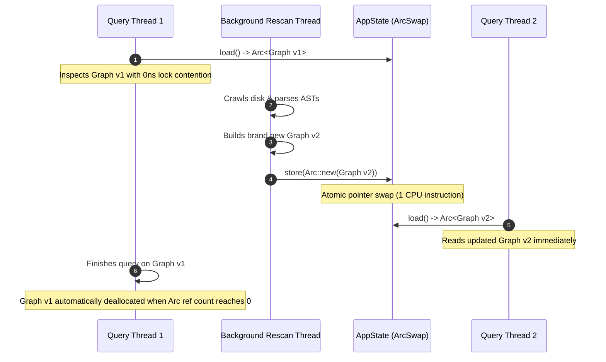
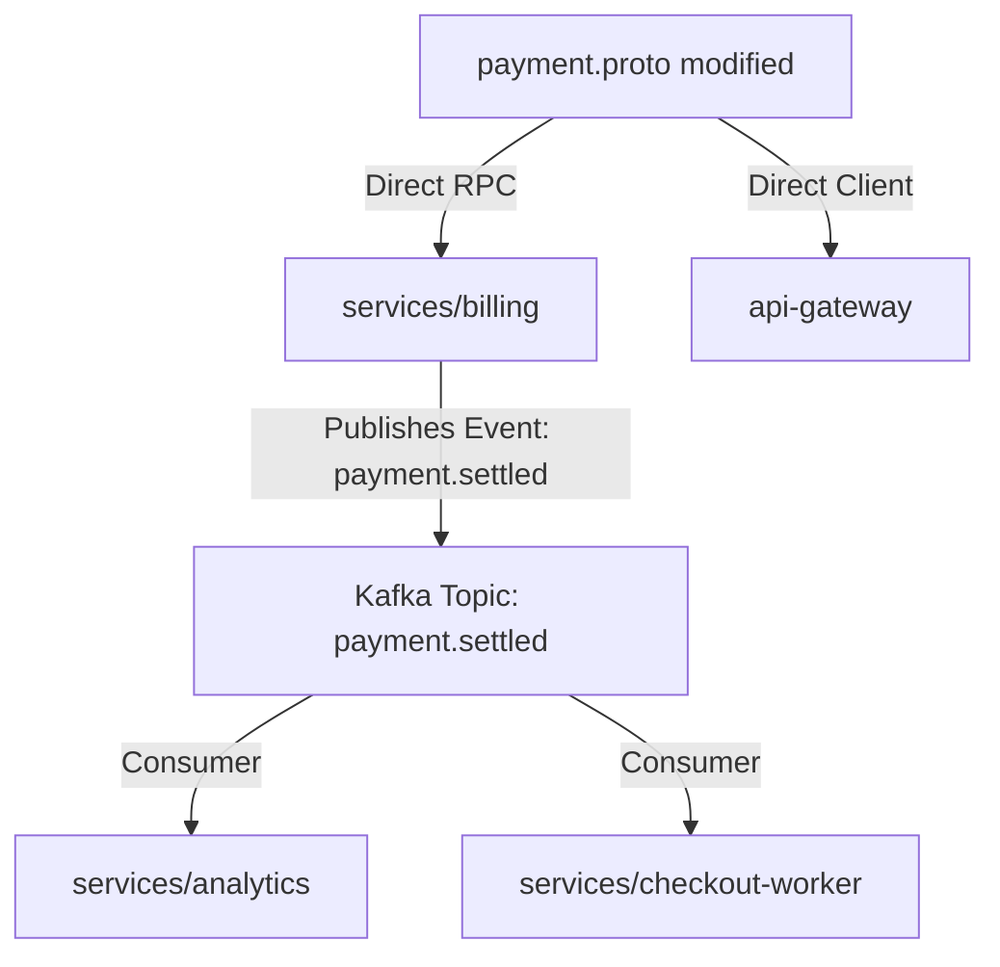

# DEEPENING: Graph Reconciliation Algorithms & Lock-Free State Synchronization

This document provides deep technical reference material for the `mesh-graph-reconciliation` skill.

---

## 1. Lock-Free Map-Level Copy-on-Write (`ArcSwap`)

In conventional architectures, in-memory graphs are protected by `tokio::sync::RwLock` or `parking_lot::RwLock`. Under high concurrency with continuous background file rescanning:
- Background writer threads block foreground agent query threads.
- Query threads cause writer starvation.
- Latency spikes can exceed 100ms.

### MeshMCP Lock-Free Design:
In [`AppState`](../../../crates/mesh-core/src/state.rs):
```rust
pub struct AppState {
    pub contract_graph: ArcSwap<ContractGraph>,
    // ...
}
```



### Memory Safety & Drop Semantics:
1. `load()` returns `Arc<ContractGraph>`, incrementing the atomic reference count.
2. `store()` atomically swaps the internal pointer using atomic CAS (`compare_exchange`).
3. The old `ContractGraph` remains valid as long as any in-flight query holds an `Arc`. Once the last query completes, the old graph deallocates without stalling the active server.

---

## 2. Polyglot FQCN Canonicalization Heuristics

Different languages declare package hierarchies differently:
- **Protobuf**: `package billing.v1;` $\to$ `billing.v1.BillingService`
- **Java**: `package com.corp.billing; @GrpcService class BillingService` $\to$ `com.corp.billing.BillingService`
- **Go**: `package handler; import pb "corp/proto/billing/v1"` $\to$ `billing.v1.BillingService`
- **TypeScript**: `import { BillingServiceClient } from '@corp/proto/billing/v1'` $\to$ `billing.v1.BillingService`

### Canonicalization Algorithm:
In [`ContractGraph`](../../../crates/mesh-core/src/contracts.rs):
1. **Strip Language Suffixes**: Remove `Client`, `Server`, `Handler`, `Impl`, `Controller`, `Servicer`.
2. **Reverse Domain Matching**: Match `.proto` package segments (`billing.v1`) against Java reverse domains (`com.corp.billing.v1`).
3. **Symbol Index**: Index by both fully qualified canonical name (`com.corp.billing.v1.BillingService`) and short name (`BillingService`) to allow fuzzy lookups while maintaining exact reverse dependency mapping.

---

## 3. Causal Blast Radius & Topological Traversal

When a schema or interface changes, computing the blast radius requires traversing both direct callers and transitive event propagation paths:



### Algorithm:
1. **Seed Node**: Locate the `ContractNode` matching the `changed_file`.
2. **Synchronous Edges**: Follow incoming `ContractEdge::CallsRpc` edges to find immediate callers.
3. **Asynchronous Edges**: Follow outgoing `ContractEdge::PublishesTo` edges to find topics/queues, then follow `ContractEdge::SubscribesFrom` edges to find all consumer microservices.
4. **Severity Scoring**:
   - $\ge 3$ impacted downstream services $\implies$ **HIGH SEVERITY**.
   - Cross-repository contract mutation $\implies$ Trigger active governance recommendation.
