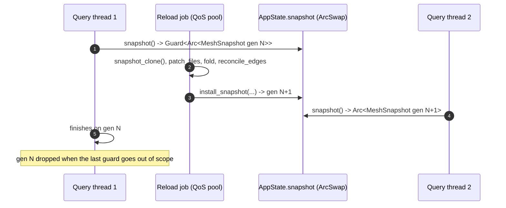
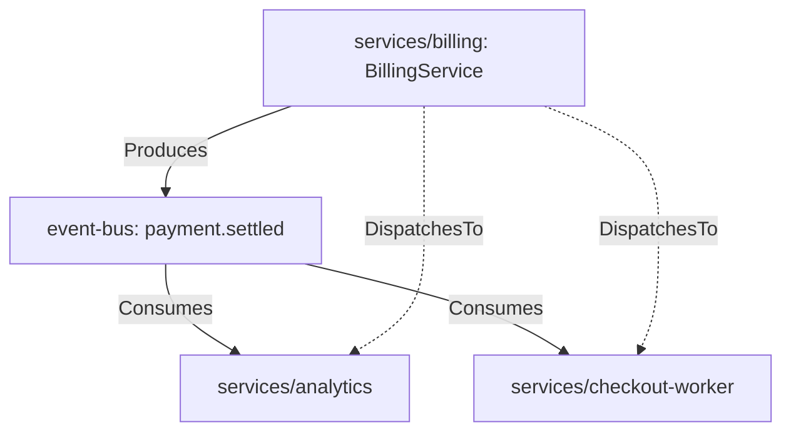

# DEEPENING: Snapshot Swapping, FQCN Matching & Edge Reconciliation

Deep reference for the `mesh-graph-reconciliation` skill. Read the skill first.

---

## 1. Lock-free map-level copy-on-write (`ArcSwap<MeshSnapshot>`)

A graph behind `RwLock` makes background rescans and foreground queries fight: the writer
blocks readers, readers starve the writer. MeshMCP swaps an immutable snapshot instead.

In [`crates/mesh-core/src/state.rs`](../../../crates/mesh-core/src/state.rs):

```rust
#[derive(Debug, Clone, Default)]
pub struct MeshSnapshot {
    pub contract_graph: ContractGraph,
    pub doc_index: DocIndex,
    pub property_registry: PropertyRegistry,
    /// Monotonic counter bumped on every install; lets callers detect a reload.
    pub generation: u64,
}
```

```rust
#[inline]
pub fn snapshot(&self) -> Guard<Arc<MeshSnapshot>> {
    self.snapshot.load()
}

pub fn install_snapshot(&self, mut snapshot: MeshSnapshot) -> u64 {
    let generation = self.snapshot.load().generation + 1;
    snapshot.generation = generation;
    self.snapshot.store(Arc::new(snapshot));
    generation
}
```



Why one snapshot rather than one `ArcSwap` per index: with separate cells a reader could
load a new `contract_graph` and then a `doc_index` from the previous generation. The
struct comment in `state.rs` records this as the reason the fields were merged.

Consequences for callers:

- Take the guard once per request and hold it for the whole request. Two `snapshot()`
  calls are two potentially different generations.
- Never hold a guard across an `.await`. `McpTool::run` is synchronous partly for this.
- `generation` is the only supported staleness signal; `node_count()` is not one.
- The old snapshot stays alive while any guard exists, so a burst of long queries during a
  reload holds two graphs in memory. This is the bounded, deliberate cost of the design.

---

## 2. Polyglot FQCN matching

The same logical service is spelled differently per language:

| Source | Declaration | Canonical projection |
| --- | --- | --- |
| Protobuf | `package billing.v1; service BillingService` | `billing.v1.BillingService` |
| Java | `package com.corp.billing; @GrpcService class BillingService` | `com.corp.billing.BillingService` |
| Go | `pb.RegisterBillingServiceServer` | `BillingService` |
| TypeScript | `@GrpcMethod('BillingService', 'Charge')` | `BillingService/Charge` |

Two mechanisms exist in the code; do not invent a third.

**`CanonicalMethodId`** ([`types.rs`](../../../crates/mesh-core/src/types.rs)) builds
`package.Service/Method` with both halves pushed through `to_pascal_case`, which treats
`_`, `-`, `.`, `/` and space as word separators. This is what normalises `charge_customer`,
`charge-customer` and `ChargeCustomer` to one key.

**`detect_service_package`** resolves a node's `package` from the path first and the AST
second, in three steps: a directory whose parent is `services`, `apps` or `packages` wins
outright; otherwise an explicit non-generic AST package (rejecting `main`, `app`, `crate`,
`src`, `module`, `custom`); otherwise the nearest meaningful directory (skipping `src`,
`lib`, `cmd`, `pkg`, `internal`, `services`, `proto`), falling back to `shared`.

In `reconcile_edges` stage 4, a handler is eligible to `Implements` an RPC only if a
language extractor actually tagged it `GrpcMethod` / `GrpcService`, it is not in a
`.proto` file, and its name does not start with the `rpc:`, `produce:` or `consume:`
synthetic prefixes. Without that filter any same-named REST handler or factory method
would match an RPC by bare name. Keep the filter if you touch this stage.

---

## 3. Event propagation and the `DispatchesTo` shortcut



Stage 2/3 of `reconcile_edges` creates the hub node if no `EventStream` node named
`topic_key` with package `event-bus` exists, wires `Produces` from each producer and
`Consumes` to each consumer, and then — only when the topic has both sides — adds a direct
`DispatchesTo` edge per producer/consumer pair, skipping `prod_id == cons_id`:

```rust
for &prod_id in producers {
    for &cons_id in consumers {
        if prod_id != cons_id
            && edge_set.insert((prod_id, cons_id, EdgeKind::DispatchesTo))
        {
            self.edges.push(ContractEdge {
                from: prod_id,
                to: cons_id,
                kind: EdgeKind::DispatchesTo,
                metadata: Some(dispatch_meta.clone()),
            });
        }
    }
}
```

This stage is the one quadratic shape left in reconcile, bounded by producers × consumers
of a single topic rather than by the whole edge list. A topic fanned out to thousands of
consumers is the case to watch; the `edge_set` insert makes it idempotent, not cheap.

There is **no severity scoring** in the graph. `analyze_impact` returns the four buckets
(`upstream_producers`, `topics`, `downstream_consumers`, `related_sagas`) and the
formatter renders them. Any "HIGH SEVERITY above N services" rule would be new behaviour,
not existing behaviour.

---

## 4. Reading `analyze_impact` before changing it

```rust
let norm_target = target.trim().to_lowercase();
```

The target is lowercased once, then matched with `topic_name.contains(...)` against the
already-lowercase topic keys, and with `contains_ignore_ascii_case` against node names.
Stage 2 walks `self.nodes.values()` filtering on `KafkaTopic | EventStream | Queue | Saga |
PostProcessor` — a single O(N) pass, unlike the per-lookup scans that were removed
elsewhere. If you add a bucket, extend that one pass rather than adding a second walk.

`find_dependents` has a similar shape but three stages, not two: an O(1) `reverse_deps`
hit on `target` as a literal import string; then, only if that's empty, a symbol bridge
through `name_to_nodes`/`fqcn_to_node` (treating `target` as a declared contract name
instead — it resolves to its declaring node(s)' own `.package`, which is re-queried
against `reverse_deps`); then, only if that's still empty, a fallback pass over every
`reverse_deps` key looking for a raw substring. The final fallback is the reason a bare
package fragment still finds something across unrelated services — it is not the fast
path, and it does not scope by service, so a caller (`find_dependents.rs`) groups
results by `ContractNode::repo_id` before rendering them.
