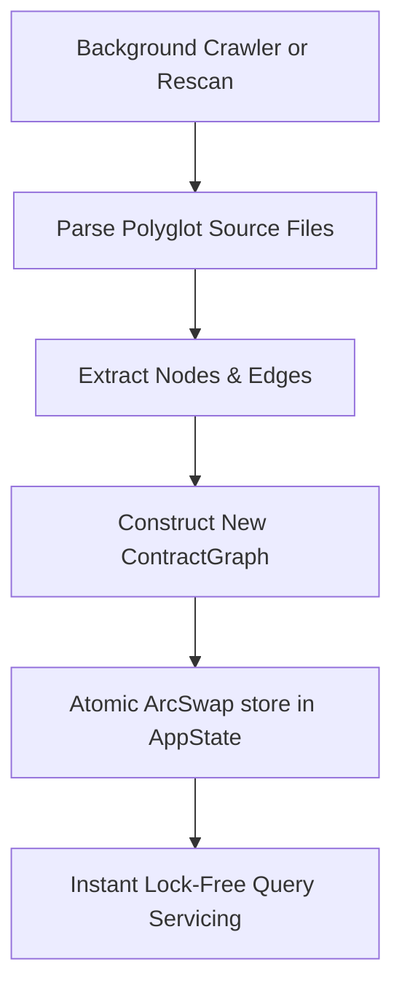

# MeshMCP Graph Reconciliation Skill

This skill guides you through maintaining, querying, and updating the cross-service polyglot architecture graph in `crates/mesh-core`.

---

## 1. Quick Navigation & Codebase References

- **Core Data Types**: [`crates/mesh-core/src/types.rs`](../../../crates/mesh-core/src/types.rs)
  - `CompactStr`: 24-byte stack inline string
  - `RepoId = u8`: Interned repository index (up to 256 repos)
  - `NodeId`: Monotonically increasing 32-bit node index
  - `ContractNode`: Node representing a Service, RPC, Schema, Topic, or RestEndpoint
  - `ContractEdge`: Typed relationship (`Implements`, `CallsRpc`, `PublishesTo`, `SubscribesFrom`)
- **Contract Graph Engine**: [`crates/mesh-core/src/contracts.rs`](../../../crates/mesh-core/src/contracts.rs)
  - `ContractGraph::new()`: Graph builder and adjacency index
  - `ContractGraph::find_reverse_dependencies()`: $O(1)$ caller lookup
  - `ContractGraph::trace_grpc_service()`: Protobuf $\to$ Server $\to$ Client matrix
  - `ContractGraph::compute_blast_radius()`: Causal impact analysis
- **Lock-Free State**: [`crates/mesh-core/src/state.rs`](../../../crates/mesh-core/src/state.rs)
  - `AppState`: Map-level Copy-on-Write using `ArcSwap`
  - Atomic snapshot swap: `state.contract_graph.store(Arc::new(new_graph))`

---

## 2. Core Workflow: Querying & Updating the Graph



### 1. Reverse Dependency Lookup ($O(1)$)
When an agent or user invokes `find_dependents(target: "PaymentService")`:
```rust
let dependents = graph.find_reverse_dependencies("PaymentService");
for (repo_id, file_path, line_no) in dependents {
    // repo_id resolves to repo name via state.repo_lookup
}
```

### 2. Tracing gRPC Flow
```rust
let (schemas, servers, clients) = graph.trace_grpc_service("AuthService", Some("VerifyToken"));
```
- **Schemas**: `.proto` definitions where the RPC is defined.
- **Servers**: Java `@GrpcService` or Go `pb.RegisterAuthServiceServer`.
- **Clients**: TypeScript `this.authClient.verifyToken()` or Spring `AuthGrpcClient`.

### 3. Causal Impact / Blast Radius Analysis
When a file is modified:
```rust
let impact_report = graph.compute_blast_radius("proto-registry/payment/v1/payment.proto");
```
Traverses forward and reverse edges to find all directly and transitively affected microservices, Kafka topics, and client gateways.

---

## 3. Invariants & Rules

1. **Zero Contention in Query Paths**: Never take a mutex or RwLock when querying the graph. Read snapshots via `state.contract_graph.load()`.
2. **FQCN Canonicalization**: Service names must be normalized to their fully qualified package name (e.g., `com.corp.billing.v1.BillingService`).
3. **Interned Repositories**: Always map repository strings to `RepoId = u8` to maintain minimal memory footprint.

---

## 4. In-Depth Reference

When advanced debugging of lock-free CoW synchronization, DAG cycle detection, or blast radius traversal is required, consult:
👉 [`DEEPENING.md`](DEEPENING.md)
