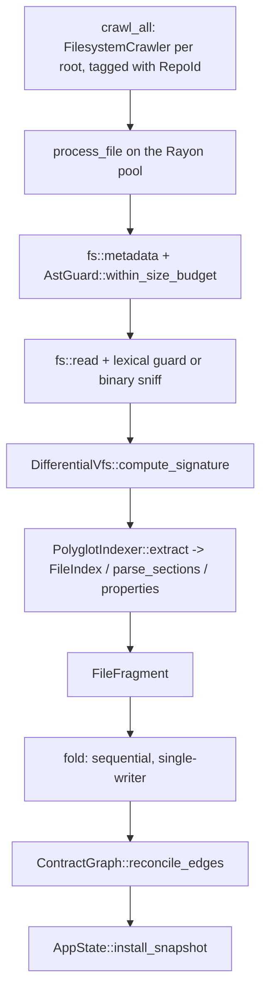

# MeshMCP Indexing Pipeline Skill

All indexing goes through one type: `WorkspaceIndexer` in
[`crates/mesh-server/src/indexer.rs`](../../../crates/mesh-server/src/indexer.rs).
`main.rs`, `cli/graph.rs`, the watcher and `meshd` each used to carry their own copy of
the scan loop; they no longer do. If you find yourself writing a crawl loop, you are in
the wrong place.

---

## 1. Quick Navigation & Codebase References

- **Pipeline entry point**: [`crates/mesh-server/src/indexer.rs`](../../../crates/mesh-server/src/indexer.rs)
  - `WorkspaceIndexer::discover_config()`: explicit path, then `.agents/mesh-mcp.toml`, then `mesh-mcp.toml`, then a built-in single-root default
  - `WorkspaceIndexer::resolve_roots()`: `expand_roots` with a warn-and-fallback to the base dir
  - `WorkspaceIndexer::build_snapshot()`: full parallel scan → one `MeshSnapshot`. Optional
    `Option<&PersistentIndexCache>` (P2 step 3.2,
    [`crates/mesh-core/src/index_cache.rs`](../../../crates/mesh-core/src/index_cache.rs)):
    skips tree-sitter for a file whose (path, content hash, `RepoId`, extraction-config
    fingerprint) all match a prior cached `FileIndex`. Passed at the two boot call sites only.
  - `WorkspaceIndexer::build_graph()`: graph-only convenience for `mesh-mcp graph`
  - `WorkspaceIndexer::reload()`: differential reload driven by the VFS, handles deletions
  - `WorkspaceIndexer::repo_names()`: display names indexed by `RepoId`
  - `SCAN_DEPTH`: crawl depth used by every full scan
  - private: `crawl_all`, `process_file`, `fold`, `compiled_patterns`, `extract_config`,
    `engine_toggles`, `FileFragment`, `ScanConfig` (bundles `patterns`/`doc_template`/
    `spring`/`extract_cfg`/`toggles` into one `&ScanConfig` param so `process_file` stays
    under `clippy::too_many_arguments` — resolved once per scan, not per file)
- **Crawl**: [`crates/mesh-core/src/crawler.rs`](../../../crates/mesh-core/src/crawler.rs)
  - `FilesystemCrawler::crawl_scope()`: `follow_links(false)`, depth cap, `git_ignore(true)`, `hidden(false)`
  - `ExcludeMatcher::compile()` / `is_excluded()`: globset compiled once, wired into `WalkBuilder::filter_entry` so excluded directories are pruned instead of filtered file by file; `.git` is always excluded
- **Guard**: [`crates/mesh-parsers/src/guard.rs`](../../../crates/mesh-parsers/src/guard.rs)
  - `AstGuard::within_size_budget(path, metadata)`: stat-only, runs *before* the read
  - `AstGuard::looks_binary(bytes)`, `AstGuard::should_parse_path(path, metadata, bytes)`
- **Extraction**: [`crates/mesh-parsers/src/languages/mod.rs`](../../../crates/mesh-parsers/src/languages/mod.rs)
  - `PolyglotIndexer::extract(path, content, repo_id) -> FileIndex` (thread-safe, no graph;
    default `ExtractConfig`) and `::extract_with_config(.., &ExtractConfig)` (the one the real
    pipeline calls)
  - `PolyglotIndexer::extract_custom_patterns(path, content, repo_id, &[CompiledPattern])`
  - `FileIndex::merge()`, `FileIndex::apply(&mut ContractGraph)`
  - `CompiledPattern::compile_all(&[CustomPatternConfig])`
  - `ExtractConfig::from_contracts(&ContractsConfig)` — `proto_dirs`, `controller_annotations`,
    `canonical_fqcn_projection`, `openapi_spec_files`, `asyncapi_spec_files`, `infer_string_topics`
- **State**: [`crates/mesh-core/src/state.rs`](../../../crates/mesh-core/src/state.rs)
  - `MeshSnapshot { contract_graph, doc_index, property_registry, generation }`
  - `AppState::snapshot()`, `AppState::snapshot_clone()`, `AppState::install_snapshot()`
- **Differential VFS**: [`crates/mesh-core/src/vfs.rs`](../../../crates/mesh-core/src/vfs.rs)
  - `DifferentialVfs::is_unchanged_fast(path, metadata)`, `compute_signature`, `upsert`, `tracked_paths`, `remove`
- **Background pool**: [`crates/mesh-core/src/rescan.rs`](../../../crates/mesh-core/src/rescan.rs)
  - `BackgroundRescanEngine::install(op)`, `::spawn(task)`, `::thread_count()`
- **Watcher**: [`crates/mesh-core/src/watcher.rs`](../../../crates/mesh-core/src/watcher.rs) (debounce, coalescing) and [`crates/mesh-server/src/watcher.rs`](../../../crates/mesh-server/src/watcher.rs) (binds `WorkspaceIndexer::reload` as the `ReloadFn`)

---

## 2. The pipeline, in order



Extraction is the parallel half; the fold and `reconcile_edges` are the sequential half.
`ContractGraph` is `&mut` and single-writer by construction: that is exactly why
`PolyglotIndexer::extract` returns a graph-independent `FileIndex` whose relations are
expressed against *local* node indices, and why `FileIndex::apply` assigns real `NodeId`s
by inserting into the graph one at a time.

`process_file` touches no shared state. Keep it that way — it is what makes
`files.par_iter()` legal.

### Which guard runs

```rust
let passes = if lang.language().is_some() {
    AstGuard::should_parse_path(path, &metadata, &bytes)
} else {
    !AstGuard::looks_binary(&bytes)
};
```

Tree-sitter inputs get the full lexical guard (null bytes, max line length, nesting
depth). Markdown, YAML and `.properties` only get the binary sniff, because prose
legitimately has lines longer than `AstGuard::MAX_LINE_LEN_BYTES`.

---

## 3. `build_snapshot` vs `reload`

| | `build_snapshot` | `reload` |
| --- | --- | --- |
| Input | every crawled file | files whose stat differs, plus deletions |
| Graph | fresh `MeshSnapshot::default()` | `state.snapshot_clone()`, then `patch_files(stale)` |
| VFS | optional `&mut`, seeded with every signature | required, read and updated under the state's `Mutex` |
| Installs | no — caller calls `install_snapshot` | yes, and logs the new generation |
| Pool | caller's choice via the `pool` argument | always `state.rescan.install(...)` |

Use `build_snapshot` for boot (`run_standalone` in
[`crates/mesh-server/src/main.rs`](../../../crates/mesh-server/src/main.rs), and `meshd`
in [`crates/mesh-daemon/src/main.rs`](../../../crates/mesh-daemon/src/main.rs)). Use
`reload` for every subsequent filesystem change. Use `build_graph` only for the one-shot
`mesh-mcp graph` CLI, which needs no doc index and no snapshot.

### Why boot uses the global pool and reload uses the QoS pool

Both boot call sites pass `None`:

```rust
WorkspaceIndexer::build_snapshot(&state.config, &state.allowed_roots, None, Some(&mut vfs), index_cache.as_ref())
```

(`index_cache`: an `Option<PersistentIndexCache>` — P2 step 3.2's persistent, content-hash-keyed
`FileIndex` cache, `None` if it failed to open. Only the two boot call sites above pass a real
one; `reload` doesn't take this parameter at all, per the table above — it already only
re-parses differential-VFS-flagged changed files, so a content-hash cache has nothing additional
to skip there.)

`None` means the global Rayon pool. At boot a human is waiting on the first response and
nothing else is running, so background-priority threads only make the wait longer — the
doc comment on `build_snapshot` records this as the reason. `reload` runs behind a live
IDE, where the cost that matters is keystroke latency, so it goes through
`BackgroundRescanEngine::install`, whose `start_handler` sets `QOS_CLASS_BACKGROUND` on
macOS and `setpriority(..., 10)` on Linux (Commandment 7). `install` is what makes the
`par_iter` *inside* the closure run on those threads; `spawn` alone would only move the
outer task.

### Reload, step by step

1. Crawl all roots (the crawl itself is not incremental).
2. `deleted` = `vfs.tracked_paths()` minus what the crawl found.
3. `candidates` = files where `!vfs.is_unchanged_fast(p, &m)`. For unchanged files the
   `fs::metadata` call is the only I/O — they are never read.
4. Bail out early when both sets are empty; no new generation is installed.
5. Extract candidates in parallel on the QoS pool.
6. `vfs.upsert` filters again by content hash: a bare `touch` changes mtime but hashes
   identical and is dropped here.
7. `contract_graph.patch_files(changed ∪ deleted)` and `doc_index.remove_file(..)` purge
   the stale entries, then the new fragments are folded in.
8. `reconcile_edges()`, then `install_snapshot`, which bumps `generation`.

Deletions must go through both `patch_files` and `doc_index.remove_file`, and must be
removed from the VFS, or the file resurrects on the next reload.

### Debounce and coalescing

`FileWatcherService::DEBOUNCE_INTERVAL` is `Duration::from_millis(150)`.
`schedule_reload` uses `state.reload_pending.swap(true, Ordering::AcqRel)` to coalesce a
burst into a single queued job; events arriving during a run queue exactly one follow-up.
Do not add your own queue on top of it.

---

## 4. Adding a file type to the pipeline

`process_file` dispatches on the extension, now gated by per-engine config (`[engines.docs]
enabled`/`paths`, `[engines.contracts] enabled`, `[engines.contracts.spring]
property_files`/`auto_redact_secrets`, resolved once per scan into `ScanConfig`):

```rust
let ext = path.extension().and_then(|e| e.to_str()).unwrap_or("");
match ext {
    "md" => {
        if toggles.docs_enabled && Self::doc_path_allowed(path, root, &toggles.doc_paths) {
            frag.docs = doc_template.parse_sections(path, content);
        }
    }
    "properties" => { /* gated by spring.is_property_source(path) */ }
    "yml" | "yaml" => { /* properties (same gate) + extract_with_config, gated by toggles.contracts_enabled */ }
    _ => {
        if toggles.contracts_enabled {
            frag.code = PolyglotIndexer::extract_with_config(path, content, repo_id, extract_cfg);
        }
    }
}
```

`PolyglotIndexer::extract_with_config` threads `[engines.contracts.grpc/.openapi/.asyncapi]`
knobs (`proto_dirs`, `controller_annotations`, `canonical_fqcn_projection`, `spec_files`,
`infer_string_topics`) into extraction; `extract(path, content, repo_id)` is a thin wrapper
using `ExtractConfig::default()` for callers (mostly tests) that don't need config-driven
behaviour.

To add a **new source language**, do not touch this `match`: the `_` arm already routes
to `PolyglotIndexer::extract_with_config`. Register the extension in `LanguageKind::from_path`
and follow [`mesh-parser-engineering`](../mesh-parser-engineering/SKILL.md) — and make sure
your language's dispatch arm in `PolyglotIndexer::extract_with_config` (in `languages/mod.rs`)
actually populates `out.dependencies`/`.producers`/`.consumers` from your extractor's relations,
not just `out.nodes`. Every one of items 2/3 (imports, native event detection) for Java, Go,
Rust and C++ was implemented correctly in its own extractor module but initially left
unreachable in production because this exact dispatch wiring was skipped — the extractor's own
unit tests passed by calling the relations-aware function directly, while the real pipeline
kept calling the old node-only `extract()`. A test that goes through
`PolyglotIndexer::index_file` (not the extractor directly) is what catches this — see
`test_polyglot_indexer_wires_java_import_dependency` and its siblings in `languages/mod.rs`
for the pattern.

To add a **new non-code artefact** (a lockfile, a manifest, an IDL that is not
tree-sitter-parsed):

1. Add an arm to the `match ext` in `process_file` producing into the existing
   `FileFragment` fields, or add a field to `FileFragment` and fold it in `fold`.
2. If it produces nodes or relations, express them as a `FileIndex` so they compose with
   `merge` and `apply`. Never take `&mut ContractGraph` inside `process_file`.
3. Make the parse function pure and `Send` — it runs on the pool. `DocIndex::parse_sections`
   is the model: it takes `&self` only for settings, and `DocIndex::clone_settings()`
   exists so a settings-only copy can cross the thread boundary.
4. Teach `FileWatcherService::is_relevant_path` about the extension, or edits to it will
   never trigger a reload.
5. Check `ExcludeMatcher` and `SCAN_DEPTH` do not drop it, and confirm the guard branch:
   anything without a tree-sitter grammar only gets `looks_binary`.

Declarative TOML patterns need no code: `[[engines.contracts.patterns]]` entries are
compiled once per run by `CompiledPattern::compile_all` and applied by
`extract_custom_patterns`. `PolyglotIndexer::apply_custom_patterns` recompiles on every
call and exists for callers that have no compiled set — do not use it in a scan loop.

---

## 5. Traps

- **Single-writer graph.** Anything holding `&mut ContractGraph` is sequential. Parallelise
  the extraction, never the fold.
- **`reconcile_edges` runs exactly once** per snapshot, after the whole fold. Calling it
  per file is quadratic work and produces the same result.
- **Order of the fold is the order of `NodeId`s.** Do not assume a stable `NodeId` across
  generations; look nodes up by name, package or file.
- **Reading the snapshot twice is two different views.** `state.snapshot()` returns a
  guard; take it once per request and hold it for the whole request.
  `smart_search` takes a second guard for `redacted_count` after dropping the first —
  that is deliberate and narrow, not a pattern to copy.
- **The VFS mutex is held across the deletion scan** in `reload`; it is dropped before
  the snapshot is built. Do not widen that critical section.
- **Roots that fail `ValidatedScope::resolve` are skipped with a warning**, not an error.
  An empty graph is often a bad root, not a broken parser — check the `mesh::indexer`
  logs on stderr.

## 6. Verifying a change

```bash
cargo test --workspace
cargo clippy --workspace --all-targets -- -D warnings
```

`indexer.rs` carries `full_scan_then_differential_reload_handles_edit_and_delete`, which
covers full scan, no-op reload, edit and delete in one test; `crates/mesh-server/src/watcher.rs`
carries `test_file_watcher_live_reload` for the debounced path. Extend those rather than
adding a parallel harness.
