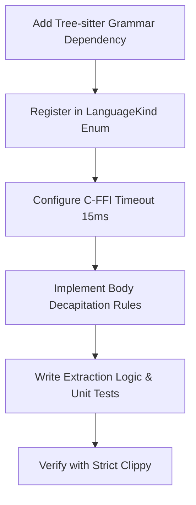

# MeshMCP Parser Engineering Skill

This skill guides you through extending and maintaining the syntax parsing and AST decapitation engine in `crates/mesh-parsers`.

---

## 1. Quick Navigation & Codebase References

- **AST Safety Guard**: [`crates/mesh-parsers/src/guard.rs`](../../../crates/mesh-parsers/src/guard.rs)
  - `AstGuard::verify_all_parsers()`: Grammar healthcheck
  - `AstGuard::check_file()`: 384 KB size check, 4 KB null sniffing, max line 1,024 bytes
  - `AstGuard::check_nesting_depth()`: Fast lexical scanner (max depth 64)
  - `BoundedMatch`: ReDoS cursor step limiter (10,000 steps)
- **Polyglot AST Decapitation**: [`crates/mesh-parsers/src/decapitate.rs`](../../../crates/mesh-parsers/src/decapitate.rs)
  - `AstDecapitator::decapitate()`: Byte-offset replacement engine
  - `AstDecapitator::collect_body_replacements()`: Grammar rules per language
- **Language Extractors**: [`crates/mesh-parsers/src/languages/`](../../../crates/mesh-parsers/src/languages/)
  - [`proto.rs`](../../../crates/mesh-parsers/src/languages/proto.rs): Protobuf service and RPC method extractor
  - [`java.rs`](../../../crates/mesh-parsers/src/languages/java.rs): Spring Boot `@GrpcService` and `@RestController`
  - [`go.rs`](../../../crates/mesh-parsers/src/languages/go.rs): Go `pb.Register*Server` and handler methods
  - [`python.rs`](../../../crates/mesh-parsers/src/languages/python.rs): FastAPI and gRPC servicer classes
  - [`typescript.rs`](../../../crates/mesh-parsers/src/languages/typescript.rs): NestJS and Node.js gRPC client invocations
  - [`rust_lang.rs`](../../../crates/mesh-parsers/src/languages/rust_lang.rs): Tonic gRPC services and public functions
  - [`mod.rs`](../../../crates/mesh-parsers/src/languages/mod.rs): AsyncAPI channels & OpenAPI paths from YAML

---

## 2. Core Workflow: Adding a New Language Parser

When extending MeshMCP to support a new language (e.g., C#, Kotlin, Swift, Scala):



### Step 1: Add Cargo Dependency
In `crates/mesh-parsers/Cargo.toml`:
```toml
tree-sitter-kotlin = "0.3"
```

### Step 2: Register Language Kind
In `crates/mesh-parsers/src/guard.rs`:
```rust
#[derive(Debug, Clone, Copy, PartialEq, Eq)]
pub enum LanguageKind {
    Java,
    Go,
    Python,
    TypeScript,
    Rust,
    Proto,
    Yaml,
    Kotlin, // <-- New language
}
```

### Step 3: Map Grammar Runtime
In `crates/mesh-parsers/src/guard.rs`:
```rust
pub fn get_tree_sitter_language(lang: LanguageKind) -> tree_sitter::Language {
    match lang {
        // ...
        LanguageKind::Kotlin => tree_sitter_kotlin::LANGUAGE.into(),
    }
}
```

### Step 4: Define AST Decapitation Grammar Rules
In `crates/mesh-parsers/src/decapitate.rs`:
```rust
LanguageKind::Kotlin if kind == "function_body" => {
    replacements.push((node.start_byte(), node.end_byte(), "{ /* stripped */ }"));
    return;
}
```

### Step 5: Unit Test Invariant
Ensure every new language parser includes a unit test verifying that implementation bodies are replaced while preserving the signature.

---

## 3. Mandatory Safety Invariants

1. **Hardware Timeout**: Every parser must invoke `ts_parser_set_timeout_micros(15_000)` before parsing.
2. **Lexical Depth Pre-Check**: Never parse an input whose brace nesting exceeds 64 depth to prevent C stack exhaustion.
3. **ReDoS Guard**: Bound all streaming query match iterations with a maximum step limit of 10,000.

---

## 4. In-Depth Reference

When advanced debugging of C-FFI lifetimes, streaming iterators, or grammar trees is required, consult:
👉 [`DEEPENING.md`](DEEPENING.md)
