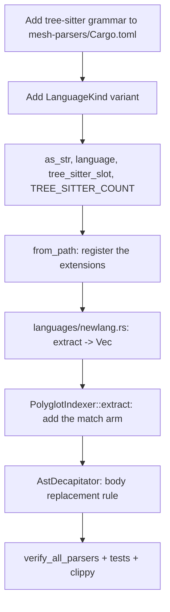

# MeshMCP Parser Engineering Skill

Everything syntax-related lives in `crates/mesh-parsers`. Supported languages today:
Java, Go, Python, TypeScript (also `.tsx`, `.js`), Rust, C++, Kotlin, C#, Ruby, PHP,
Swift, Scala, plus Protobuf and YAML handled without tree-sitter.

---

## 1. Quick Navigation & Codebase References

- **Safety guard**: [`crates/mesh-parsers/src/guard.rs`](../../../crates/mesh-parsers/src/guard.rs)
  - constants: `MAX_FILE_SIZE_BYTES = 384 * 1024`, `MAX_SCHEMA_FILE_SIZE_BYTES = 1536 * 1024`,
    `BINARY_SNIFF_LEN = 4096`, `MAX_LINE_LEN_BYTES = 1024`, `MAX_NESTING_DEPTH = 64`,
    `PARSER_TIMEOUT_MICROS = 15_000`, `QUERY_MATCH_LIMIT = 500`, `MAX_QUERY_STEPS = 10_000`
  - `is_contract_or_schema()`, `size_budget()`, `within_size_budget()`, `looks_binary()`
  - `should_parse_path()`, `should_parse()`, `should_parse_with_budget()`, `max_nesting_depth()`
  - `with_parser()` — thread-local parser cache, the normal path
  - `create_bounded_parser()` — the constructor behind it; `verify_all_parsers()`
  - `execute_bounded_query()`, `BoundedMatch<'tree>`, `ParserError`
- **Language kinds & decapitation**: [`crates/mesh-parsers/src/decapitate.rs`](../../../crates/mesh-parsers/src/decapitate.rs)
  - `LanguageKind { Java, Go, Python, TypeScript, Rust, Cpp, Kotlin, CSharp, Ruby, Php, Swift, Scala, Protobuf, Yaml, Unknown }`
  - `LanguageKind::TREE_SITTER_COUNT`, `as_str()`, `language()`, `from_path()`, `tree_sitter_slot()`
  - `AstDecapitator::decapitate_auto()`, `::decapitate()`, `BOUNDED_ERROR_STUB`
- **Extraction dispatch**: [`crates/mesh-parsers/src/languages/mod.rs`](../../../crates/mesh-parsers/src/languages/mod.rs)
  - `PolyglotIndexer::extract()`, `::extract_custom_patterns()`, `::index_file()`, `::apply_custom_patterns()`
  - `FileIndex`, `CompiledPattern`
- **Extractors**: [`proto.rs`](../../../crates/mesh-parsers/src/languages/proto.rs) (no tree-sitter),
  [`java.rs`](../../../crates/mesh-parsers/src/languages/java.rs),
  [`go.rs`](../../../crates/mesh-parsers/src/languages/go.rs),
  [`python.rs`](../../../crates/mesh-parsers/src/languages/python.rs),
  [`typescript.rs`](../../../crates/mesh-parsers/src/languages/typescript.rs),
  [`rust_lang.rs`](../../../crates/mesh-parsers/src/languages/rust_lang.rs),
  [`cpp.rs`](../../../crates/mesh-parsers/src/languages/cpp.rs),
  [`kotlin.rs`](../../../crates/mesh-parsers/src/languages/kotlin.rs),
  [`csharp.rs`](../../../crates/mesh-parsers/src/languages/csharp.rs),
  [`ruby.rs`](../../../crates/mesh-parsers/src/languages/ruby.rs),
  [`php.rs`](../../../crates/mesh-parsers/src/languages/php.rs),
  [`swift.rs`](../../../crates/mesh-parsers/src/languages/swift.rs),
  [`scala.rs`](../../../crates/mesh-parsers/src/languages/scala.rs)

---

## 2. The extractor contract

An extractor is a pure function that returns nodes; it never sees the graph.

```rust
pub fn extract(
    file_path: &Path,
    content: &str,
    repo_id: RepoId,
    parser: &mut Parser,
) -> Vec<ContractNode> {
    let file_path: FilePath = Arc::from(file_path);
    ...
}
```

Interning the path **once** per file into a `FilePath = Arc<Path>` and cloning the `Arc`
per node is mandatory (Commandment 1). `proto.rs` is the exception to the signature: it
takes no `Parser` because Protobuf is handled without a tree-sitter grammar.

`PolyglotIndexer::extract` wraps each extractor and folds the result into a `FileIndex`:

```rust
LanguageKind::Cpp => {
    if let Some(nodes) = AstGuard::with_parser(lang_kind, |parser| {
        cpp::CppExtractor::extract(file_path, content, repo_id, parser)
    }) {
        out.nodes = nodes;
    }
}
```

Relations are recorded as `(local node index, target)` pairs in `FileIndex.dependencies`,
`.producers`, `.consumers`, `.rpc_calls`, and become real edges only in `FileIndex::apply`.
This is what allows extraction to run in parallel — see
[`mesh-indexing-pipeline`](../mesh-indexing-pipeline/SKILL.md).

---

## 3. Parsers are cached per thread

```rust
pub fn with_parser<R>(lang_kind: LanguageKind, f: impl FnOnce(&mut Parser) -> R) -> Option<R> {
    thread_local! {
        static PARSERS: RefCell<[Option<Parser>; LanguageKind::TREE_SITTER_COUNT]> =
            const { RefCell::new([None, None, None, None, None, None, None, None]) };
    }
    ...
}
```

`Parser::new` + `set_language` is C-FFI allocation plus grammar binding; recreating one
per file on a large workspace is pure overhead. Rayon workers and the tokio blocking pool
each keep their own instance, so no locking is needed. `with_parser` returns `None` for a
language with no grammar, and calls `parser.reset()` after `f`, because a timed-out parse
leaves the parser mid-state.

**Do not call `create_bounded_parser` on the indexing path.** It is the constructor
`with_parser` uses, and is appropriate only for one-off checks like `verify_all_parsers`,
which builds one parser per grammar to prove the bindings load.

---

## 4. Adding a language



Use the C++ support as the worked example — `languages/cpp.rs` plus the `Cpp` variant is
exactly this change set.

**Step 1.** Add the grammar crate to `crates/mesh-parsers/Cargo.toml`.

**Step 2.** Add the variant to `LanguageKind` in `decapitate.rs` and update, in the same
file, all four of: `as_str()` (a `&'static str`, never `format!("{:?}").to_lowercase()`),
`language()`, `tree_sitter_slot()` and the `TREE_SITTER_COUNT` constant. The thread-local
array is sized by `TREE_SITTER_COUNT` and initialised with one `None` per slot — both must
grow together or you will index out of bounds.

**Step 3.** Register the extensions in `LanguageKind::from_path`, which matches on
suffixes. For reference, `Cpp` claims `.cpp .cc .cxx .hpp .hh .hxx .h`, and `TypeScript`
claims `.ts .tsx .js`. Order matters where suffixes overlap.

**Step 4.** Write `crates/mesh-parsers/src/languages/<lang>.rs` with an `extract`
following the contract in section 2, and add `pub mod <lang>;` at the top of
`languages/mod.rs`.

**Step 5.** Add the arm in `PolyglotIndexer::extract` wrapping the call in
`AstGuard::with_parser`.

**Step 6.** Add the body replacement rule in `AstDecapitator`, so signatures survive and
implementations do not.

**Step 7.** Add the grammar to `AstGuard::verify_all_parsers`, which `mesh-mcp doctor`
relies on, and write a unit test asserting that a body is stripped while the signature,
annotations and docstrings remain.

No change is needed in `crates/mesh-server/src/indexer.rs`: `process_file`'s `_` arm
already routes any unrecognised extension to `PolyglotIndexer::extract`. Do check
`FileWatcherService::is_relevant_path` so edits to the new extension trigger a reload.

---

## 5. Decapitation

```rust
pub fn decapitate_auto(content: &str, lang_kind: LanguageKind, include_body: bool) -> String
```

- `include_body == true` returns the content unchanged.
- `Protobuf` and `Yaml` are returned unchanged — they are declarations already.
- `Unknown` returns the content if it is 1024 bytes or shorter, else `BOUNDED_ERROR_STUB`.
- Everything else goes through `with_parser` and `decapitate`, falling back to
  `BOUNDED_ERROR_STUB` when no parser is available or the parse fails.

`BOUNDED_ERROR_STUB` is a fixed one-line comment; it is what a caller sees on a parser
timeout, and it is deliberately short so a failed parse cannot cost context.

Replacement is done by byte range, never by character index: tree-sitter reports
`node.start_byte()` / `node.end_byte()`, and indexing a UTF-8 string by character count is
a panic waiting for the first non-ASCII identifier. `collect_body_replacements` gathers
`(start_byte, end_byte, Cow<'static, str>)` triples, which are then applied **bottom-up**
so earlier offsets stay valid.

`collect_body_replacements` takes a `depth: usize` parameter, capped at
`AstGuard::MAX_NESTING_DEPTH`, incremented on every recursive call into a child node —
past the cap it stops recursing into that subtree rather than stripping it. This is a
**separate** guard from `AstGuard::max_nesting_depth`'s pre-parse lexical bracket count:
that one is a proxy over raw bytes and can be passed by a file whose real tree-sitter CST
is still hundreds of levels deep (long chained calls / generics / match arms add no
brackets), which previously native-stack-overflowed this exact recursive walk. If you add
a language-specific recursive AST walker anywhere in `mesh-parsers`, thread the same
`depth` cap through it — `AstGuard`'s lexical check alone is not sufficient protection.

```rust
// Sort replacements in reverse order of start byte to apply bottom-up.
// For identical start bytes (e.g. insertion at start of body), sort by end byte descending.
replacements.sort_by(|a, b| b.0.cmp(&a.0).then_with(|| b.1.cmp(&a.1)));

let mut result = content.to_string();
for (start_byte, end_byte, replacement) in replacements {
    if start_byte < result.len() && end_byte <= result.len() && start_byte <= end_byte {
        result.replace_range(start_byte..end_byte, &replacement);
    }
}
```

An empty `replacements` vector short-circuits to `content.to_string()`.

---

## 6. Mandatory safety invariants (Commandment 2)

1. **Size before read.** `AstGuard::within_size_budget(path, &metadata)` is a stat-only
   check callers run *before* `fs::read`. The budget is path-aware:
   `MAX_SCHEMA_FILE_SIZE_BYTES` (1.5 MB) for contracts and generated stubs recognised by
   `is_contract_or_schema` (`.proto`, `.pb.go`, `.pb.ts`, `_pb2.py`, `.pb.rs`,
   `openapi.yaml|json`, `asyncapi.yaml|json`, `*outerclass.java`), `MAX_FILE_SIZE_BYTES`
   (384 KB) otherwise.
2. **Lexical pre-check.** `should_parse_path` rejects, in order: over budget, a null byte
   in the first `BINARY_SNIFF_LEN` bytes, any line over `MAX_LINE_LEN_BYTES`, and nesting
   deeper than `MAX_NESTING_DEPTH`. The depth scan runs before tree-sitter's C runtime is
   touched, because a deeply nested payload overflows the native stack and kills the
   process. `max_nesting_depth` is context-aware: brackets inside strings and comments do
   not count, and there is a test pinning that.
3. **C-FFI timeout.** `create_bounded_parser` sets
   `parser.set_timeout_micros(Self::PARSER_TIMEOUT_MICROS)` (15 ms) on construction, so
   every parser obtained through `with_parser` is already bounded.
4. **Bounded queries.** `execute_bounded_query` sets
   `cursor.set_match_limit(Self::QUERY_MATCH_LIMIT)` (500) and additionally counts
   iterations, breaking at `MAX_QUERY_STEPS` (10 000) with a `mesh::parser` warning. Never
   drive a `QueryCursor` directly from an extractor; go through this function.

Non-tree-sitter inputs (Markdown, YAML, `.properties`) get only `looks_binary` — prose
legitimately exceeds `MAX_LINE_LEN_BYTES`. That branch lives in
`WorkspaceIndexer::process_file`.

---

## 7. In-depth reference

Streaming-iterator lifetimes, the `BoundedMatch` workaround, and the byte-range splice
algorithm: [`DEEPENING.md`](DEEPENING.md).
