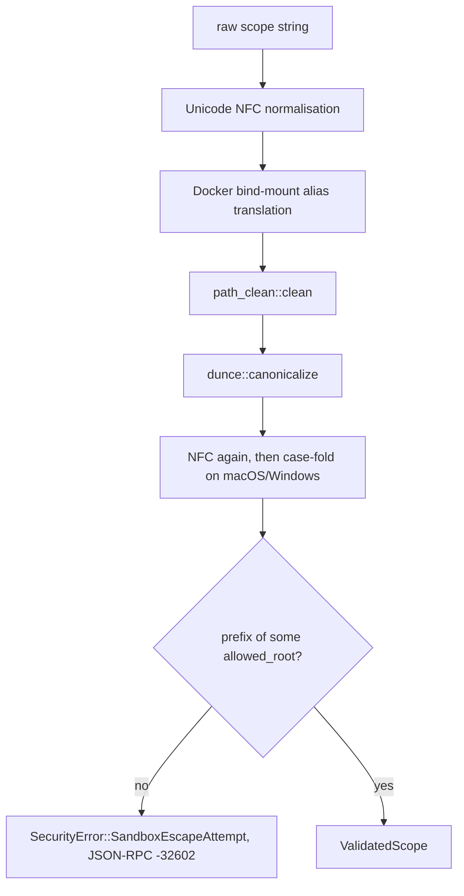

# MeshMCP Security & Governance Skill

Four separate mechanisms, often confused with each other:

| Mechanism | Enforced where | Status |
| --- | --- | --- |
| `ValidatedScope` sandbox | every tool taking a path | enforced at runtime |
| Secret redaction | `PropertyRegistry` at index time | enforced at runtime |
| Audit chain | `ToolRegistry::invoke` after every call | enforced at runtime |
| RSAH governance refusal (`evaluate_guard`) | git pre-commit hook only | **not** called by any MCP tool |
| `[engines.policy.skills]` hint (`recommend_skill`) | `ToolRegistry::invoke` | wired, see section 4 |

---

## 1. Quick Navigation & Codebase References

- **Sandbox jail**: [`crates/mesh-core/src/security.rs`](../../../crates/mesh-core/src/security.rs)
  - `ValidatedScope::resolve(raw_scope, allowed_roots)`, `::resolve_with_aliases(.., mount_aliases)`
  - `ValidatedScope::validate_file_access()`, `::as_path()`, `::into_path_buf()`
  - `SecurityError { SandboxEscapeAttempt, PathNotFound, BrokenSymlink, ProhibitedRoot, NormalizationFailed }`,
    `SecurityError::jsonrpc_code()` → `-32602`
  - `to_nfc_path()` — Unicode NFC normalisation helper
- **Crawl invariant**: [`crates/mesh-core/src/crawler.rs`](../../../crates/mesh-core/src/crawler.rs)
  (`follow_links(false)`, `.git` always excluded, `ExcludeMatcher` pruning directories)
- **Secret redaction**: [`crates/mesh-core/src/properties.rs`](../../../crates/mesh-core/src/properties.rs)
  - `PropertyRegistry::SECRET_PATTERNS`, `::REDACTED_PLACEHOLDER`
  - `::insert_sanitized()`, `::resolve_placeholder()`, `::ingest_properties_str()`,
    `::ingest_yaml_str()`, `::merge()`, `::redacted_count()`
- **Governance**: [`crates/mesh-core/src/governance.rs`](../../../crates/mesh-core/src/governance.rs)
  - `GovernanceEngine::new(stop_rules, skills)`, `::is_empty()`
  - `::evaluate_guard(target_or_scope) -> Option<RsahResponse>`
  - `::get_skill_path(tool_or_key)`, `::recommend_skill(tool, subject)`, `::skills()`
  - `RsahResponse { status, policy, violation, required_workflow, agent_next_action, message_to_user }`, `RsahWorkflow`
- **Audit chain**: [`crates/mesh-core/src/audit.rs`](../../../crates/mesh-core/src/audit.rs)
  - `AuditLogger::new(Option<PathBuf>)`, `::new_in_memory()`, `::default_db_path()`, `::log_path()`
  - `::record_entry()`, `::verify_db()`, `::verify_log_file()` (alias), `::export_to_jsonl()`
  - `::compute_sha256()`, `GENESIS_HASH`, `AuditEntry`
- **Git hook**: [`crates/mesh-server/src/cli/hooks.rs`](../../../crates/mesh-server/src/cli/hooks.rs) (`HooksCommand::run`)
- **Doctor**: [`crates/mesh-server/src/cli/doctor.rs`](../../../crates/mesh-server/src/cli/doctor.rs)
- **Prompt-injection sanitising of docs**: [`crates/mesh-core/src/docs.rs`](../../../crates/mesh-core/src/docs.rs) (`DocIndex::sanitize_prompt_injections`)

---

## 2. The jail (Commandment 4)



`resolve` delegates to `resolve_with_aliases` with an empty alias map. Canonicalisation
failure is `PathNotFound`, not a silent pass — a non-existent path never reaches a reader.

Rules:

1. Never accept a raw `&str` or `PathBuf` in a query engine or crawler. Take a
   `&ValidatedScope`:

   ```rust
   let validated_scope = ValidatedScope::resolve(args.scope.as_str(), &state.allowed_roots)
       .map_err(|e| (e.jsonrpc_code(), e.to_string()))?;
   ```

2. Every path failure is JSON-RPC `-32602`. `SecurityError::jsonrpc_code()` returns it for
   all variants — do not invent per-variant codes.
3. `follow_links(false)` on every filesystem walk. `dunce::canonicalize` resolves symlinks
   to their target *before* the prefix check, so a link pointing outside the roots fails
   `starts_with`.
4. `validate_file_access` is the per-file check: it takes `symlink_metadata` first so a
   broken symlink reports `BrokenSymlink` rather than `PathNotFound`, then canonicalises
   and re-runs `resolve`.
5. Comparison is case-folded on macOS and Windows only, under
   `#[cfg(any(target_os = "windows", target_os = "macos"))]`. Do not "simplify" that into
   an unconditional `to_lowercase()`: on Linux, `/srv/App` and `/srv/app` are genuinely
   different directories and folding them would *widen* the jail.

---

## 3. Secret redaction (Commandment 5)

Redaction happens at **index** time, in `PropertyRegistry::insert_sanitized`, not at
render time:

```rust
let lower_key = key.to_lowercase();
let is_sensitive = Self::SECRET_PATTERNS
    .iter()
    .any(|&pattern| lower_key.contains(pattern));

let sanitized_value = if is_sensitive {
    self.redacted_count += 1;
    CompactStr::new(Self::REDACTED_PLACEHOLDER)
} else {
    CompactStr::new(raw_val)
};
```

`SECRET_PATTERNS` matches on the **key name** — `password`, `secret`, `token`,
`credential`, `key`, `auth`, `private`, `jwt`, `apikey`, `cert`, `passphrase` — so the raw
value is never stored in the registry at all. `REDACTED_PLACEHOLDER` is
`[REDACTED_SECRET: USE_ENV_OR_LOCAL_FALLBACK]`: it tells the agent to use an env var or a
local fallback instead of hunting for the real value.

`resolve_placeholder` handles Spring-style `${key:default}`. When the key is unknown and
the default would be returned, it re-checks the key against `SECRET_PATTERNS` and returns
the placeholder instead — a default password in a config file is still a password.

`redacted_count()` is what tools report as `ToolOutput.secrets_redacted`, which the audit
row records. Per-file registries are built in parallel and folded with `merge`, which sums
the counts.

Adding a new source of properties means routing it through `insert_sanitized`. Inserting
into `flat_properties` directly bypasses redaction entirely.

---

## 4. Governance: what actually runs

### 4.1 RSAH refusals are not enforced by the MCP tools

`GovernanceEngine::evaluate_guard(target_or_scope)` lowercases its input, tests it against
each `[engines.policy.stop_rules]` key by substring, and returns a fully-formed
`RsahResponse` (status `GOVERNANCE_BLOCKED`, a four-step `required_workflow`,
`agent_next_action: "STOP_AND_REPORT_TO_USER"`, and a user-facing message). It has
special-cased envelopes for `proto-registry` (policy `CONTRACT_FIRST_CASCADE_CI`) and
`k8s-infrastructure` (`INFRASTRUCTURE_AS_CODE_REVIEW`), plus a generic fallback.

**No MCP tool calls it.** The only non-test caller in the tree is none; the integration
test `test_governance_rsah_trigger_on_mutation` calls it directly on `state.governance`.
This is deliberate and documented in `smart_search`:

```rust
// Note: smart_search is a read-only discovery tool. Read access to guarded contract
// scopes (such as proto-registry) is permitted so agents can inspect schemas and signatures.
// Active governance (RSAH) is reserved for mutations and commit verification.
```

The enforcement that actually bites is the OS-level git hook installed by
`mesh-mcp install-hooks` (`HooksCommand::run`): a `.git/hooks/pre-commit` script, mode
`0755`, that fails the commit when staged files touch both `proto-registry/` or `proto/`
and `services/` or `api-gateway/`. MeshMCP's tools are read-only; the commit boundary is
where a mutation can be stopped.

If you wire `evaluate_guard` into a tool, say so in that tool's `DESCRIPTION` and update
this section — a refusal an agent cannot predict is worse than none.

### 4.2 Skill hints: key = tool name, or path fragment

`GovernanceEngine::recommend_skill(tool, subject)` is called from `ToolRegistry::invoke`
on every successful tool call, and appends a `Project skill for this area` footer naming
the configured file. The convention:

```toml
[engines.policy.skills]
"smart_search"   = ".agents/skills/mesh-performance-invariants/SKILL.md"  # exact tool name
"proto-registry" = ".agents/skills/mesh-graph-reconciliation/SKILL.md"    # path fragment
```

Resolution order, from the function's own doc comment: an exact match on the MCP tool name
(`McpTool::NAME`) wins outright; otherwise the lowercased subject
(`McpTool::subject(args)` — `scope` for `smart_search`, `target` for the graph tools) is
searched for each key as a substring, and the **longest matching key wins**, so a specific
rule beats a generic one regardless of `HashMap` iteration order. This is the same
matching shape as `[engines.policy.stop_rules]`.

Relative paths are resolved against the config file's directory by
`Config::resolve_skill_paths(base_dir)`, called from `WorkspaceIndexer::discover_config`,
because the server is spawned by an IDE with an arbitrary working directory; a relative
path that resolves nowhere is left verbatim so `doctor` reports what was actually written.

A configured path that does not exist silently never fires — the footer is only rendered
for a path that reads. `mesh-mcp doctor` validates every entry against disk and names the
missing ones; run it after editing the table. `GovernanceEngine::skills()` is the iterator
doctor uses.

Note that the checked-in `mesh-mcp.toml` at the repo root still points at a path that does
not exist in this tree; treat `doctor`'s output as the source of truth, not the file.

---

## 5. Audit: SQLite, not a text log

The audit trail is a **SQLite database in WAL mode**, not an append-only text file. The
naming is historical: `default_log_path()` is an alias for `default_db_path()`, which is
`~/.cache/mesh-mcp/audit.db` (falling back to the temp dir), and `verify_log_file()` is an
alias for `verify_db()`.

- The parent directory is created `0700` and the database file `0600` on Unix.
- `busy_timeout` is 5 s, `journal_mode = WAL`, `synchronous = NORMAL`; one table,
  `audit_entries`, keyed by `entry_seq INTEGER PRIMARY KEY` (the rowid).
- `record_entry` opens a `TransactionBehavior::Immediate` transaction so concurrent
  processes serialise, reads the committed tail from SQLite rather than from RAM (another
  process may share the DB), and chains:

  ```rust
  // Hash_n = SHA256(Hash_{n-1} || Timestamp || SessionId || Tool || Digest)
  let hash_input = format!("{prev_hash}{timestamp}{session_id}{tool}{args_digest}");
  let entry_hash = Self::compute_sha256(hash_input.as_bytes());
  ```

  `args_digest` is `SHA256(args_json)`, so the arguments are committed to without being
  stored verbatim. The first entry uses `GENESIS_HASH` (64 zeros) and `seq = 0`.
- `verify_db` replays the chain; `export_to_jsonl` dumps entries for compliance tooling.

Because the whole args struct is serialised into `args_json` before digesting, never put a
secret or a file body in a tool argument.

---

## 6. In-depth reference

Case-folding and symlink attack detail, and how to verify a chain by hand:
[`DEEPENING.md`](DEEPENING.md).
