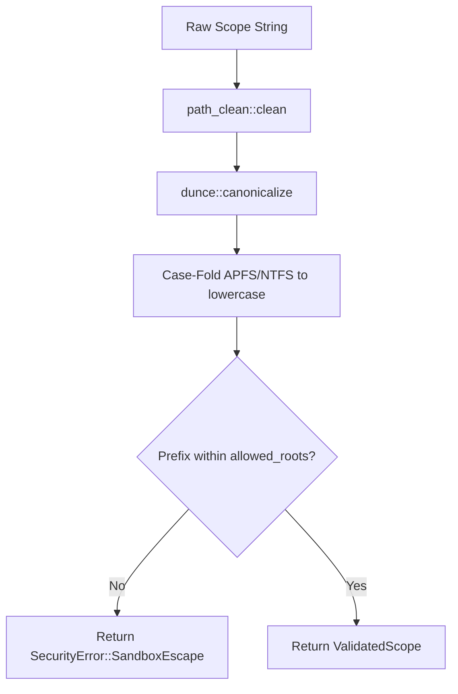

# MeshMCP Security & Governance Skill

This skill guides you through maintaining and enforcing the security boundaries, active governance, and cryptographic audit invariants in MeshMCP.

---

## 1. Quick Navigation & Codebase References

- **Security Boundary & Jail**: [`crates/mesh-core/src/security.rs`](file:///Users/victoragahi/Developer/causalmesh/crates/mesh-core/src/security.rs)
  - `ValidatedScope::resolve()`: Normalization, Dunce canonicalization, and boundary check
  - `SecurityError`: Sandbox breakout, symlink traversal, not found
- **Secret Redaction Engine**: [`crates/mesh-core/src/properties.rs`](file:///Users/victoragahi/Developer/causalmesh/crates/mesh-core/src/properties.rs)
  - `PropertyRegistry::load_file()`: Properties & YAML flattening
  - `PropertyRegistry::redact_secrets()`: Regex masking of AWS keys, JWTs, private keys, API secrets
  - `[REDACTED_SECRET: USE_ENV_OR_LOCAL_FALLBACK]`: Testing fallback guidance
- **Governance & RSAH**: [`crates/mesh-core/src/governance.rs`](file:///Users/victoragahi/Developer/causalmesh/crates/mesh-core/src/governance.rs)
  - `GovernanceEngine::check_scope()`: Checks path against `[engines.policy.stop_rules]`
  - `GovernanceEngine::generate_rsah_refusal()`: Returns structured handoff envelope
- **Cryptographic Audit**: [`crates/mesh-core/src/audit.rs`](file:///Users/victoragahi/Developer/causalmesh/crates/mesh-core/src/audit.rs)
  - `AuditLogger::log()`: SHA-256 hash chaining
  - Mode `0600` POSIX permission verification
- **Physical Git Pre-Commit Hook**: [`crates/mesh-server/src/cli/hooks.rs`](file:///Users/victoragahi/Developer/causalmesh/crates/mesh-server/src/cli/hooks.rs)
  - Installs `.git/hooks/pre-commit` (mode `0755`) to prevent unauthorized cross-service commits

---

## 2. Core Workflow: Resolving Scopes & Jailing



### Invariant:
**Never** accept or pass a raw `&str` or `PathBuf` to file readers or crawlers. Always require a `&ValidatedScope`:
```rust
let scope = ValidatedScope::resolve(raw_scope, &allowed_roots)
    .map_err(|e| jsonrpc_err(-32602, e.to_string()))?;
```

---

## 3. Core Workflow: Active Governance & RSAH

When an agent calls an MCP tool targeting a path listed in `mesh-mcp.toml` under `[engines.policy.stop_rules]`:

```rust
if let Some(rule) = governance.check_scope(&scope) {
    let rsah_payload = governance.generate_rsah_refusal(&scope, rule);
    return Ok(jsonrpc_success(id, rsah_payload));
}
```

The payload instructs the agent's Chain-of-Thought:
1. State the architectural reason for the stop rule.
2. Formulate the recommended handoff message for the user.
3. Halt autonomous modification of the contract repository.

---

## 4. In-Depth Reference

When advanced auditing of TOCTOU symlink races, case-insensitivity bypasses, or SHA-256 hash verification is required, consult:
👉 [`DEEPENING.md`](DEEPENING.md)
