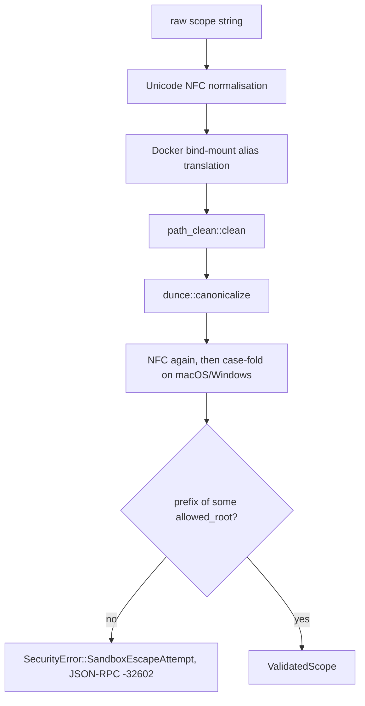

# MeshMCP Security & Governance Skill

Six separate mechanisms, often confused with each other:

| Mechanism | Enforced where | Status |
| --- | --- | --- |
| `ValidatedScope` jail | every tool taking a path | enforced at runtime |
| Secret redaction | `PropertyRegistry` at index time, and `smart_search` snippet lines | enforced at runtime, key-name based |
| Audit chain (v2, 8-field) | `ToolRegistry::invoke` after every call, including refused/invalid calls; gated by `[engines.policy] cryptographic_audit_trail` | enforced at runtime |
| RSAH refusal (`evaluate_guard`) | `ToolRegistry::invoke` before `run`, when `McpTool::mutates(&args)` is `true` (no shipped tool) **or** `read_governance_mode = "enforce_refusal"`; `audit_warn` only logs | wired; inactive under the default `allow_all` |
| Git pre-commit hook | `mesh-mcp install-hooks` → `.git/hooks/pre-commit`, built from `[engines.contracts.grpc] proto_dirs` (not from stop rules) | opt-in |
| `meshd` network sandbox | `crates/mesh-daemon/src/sandbox.rs`, Linux seccomp after the socket is bound | enforced on Linux, best-effort unless `MESH_DAEMON_SANDBOX=required` |
| `[engines.policy.skills]` note (`recommend_skill`) | `ToolRegistry::invoke` | wired, see section 4 |

---

## 1. Quick Navigation & Codebase References

- **Sandbox jail**: [`crates/mesh-core/src/security.rs`](../../../crates/mesh-core/src/security.rs)
  - `ValidatedScope::resolve(raw_scope, allowed_roots)`, `::resolve_with_aliases(.., mount_aliases)`
  - `ValidatedScope::validate_file_access()`, `::as_path()`, `::into_path_buf()`
  - `SecurityError { SandboxEscapeAttempt, PathNotFound, BrokenSymlink, ProhibitedRoot, NormalizationFailed }`,
    `SecurityError::jsonrpc_code()` → `-32602`
  - `to_nfc_path()` — Unicode NFC normalisation helper
- **Crawl invariant**: [`crates/mesh-core/src/crawler.rs`](../../../crates/mesh-core/src/crawler.rs)
  (`follow_links(false)`, `.git` always excluded, `ExcludeMatcher` pruning directories)
- **Secret redaction**: [`crates/mesh-core/src/properties.rs`](../../../crates/mesh-core/src/properties.rs)
  - `PropertyRegistry::SECRET_PATTERNS`, `::REDACTED_PLACEHOLDER`
  - `::insert_sanitized()`, `::resolve_placeholder()`, `::ingest_properties_str()`,
    `::ingest_yaml_str()`, `::merge()`, `::redacted_count()`
- **Governance**: [`crates/mesh-core/src/governance.rs`](../../../crates/mesh-core/src/governance.rs)
  - `GovernanceEngine::new(stop_rules, skills, read_governance_mode)`, `::is_empty()`,
    `::read_governance_mode()`
  - `::evaluate_guard(target_or_scope) -> Option<RsahResponse>`
  - `::get_skill_path(tool_or_key)`, `::recommend_skill(tool, subject)`, `::skills()`
  - `RsahResponse { status, policy, violation, required_workflow, agent_next_action, message_to_user }`, `RsahWorkflow`
- **Audit chain**: [`crates/mesh-core/src/audit.rs`](../../../crates/mesh-core/src/audit.rs)
  - `AuditLogger::new(Option<PathBuf>)`, `::new_in_memory()`, `::default_db_path()`, `::log_path()`
  - `::record_entry()`, `::verify_db()`, `::verify_log_file()` (alias), `::export_to_jsonl()`,
    `::read_entries(path, since_epoch_secs)` (read-only, backs `mesh-mcp stats`)
  - `::compute_sha256()`, `GENESIS_HASH`, `CHAIN_VERSION`, `AuditEntry { .., chain_version }`
- **Governance gate in tool dispatch**: [`crates/mesh-server/src/tools/mod.rs`](../../../crates/mesh-server/src/tools/mod.rs)
  - `McpTool::mutates()`, `GOVERNANCE_BLOCKED_CODE = -32001`, the check inside `ToolRegistry::invoke`
- **Git hook**: [`crates/mesh-server/src/cli/hooks.rs`](../../../crates/mesh-server/src/cli/hooks.rs) (`HooksCommand::run`, `build_hook_script`)
- **Daemon sandbox**: `crates/mesh-daemon/src/sandbox.rs` (`apply_after_bind`, `confine_network`,
  `POLICY_ENV = "MESH_DAEMON_SANDBOX"`); documented in `docs/architecture.md` §8.3
- **Doctor**: [`crates/mesh-server/src/cli/doctor.rs`](../../../crates/mesh-server/src/cli/doctor.rs)
- **Prompt-injection sanitising of docs**: [`crates/mesh-core/src/docs.rs`](../../../crates/mesh-core/src/docs.rs) (`DocIndex::sanitize_prompt_injections`)

---

## 2. The jail (Commandment 4)


```mermaid
graph TD
    A[raw scope string] --> B[Unicode NFC normalisation]
    B --> C[Docker bind-mount alias translation]
    C --> D[path_clean::clean]
    D --> E[dunce::canonicalize]
    E --> F[NFC again, then case-fold on macOS/Windows]
    F --> G{prefix of some allowed_root?}
    G -->|no| H[SecurityError::SandboxEscapeAttempt, JSON-RPC -32602]
    G -->|yes| I[ValidatedScope]
```

`resolve` delegates to `resolve_with_aliases` with an empty alias map. Canonicalisation
failure is `PathNotFound`, not a silent pass — a non-existent path never reaches a reader.

Rules:

1. Never accept a raw `&str` or `PathBuf` in a query engine or crawler. Take a
   `&ValidatedScope`:

   ```rust
   let validated_scope = ValidatedScope::resolve(args.scope.as_str(), &state.allowed_roots)
       .map_err(|e| (e.jsonrpc_code(), e.to_string()))?;
   ```

2. Every path failure is JSON-RPC `-32602`. `SecurityError::jsonrpc_code()` returns it for
   all variants — do not invent per-variant codes.
3. `follow_links(false)` on every filesystem walk. `dunce::canonicalize` resolves symlinks
   to their target *before* the prefix check, so a link pointing outside the roots fails
   `starts_with`.
4. `validate_file_access` is the per-file check: it takes `symlink_metadata` first so a
   broken symlink reports `BrokenSymlink` rather than `PathNotFound`, then canonicalises
   and re-runs `resolve`.
5. Comparison is case-folded on macOS and Windows only, under
   `#[cfg(any(target_os = "windows", target_os = "macos"))]`. Do not "simplify" that into
   an unconditional `to_lowercase()`: on Linux, `/srv/App` and `/srv/app` are genuinely
   different directories and folding them would *widen* the jail.

---

## 3. Secret redaction (Commandment 5)

Redaction happens at **index** time, in `PropertyRegistry::insert_sanitized`:

```rust
let is_sensitive = self.is_sensitive_key(key);
let sanitized_value = if is_sensitive {
    CompactStr::new(Self::REDACTED_PLACEHOLDER)
} else {
    CompactStr::new(raw_val)
};
self.raw_values.insert(CompactStr::new(key), CompactStr::new(raw_val));
self.flat_properties.insert(CompactStr::new(key), sanitized_value);
```

`is_sensitive_key` matches on the **key name**: any of `SECRET_PATTERNS` (`password`, `secret`,
`token`, `credential`, `passphrase`, `private`, `jwt`, `cert`, `apikey`, `api_key`, `api-key`,
`secret_key`, `access_key`, `signing_key`, `auth_token`) as a substring, plus key-like suffixes
(`.key`, `_key`, `-key`, ...). It returns `false` for everything when
`[engines.contracts.spring] auto_redact_secrets = false`. The raw value is kept in memory in
`raw_values` (placeholder resolution needs it) but only `flat_properties`, the masked view, is
ever read for output; `resolve_all_placeholders` never re-reads a redacted key's raw value. `REDACTED_PLACEHOLDER` is
`[REDACTED_SECRET: USE_ENV_OR_LOCAL_FALLBACK]`: it tells the agent to use an env var or a
local fallback instead of hunting for the real value.

`resolve_placeholder` handles Spring-style `${key:default}`. When the key is unknown and
the default would be returned, it re-checks the key against `SECRET_PATTERNS` and returns
the placeholder instead — a default password in a config file is still a password.

`redacted_count()` counts masked values in `flat_properties`; tools report it as
`ToolOutput.secrets_redacted`, which the audit row records. Per-file registries are built in
parallel and folded with `merge`.

`smart_search` returns raw source snippets, so it applies the same key test line by line
(`SmartSearchTool::redact_sensitive_line`): a `key: value` / `key = value` line whose key is
sensitive has its value replaced by the placeholder. A secret held by an innocuously named key,
or embedded in a code string literal, is not detected by either mechanism.

Adding a new source of properties means routing it through `insert_sanitized`. Inserting
into `flat_properties` directly bypasses redaction entirely.

---

## 4. Governance: what actually runs

### 4.1 RSAH in `ToolRegistry::invoke`

`GovernanceEngine::evaluate_guard(target_or_scope)` lowercases its input and matches each
`[engines.policy.stop_rules]` key as a **whole path segment** (`has_path_segment`, splitting on
`/` and `\`): `proto` matches `proto/x.proto`, not `internal/prototype/x.go`. On a hit it returns
a `RsahResponse` (status `GOVERNANCE_BLOCKED`, a four-step `required_workflow`,
`agent_next_action: "STOP_AND_REPORT_TO_USER"`, a user-facing message). The envelope depends on
the key: containing `proto` → `CONTRACT_FIRST_CASCADE_CI`; `k8s`, `infra` or `deploy` →
`INFRASTRUCTURE_AS_CODE_REVIEW`; otherwise `ACTIVE_GOVERNANCE_POLICY`.

Right after parsing args, `ToolRegistry::invoke` does (simplified):

```rust
let is_mutating = T::mutates(&args);
let mode = state.governance.read_governance_mode();
if is_mutating || mode != ReadGovernanceMode::AllowAll {
    if let Some(subject) = T::subject(&args) {
        if let Some(rsah) = state.governance.evaluate_guard(subject) {
            if is_mutating || mode == ReadGovernanceMode::EnforceRefusal {
                // audited as ERROR, then:
                return Ok(Err((GOVERNANCE_BLOCKED_CODE, serde_json::to_string(&rsah)?)));
            } else if mode == ReadGovernanceMode::AuditWarn {
                tracing::warn!(target: "mesh::security", /* ... */);
            }
        }
    }
}
```

`GOVERNANCE_BLOCKED_CODE` is `-32001`; like every tool failure it reaches the client as an
`isError: true` result carrying the RSAH JSON, not as a JSON-RPC error. Every shipped tool leaves
`mutates()` at `false`, so under the default `read_governance_mode = "allow_all"` nothing is
ever refused. The path is covered by `test_invoke_blocks_mutating_call_on_guarded_subject`
(`crates/mesh-server/src/tools/mod.rs`).

The Git hook is a separate mechanism: `mesh-mcp install-hooks` (`HooksCommand::run`, gated by
`[engines.policy] enforce_git_hooks`) writes a `0755` `.git/hooks/pre-commit` generated by
`build_hook_script` from `[engines.contracts.grpc] proto_dirs`. It fails a commit that stages
both a `.proto` under those directories and a source file (`.go`, `.rs`, `.java`, `.kt`, `.ts`,
`.tsx`, `.py`, `.cpp`, `.cs`, `.php`, `.rb`, `.swift`, `.scala`). With no `proto_dirs` it
checks nothing. It does not read `stop_rules`.

If you add a tool that mutates something, override `mutates()` to `true` for the args that do,
say so in that tool's `DESCRIPTION`, and add an integration test proving the refusal fires
through the real `invoke` path — a refusal an agent cannot predict is worse than none.

### 4.2 Skill hints: key = tool name, or path fragment

`GovernanceEngine::recommend_skill(tool, subject)` is called from `ToolRegistry::invoke`
on every successful tool call, and inserts a `Project skill for this area` note naming the
configured file at the start of the output (not for JSON/HTML documents). The convention:

```toml
[engines.policy.skills]
"smart_search"   = ".agents/skills/mesh-performance-invariants/SKILL.md"  # exact tool name
"proto-registry" = ".agents/skills/mesh-graph-reconciliation/SKILL.md"    # path fragment
```

Resolution order, from the function's own doc comment: an exact match on the MCP tool name
(`McpTool::NAME`) wins outright; otherwise the lowercased subject
(`McpTool::subject(args)` — `scope` for `smart_search`, `target` for the graph tools) is
searched for each key as a substring, and the **longest matching key wins**, so a specific
rule beats a generic one regardless of `HashMap` iteration order. (Stop rules differ: they
match whole path segments.)

Relative paths are resolved against the config file's directory by
`Config::resolve_skill_paths(base_dir)`, called from `WorkspaceIndexer::discover_config`,
because the server is spawned by an IDE with an arbitrary working directory; a relative
path that resolves nowhere is left verbatim so `doctor` reports what was actually written.

A configured path that does not exist still produces the note, but without a title, and the
agent is pointed at a missing file. `mesh-mcp doctor` validates every entry against disk and names the
missing ones; run it after editing the table. `GovernanceEngine::skills()` is the iterator
doctor uses.

---

## 5. Audit: SQLite, not a text log

The audit trail is a **SQLite database in WAL mode**, not an append-only text file. The
naming is historical: `default_log_path()` is an alias for `default_db_path()`, which is
`~/.cache/mesh-mcp/audit.db` (falling back to the temp dir), and `verify_log_file()` is an
alias for `verify_db()`.

- The parent directory is created `0700` and the database file `0600` on Unix.
- `busy_timeout` is 5 s, `journal_mode = WAL`, `synchronous = NORMAL`; one table,
  `audit_entries`, keyed by `entry_seq INTEGER PRIMARY KEY` (the rowid).
- `record_entry` opens a `TransactionBehavior::Immediate` transaction so concurrent
  processes serialise, reads the committed tail from SQLite rather than from RAM (another
  process may share the DB), and chains (chain v2 — see below for why a version exists):

  ```rust
  // Hash_n = SHA256(Hash_{n-1} || Timestamp || SessionId || Tool || Digest
  //                 || Status || FilesAccessed || SecretsRedactedCount)
  let hash_input = format!(
      "{prev_hash}{timestamp}{session_id}{tool}{args_digest}{status}{files_json}{secrets_redacted_count}"
  );
  let entry_hash = Self::compute_sha256(hash_input.as_bytes());
  ```

  `args_digest` is `SHA256(args_json)`, so the arguments are committed to without being
  stored verbatim. The first entry uses `GENESIS_HASH` (64 zeros) and `seq = 0`.
- Every row carries a `chain_version` column. The original (v1) formula covered only the first
  five fields, which let `status`, `files_accessed` and `secrets_redacted_count` be tampered
  with in the row without breaking the chain — v2 folds those three in. `verify_db` dispatches
  the hash formula **per row** based on its own `chain_version`, so a database written before
  v2 existed keeps verifying under the original five-field formula instead of every historical
  entry being rejected the moment the binary upgrades. New writes always use v2
  (`AuditLogger::CHAIN_VERSION`). If you add another stored field that should be tamper-evident,
  bump `CHAIN_VERSION` again and add a new match arm in `verify_db` — never change what an
  existing version number means.
- Calls refused before `run` (invalid arguments, RSAH refusals) are recorded too, with status
  `ERROR` (`ToolRegistry::record_refusal`).
- Three metrics tables sit next to `audit_entries`, **outside** the hash chain:
  `tool_call_metrics` (latency per audited call, `record_tool_latency`),
  `index_cache_metrics` and `process_starts`. `mesh-mcp stats` reads them; `verify_db` ignores
  them.
- `verify_db` replays the chain (also run by `mesh-mcp doctor`, which never repairs the audit
  database); `export_to_jsonl` dumps entries for compliance tooling;
  `read_entries` (read-only, `SQLITE_OPEN_READ_ONLY`) backs `mesh-mcp stats` and never mutates
  the file or its `0600` permissions.

Because the whole args struct is serialised into `args_json` before digesting, never put a
secret or a file body in a tool argument.

---

## 6. In-depth reference

Case-folding and symlink attack detail, and how to verify a chain by hand:
[`DEEPENING.md`](DEEPENING.md).
