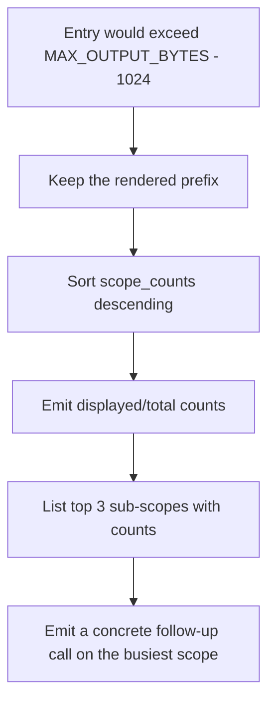

# DEEPENING: Stdio Actor Mechanics, Drain Barriers & Truncation Affordance

Deep reference for the `mesh-stdio-protocol` skill. Read the skill first.

---

## 1. Two tasks, two bounded channels

`StdioFramingActor::spawn` creates both directions up front:

```rust
let (tx_in, rx_in) = mpsc::channel::<String>(MPSC_BUFFER_CAPACITY);
let (tx_out, mut rx_out) = mpsc::channel::<String>(MPSC_BUFFER_CAPACITY);
```

`MPSC_BUFFER_CAPACITY` is 64 in both directions. The bound is the backpressure: a client
that floods stdin stalls the reader task rather than growing an unbounded queue, and a
slow stdout stalls `run_server` at the `tx_out.send(...).await` rather than buffering
responses in memory.

The function returns `(tx_out, rx_in, writer_done)`. The third element is the piece that
is easy to drop on a refactor and expensive to lose — see section 3.

### Reader task

Synchronous `std::io::stdin().read_line()` blocks its thread and cannot be cancelled, so
the reader uses `tokio::io::AsyncBufReadExt::read_line` inside a `select!` against the
cancellation token:

```rust
tokio::select! {
    _ = cancel_reader.cancelled() => break,
    read_res = reader.read_line(&mut line) => {
        match read_res {
            Ok(0) => {
                tracing::info!(target: "mesh::framing", "Stdin EOF detected. Closing reader channel.");
                break;
            }
            Ok(_) => {
                let trimmed = line.trim().to_string();
                if !trimmed.is_empty() && tx_in.send(trimmed).await.is_err() {
                    break;
                }
            }
            Err(e) if e.kind() == ErrorKind::Interrupted => continue,
            Err(e) => { /* log and break */ }
        }
    }
}
```

`Ok(0)` is EOF — the parent IDE closed the pipe. Breaking drops `tx_in`, which ends
`run_server`'s `while let Some(line) = rx_in.recv().await`, which reaches the drain
barrier. That is the whole shutdown path for a normal client exit; no signal is needed.

`ErrorKind::Interrupted` is retried deliberately: a `SIGWINCH` or similar during a read
must not be read as end-of-session.

### Writer task

Owns the only `BufWriter<Stdout>`. Per frame it writes the bytes, appends `\n` if the
frame does not end with one, and flushes. Flushing every frame trades throughput for
latency on purpose: the client is waiting on a line-delimited stream, and a buffered
response that never flushes looks exactly like a hung server. A write or flush error
breaks the loop rather than retrying — the pipe is gone.

On cancellation the writer flushes before breaking, and on channel closure (`None`) it
flushes and exits cleanly.

---

## 2. Why `run` is synchronous and dispatch uses `spawn_blocking`

The event loop is a single `while let` over `rx_in`. Everything it awaits must be short,
or the next request waits. Tool bodies are not short: they read files, run tree-sitter and
write SQLite. `ToolRegistry::invoke` therefore wraps `T::run` in
`tokio::task::spawn_blocking`, and `McpTool::run` is declared synchronous so it cannot
accidentally be awaited inline.

Consequences worth remembering: a snapshot guard must not cross an `.await` (it does not
need to — `run` is sync), and a `JoinError` from the blocking task surfaces as `-32603`
(`"Tool task failed: ..."`), which is the internal-error code, not `-32602`.

---

## 3. The drain barrier

```rust
// Drop tx_out so the writer task sees channel closure and flushes, then
// wait for it to complete before returning — this is the key drain barrier.
drop(tx_out);
let _ = writer_done.await;
```

Without the `drop`, `run_server` still holds a sender, the writer's `rx_out.recv()` never
returns `None`, and the task never exits. Without the `await`, `run_server` returns, `main`
returns, and the process exits while the final frame is still in the `BufWriter`. The
symptom is a test or CI step that pipes one request in with `echo` and gets no response
back — the exact race the comment records.

`run_proxy_mode` has the same hazard in a different shape:

```rust
tokio::select! {
    _ = stdin_to_daemon => {
        let _ = (&mut daemon_to_stdout).await;
    }
    _ = daemon_to_stdout => {}
}
```

If stdin closes first (a piped `echo`), the proxy must keep waiting for the daemon to
finish writing. If the daemon disconnects first, there is nothing left to drain and the
proxy exits immediately.

---

## 4. Truncation affordance

When a query yields more than fits, cutting off leaves the agent blind to the remainder,
and an agent that cannot see the remainder either guesses or gives up. `MarkdownFormatter`
tracks sub-scope frequencies while it renders, so at the moment of truncation it already
knows where the matches were concentrated:



`extract_sub_scope` reduces `services/billing/handlers/charge.ts` to `services/billing` —
the first two path components, falling back to the first component, then to `"root"`. The
footer is written into a `String::with_capacity(MAX_OUTPUT_BYTES)` so the tail does not
reallocate.

The 1 KB reserved headroom is sized for that footer. If you make the footer richer, raise
the reserve in the same commit, or a pathological result set can push the response past
the cap the reserve exists to guarantee.

---

## 5. Method table details that bite

- `notifications/initialized` must `continue` without sending anything. JSON-RPC
  notifications have no `id`, and answering one makes strict clients error.
- `JsonRpcResponse.jsonrpc` is a `Cow<'static, str>` borrowed from `"2.0"`, saving a heap
  allocation per response. Do not change it to `String` for tidiness.
- `result` and `error` are both `skip_serializing_if = "Option::is_none"`, so a response
  carries exactly one of them.
- A parse error answers with `id: None`, because the id could not be read. That is correct
  per JSON-RPC and clients expect it.
- `initialize` advertises `protocolVersion` `"2024-11-05"` and
  `capabilities.tools.listChanged: false`. If tools ever become dynamic, that flag and
  `ToolRegistry::list_tools`'s `LazyLock` must change together.
