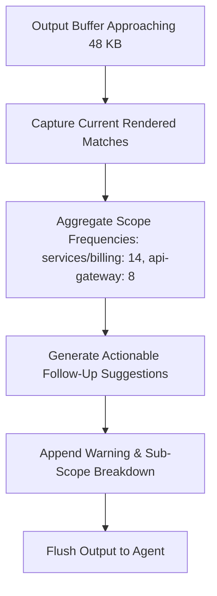

# DEEPENING: Stdio Actor Mechanics, W3C Tracing & BPE Token Density

This document provides deep technical reference material for the `mesh-stdio-protocol` skill.

---

## 1. Tokio Actor Model & Non-Blocking Stdin EOF

Standard synchronous `std::io::stdin().read_line()` blocks the thread. If the client terminates, the thread hangs indefinitely unless an interrupt is delivered.

In [`StdioFramingActor`](file:///Users/victoragahi/Developer/causalmesh/crates/mesh-server/src/framing.rs#L40-L95):
```rust
let (tx_out, mut rx_out) = mpsc::channel::<String>(64);
let (tx_in, rx_in) = mpsc::channel::<String>(64);
```

### Ingestion Actor:
- Uses asynchronous `tokio::io::AsyncBufReadExt::read_line`.
- Detects `Ok(0)`: This indicates that the parent IDE process closed the standard input pipe.
- When `Ok(0)` is detected:
  ```rust
  tracing::info!("Stdin EOF detected. Initiating shutdown.");
  cancel_reader.cancel();
  break;
  ```
- Broadcasts `tokio_util::sync::CancellationToken` cancellation to gracefully shut down the server loop without zombie processes.

### Egress Actor:
- Owns `tokio::io::BufWriter<tokio::io::Stdout>`.
- Batches writes when multiple frames are queued.
- Flushes `writer.flush().await` after every completed JSON-RPC line to ensure instantaneous delivery to the agent.

---

## 2. W3C Distributed Trace Context (`traceparent`)

To correlate agent queries with APM traces (Datadog, OpenTelemetry, Jaeger), MeshMCP extracts and propagates the W3C Trace Context over JSON-RPC.

In [`crates/mesh-server/src/protocol.rs`](file:///Users/victoragahi/Developer/causalmesh/crates/mesh-server/src/protocol.rs#L30-L75):
```rust
#[derive(Debug, Clone, Deserialize, Serialize)]
pub struct RequestMeta {
    pub traceparent: Option<String>,
    pub tracestate: Option<String>,
}
```

### Format:
```
traceparent: {version}-{trace_id}-{parent_id}-{trace_flags}
Example: 00-4bf92f3577b34da6a3ce929d0e0e4736-00f067aa0ba902b7-01
```

When present:
1. MeshMCP extracts the 128-bit `trace_id` and 64-bit `parent_id`.
2. Creates a corresponding `tracing::Span` configured with the parent trace context.
3. Propagates the span across background Rayon jobs and audit logging.

---

## 3. Sub-Scope Affordance Calculation Algorithm

When a query yields more results than can fit in the 48 KB buffer, cutting off abruptly leaves the agent blind to remaining matches.

In [`MarkdownFormatter::build_truncated_search_output`](file:///Users/victoragahi/Developer/causalmesh/crates/mesh-parsers/src/markdown.rs#L85-L135):



### Truncation Payload Template:
```markdown
⚠️ **Output truncated: Showing 12 of 48 matches (48 KB payload budget reached).**

### Recommendations for Refinement:
- Scope: `services/billing` (14 matching definitions)
  `smart_search(query: "processPayment", scope: "services/billing")`
- Scope: `api-gateway` (8 matching definitions)
  `smart_search(query: "processPayment", scope: "api-gateway")`
```
This enables the agent to immediately narrow its search without hallucinating or requiring human intervention.
