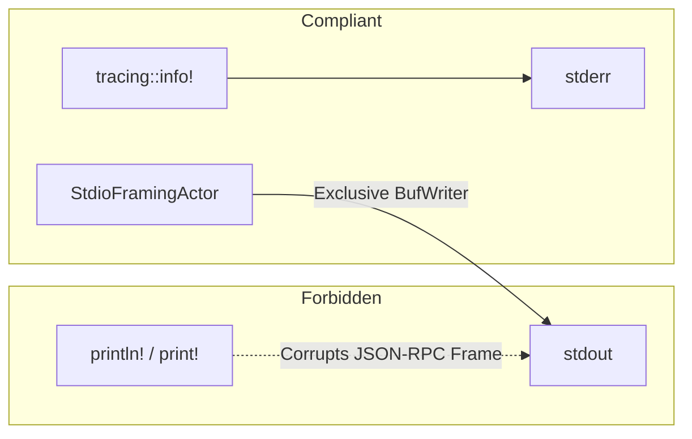

# MeshMCP Stdio Protocol & Framing Skill

This skill guides you through maintaining and extending the JSON-RPC 2.0 stdio transport, distributed tracing, and Markdown formatting pipeline in MeshMCP.

---

## 1. Quick Navigation & Codebase References

- **Stdio Framing Actor**: [`crates/mesh-server/src/framing.rs`](file:///Users/victoragahi/Developer/causalmesh/crates/mesh-server/src/framing.rs)
  - `StdioFramingActor::spawn()`: Background task with exclusive write ownership of `BufWriter<Stdout>`
  - Bounded MPSC channels (capacity 64)
  - Non-blocking Stdin EOF shutdown
- **Protocol & W3C Tracing**: [`crates/mesh-server/src/protocol.rs`](file:///Users/victoragahi/Developer/causalmesh/crates/mesh-server/src/protocol.rs)
  - `JsonRpcRequest`, `JsonRpcResponse`, `JsonRpcError`
  - `RequestMeta`: Extracts `_meta.traceparent` for distributed APM tracing
- **Markdown Formatter & Truncation**: [`crates/mesh-parsers/src/markdown.rs`](file:///Users/victoragahi/Developer/causalmesh/crates/mesh-parsers/src/markdown.rs)
  - `MAX_OUTPUT_BYTES = 48 * 1024` (48 KB cap)
  - `build_truncated_search_output()`: Injects sub-scope counts and navigational tips
- **Tool Registry & Dispatch**: [`crates/mesh-server/src/tools/mod.rs`](file:///Users/victoragahi/Developer/causalmesh/crates/mesh-server/src/tools/mod.rs)
  - `ToolRegistry::handle_call()`: Tool execution and framing dispatch

---

## 2. Mandatory Framing Invariants (Commandment 3)

1. **Zero Stdout Pollution**: Never use `println!`, `print!`, or `dbg!`. Even a single newline printed to `stdout` will corrupt the JSON-RPC parser on the IDE client (Claude Code, Cursor).
2. **Stderr Exclusivity**: All logging, diagnostics, and metrics must be sent to `stderr` via `tracing::info!`, `tracing::warn!`, or `eprintln!`.
3. **Hard 48 KB Payload Limit**: Any response approaching 48 KB must be truncated with sub-scope affordance tips to protect LLM context windows.

---

## 3. Core Workflow: Handling Stdio Requests

When a JSON-RPC message arrives on Stdin:
1. `StdioFramingActor` reads line, parses JSON, and forwards through bounded MPSC to server.
2. `JsonRpcRequest` extracts W3C `_meta.traceparent` if provided by client.
3. Target tool is dispatched.
4. Response payload is formatted in dense Markdown.
5. `JsonRpcResponse` is sent through bounded output MPSC to the framing actor, which flushes to `stdout` via `BufWriter`.

---

## 4. In-Depth Reference

When advanced debugging of Tokio channel backpressure, W3C distributed tracing context propagation, or BPE token density optimization is required, consult:
👉 [`DEEPENING.md`](DEEPENING.md)
