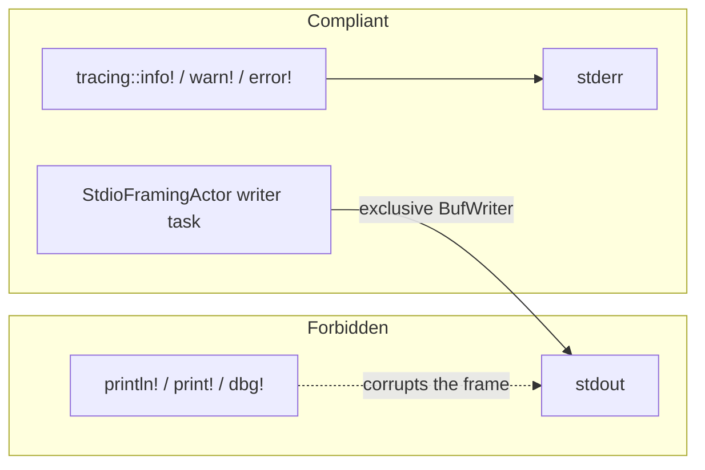

# MeshMCP Stdio Protocol & Framing Skill

`stdout` belongs to the framing actor and to nothing else (Commandment 3). One stray
newline corrupts the JSON-RPC stream for the whole session.

---

## 1. Quick Navigation & Codebase References

- **Framing actor**: [`crates/mesh-server/src/framing.rs`](../../../crates/mesh-server/src/framing.rs)
  - `StdioFramingActor::spawn(cancel_token) -> (mpsc::Sender<String>, mpsc::Receiver<String>, JoinHandle<()>)`
  - `MPSC_BUFFER_CAPACITY = 64`
- **Event loop & method table**: [`crates/mesh-server/src/lib.rs`](../../../crates/mesh-server/src/lib.rs)
  (`run_server`: `initialize`, `notifications/initialized`, `ping`, `tools/list`, `tools/call`)
- **Wire types**: [`crates/mesh-server/src/protocol.rs`](../../../crates/mesh-server/src/protocol.rs)
  - `JsonRpcRequest`, `JsonRpcResponse::success/error`, `JsonRpcError`
  - `RequestMeta { traceparent, tracestate }`, `RequestMeta::extract_trace_id()`
- **Dispatch**: [`crates/mesh-server/src/tools/mod.rs`](../../../crates/mesh-server/src/tools/mod.rs)
  (`ToolRegistry::call_tool`, `::invoke`, `::list_tools`) — see
  [`mesh-tool-authoring`](../mesh-tool-authoring/SKILL.md)
- **Rendering & cap**: [`crates/mesh-parsers/src/markdown.rs`](../../../crates/mesh-parsers/src/markdown.rs)
  - `MAX_OUTPUT_BYTES = 48 * 1024`
  - `MarkdownFormatter::format_search_results` / `format_dependents` / `format_grpc_trace` /
    `format_impact_flow` / `format_doc_sections`; `SearchResult`
- **Daemon proxy**: [`crates/mesh-server/src/main.rs`](../../../crates/mesh-server/src/main.rs)
  (`resolve_socket_path`/`resolve_pipe_name`, `ensure_daemon_running[_windows]`,
  `run_proxy_mode[_windows]`, `run_standalone`) and
  [`crates/mesh-daemon/src/server.rs`](../../../crates/mesh-daemon/src/server.rs)
  (shared `dispatch`/`handle_client`, `unix_impl::run_uds_server`,
  `windows_impl::run_named_pipe_server`)

---

## 2. Framing invariants (Commandment 3)



1. **No `println!`, `print!` or `dbg!`** anywhere reachable from the server. The one
   legitimate `println!` in the tree is in `cli/graph.rs`, which pipes Mermaid or JSON to
   stdout from a one-shot CLI subcommand that never runs the JSON-RPC loop. Do not take it
   as precedent.
2. **All diagnostics go to stderr.** `main.rs` builds the subscriber with
   `tracing_subscriber::fmt::layer().with_writer(std::io::stderr)` for exactly this reason.
   Use a `target:` on every event (`mesh::server`, `mesh::framing`, `mesh::indexer`,
   `mesh::watcher`, `mesh::parser`, `mesh::security`, `mesh::audit`, `mesh::proxy`).
3. **Only the writer task owns stdout.** It holds the single `BufWriter<Stdout>`, appends a
   newline when the frame lacks one, and flushes after every frame.
4. **Every response is bounded by 48 KB** with truncation guidance (section 5).

---

## 3. Request lifecycle

```rust
let (tx_out, mut rx_in, writer_done) = StdioFramingActor::spawn(cancel_token.clone());
```

1. The reader task reads stdin line by line with `AsyncBufReadExt::read_line`, trims, drops
   empty lines, and forwards through a bounded channel (`MPSC_BUFFER_CAPACITY = 64`).
   `Ok(0)` means the client closed the pipe: it logs and breaks. `ErrorKind::Interrupted`
   is retried rather than treated as fatal.
2. `run_server` deserialises into `JsonRpcRequest`. A parse failure answers `-32700` with
   `id: None` and continues — a malformed frame must not kill the loop.
3. The method table dispatches. `notifications/initialized` is a notification and
   `continue`s **without** a response; everything else produces one. An unknown method is
   `-32601`.
4. `tools/call` extracts `name` and `arguments` from `params` and hands off to
   `ToolRegistry::call_tool`, which returns either a `content` array or a `(code, message)`
   rendered by `JsonRpcResponse::error`.
5. The serialised response goes back through `tx_out`; the writer task flushes it.

**Shutdown is a drain barrier, not a drop.** At the end of `run_server`:

```rust
drop(tx_out);
let _ = writer_done.await;
```

Dropping the sender is what lets the writer see channel closure and flush; awaiting
`writer_done` is what stops the process exiting before the last response reaches stdout.
Both lines are required — removing either reintroduces a truncated-response race under
piped stdin. If you add another exit path from the loop, it must go through the same
barrier.

Cancellation is a `tokio_util::sync::CancellationToken`, cancelled by the Ctrl-C handler
in `run_standalone` and selected on by both framing tasks; the writer flushes before
breaking.

---

## 4. `_meta` and W3C trace context

`RequestMeta` is `#[serde(deny_unknown_fields)]` like every args struct, and is carried as
`pub _meta: Option<RequestMeta>` on each tool's `Args`:

```rust
pub struct RequestMeta {
    /// W3C Trace Context (e.g. "00-4bf92f3577b34da6a3ce929d0e0e4736-00f067aa0ba902b7-01")
    pub traceparent: Option<String>,
    pub tracestate: Option<String>,
}
```

`extract_trace_id` splits on `-` and returns field 1 only when there are at least four
fields and the trace id is exactly 32 hex characters; anything else yields `None`.
`ToolRegistry::invoke` calls `T::meta(&args).and_then(|m| m.extract_trace_id())` and passes
the result to `AuditLogger::record_entry`, which stores it in the `trace_id` column. That
is the whole of the propagation today: the trace id reaches the audit row. `tracestate` is
parsed and carried but not otherwise consumed, and no `tracing::Span` is currently built
from the parent context — do not claim otherwise in a tool description.

---

## 5. Output rendering and the 48 KB cap

Tools return Markdown, not JSON, and render through `MarkdownFormatter`.
`MAX_OUTPUT_BYTES = 48 * 1024` is checked before each entry is appended, reserving 1 KB for
the truncation footer:

```rust
if header.len() + body.len() + entry_str.len() > MAX_OUTPUT_BYTES - 1024 {
    return Self::build_truncated_search_output(
        &header, &body, idx, results.len(), query, &scope_counts,
    );
}
```

The footer (private `build_truncated_search_output`) states how many matches were shown of
how many total, lists the top three sub-scopes by match count with
`extract_sub_scope` (the first two path components), and prints a concrete follow-up call
targeting the busiest one. Truncating without that affordance leaves the agent unable to
narrow the search on its own.

A new formatter must do the same three things: bound the total, report what was dropped,
and name the next call.

---

## 6. Daemon proxy mode

`mesh-mcp run` defaults to proxy mode: on Unix, `resolve_socket_path` (honouring
`MESH_SOCKET_PATH`, then `XDG_RUNTIME_DIR`, then `~/.cache/mesh/meshd.sock`),
`ensure_daemon_running` (auto-spawns `meshd` next to the current exe and polls the socket),
then `run_proxy_mode`, a bidirectional `tokio::io::copy` between stdin/stdout and the UDS. On
Windows the same shape runs over a named pipe instead (`resolve_pipe_name`,
`ensure_daemon_running_windows`, `run_proxy_mode_windows`, spawning `meshd.exe`) —
`crates/mesh-daemon/src/server.rs` shares one `dispatch`/`handle_client<S: AsyncRead +
AsyncWrite>` between `unix_impl::run_uds_server` and `windows_impl::run_named_pipe_server`, so
the JSON-RPC handling itself is transport-agnostic; only the accept loop differs. `--standalone`
skips detection on either platform, and any failure to reach `meshd` falls back to
`run_standalone` with a warning.

In proxy mode the framing rules apply to `meshd`, not to the proxy: the proxy copies bytes
and must add none. Its `tokio::select!` waits for the daemon to drain when stdin closes
first, which is the same truncation hazard as the drain barrier above.

---

## 7. In-depth reference

Actor mechanics, EOF handling and truncation affordance detail:
[`DEEPENING.md`](DEEPENING.md).
