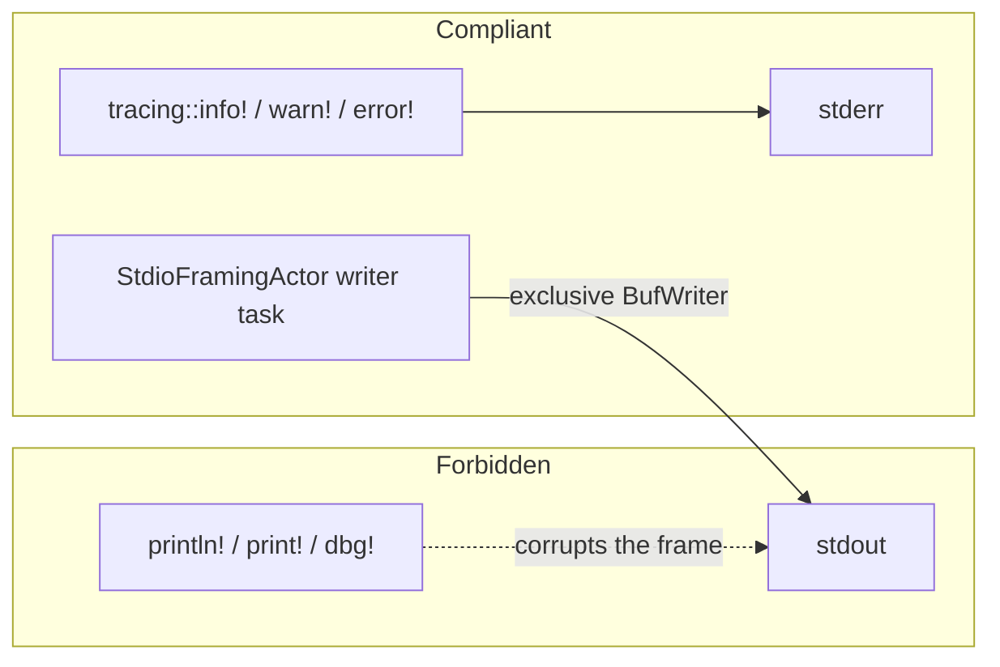

# MeshMCP Stdio Protocol & Framing Skill

`stdout` belongs to the framing actor and to nothing else (Commandment 3). One stray
newline corrupts the JSON-RPC stream for the whole session.

---

## 1. Quick Navigation & Codebase References

- **Framing actor**: [`crates/mesh-server/src/framing.rs`](../../../crates/mesh-server/src/framing.rs)
  - `StdioFramingActor::spawn(cancel_token) -> (mpsc::Sender<String>, mpsc::Receiver<String>, JoinHandle<()>)`
  - `MPSC_BUFFER_CAPACITY = 64`
- **Event loop & method table**: [`crates/mesh-server/src/lib.rs`](../../../crates/mesh-server/src/lib.rs)
  (`run_server`, `respond`: `initialize`, `ping`, `tools/list`, `tools/call`; notifications are
  classified by `protocol::classify` and never answered)
- **Wire types**: [`crates/mesh-server/src/protocol.rs`](../../../crates/mesh-server/src/protocol.rs)
  - `JsonRpcRequest`, `JsonRpcResponse::success/error`, `JsonRpcError`, `classify` → `Incoming`
  - `RequestMeta { traceparent, tracestate }`, `RequestMeta::extract_trace_id()`
- **Dispatch**: [`crates/mesh-server/src/tools/mod.rs`](../../../crates/mesh-server/src/tools/mod.rs)
  (`ToolRegistry::call_tool`, `::invoke`, `::list_tools`) — see
  [`mesh-tool-authoring`](../mesh-tool-authoring/SKILL.md)
- **Rendering & cap**: [`crates/mesh-parsers/src/markdown.rs`](../../../crates/mesh-parsers/src/markdown.rs)
  - `MAX_OUTPUT_BYTES = 48 * 1024`
  - `MarkdownFormatter::format_search_page` / `format_dependents` / `format_grpc_trace` /
    `format_impact_matrix` / `format_doc_sections`; `SearchResult`, `SearchPage`
- **Daemon proxy**: [`crates/mesh-server/src/main.rs`](../../../crates/mesh-server/src/main.rs)
  (`ensure_daemon_running[_windows]`, `try_proxy_unix` / `try_proxy_windows`, `bridge`,
  `finish_proxy_session`, `warn_on_daemon_version_mismatch`, `run_standalone`), socket naming in
  [`crates/mesh-core/src/socket.rs`](../../../crates/mesh-core/src/socket.rs) (`workspace_id`,
  `socket_path_for`, `pipe_name_for`) and
  [`crates/mesh-daemon/src/server.rs`](../../../crates/mesh-daemon/src/server.rs)
  (shared `dispatch`/`handle_client`, `unix_impl::run_uds_server` / `run_uds_server_then`,
  `windows_impl::run_named_pipe_server`)

---

## 2. Framing invariants (Commandment 3)


```mermaid
graph LR
    subgraph Forbidden
        P["println! / print! / dbg!"] -.->|corrupts the frame| Stdout[stdout]
    end
    subgraph Compliant
        Log["tracing::info! / warn! / error!"] --> Stderr[stderr]
        Actor[StdioFramingActor writer task] -->|exclusive BufWriter| Stdout
    end
```

1. **No `println!`, `print!` or `dbg!`** anywhere reachable from the server. The only
   stdout writes outside the framing actor are one-shot CLI subcommands that never run the
   JSON-RPC loop: `cli/graph.rs` (an explicit `io::stdout()` handle for Mermaid/JSON/HTML) and
   `mesh-mcp doctor --json` (`println!` of the check list). Do not take them as precedent.
2. **All diagnostics go to stderr.** `main.rs` builds the subscriber with
   `tracing_subscriber::fmt::layer().with_writer(std::io::stderr)` for exactly this reason.
   Use a `target:` on every event (`mesh::server`, `mesh::framing`, `mesh::indexer`,
   `mesh::watcher`, `mesh::parser`, `mesh::security`, `mesh::audit`, `mesh::proxy`).
3. **Only the writer task owns stdout.** It holds the single `BufWriter<Stdout>`, appends a
   newline when the frame lacks one, and flushes after every frame.
4. **Every response is bounded by 48 KB** with truncation guidance (section 5).

---

## 3. Request lifecycle

```rust
let (tx_out, mut rx_in, writer_done) = StdioFramingActor::spawn(cancel_token.clone());
```

1. The reader task reads stdin line by line with `AsyncBufReadExt::read_line`, trims, drops
   empty lines, and forwards through a bounded channel (`MPSC_BUFFER_CAPACITY = 64`).
   `Ok(0)` means the client closed the pipe: it logs and breaks. `ErrorKind::Interrupted`
   is retried rather than treated as fatal.
2. `run_server` passes each line to `protocol::classify`: a request, a notification (no `id`
   member — never answered, not even with an error), or a reject (`-32700` parse error with
   `id: null`, `-32600` invalid request). A malformed frame must not kill the loop.
3. `respond` dispatches the method table. An unknown method is `-32601`.
4. `tools/call` extracts `name` and `arguments` from `params` and hands off to
   `ToolRegistry::call_tool`. A tool's own failure comes back as a successful response whose
   result has `isError: true`; only an unknown tool (`-32602`), missing `params` (`-32602`) or a
   failed tool task (`-32603`) become `JsonRpcResponse::error`. In `meshd`, a `tools/call`
   before the first snapshot is installed gets a "still indexing" tool error.
5. The serialised response goes back through `tx_out`; the writer task flushes it.

**Shutdown is a drain barrier, not a drop.** At the end of `run_server`:

```rust
drop(tx_out);
let _ = writer_done.await;
```

Dropping the sender is what lets the writer see channel closure and flush; awaiting
`writer_done` is what stops the process exiting before the last response reaches stdout.
Both lines are required — removing either reintroduces a truncated-response race under
piped stdin. If you add another exit path from the loop, it must go through the same
barrier.

Cancellation is a `tokio_util::sync::CancellationToken`, cancelled by the Ctrl-C handler
in `run_standalone` and selected on by both framing tasks; the writer flushes before
breaking.

---

## 4. `_meta` and W3C trace context

`RequestMeta` is `#[serde(deny_unknown_fields)]` like every args struct, and is carried as
`pub _meta: Option<RequestMeta>` on each tool's `Args`:

```rust
pub struct RequestMeta {
    /// W3C Trace Context (e.g. "00-4bf92f3577b34da6a3ce929d0e0e4736-00f067aa0ba902b7-01")
    pub traceparent: Option<String>,
    pub tracestate: Option<String>,
}
```

`extract_trace_id` splits on `-` and returns field 1 only when there are at least four
fields and the trace id is exactly 32 hex characters; anything else yields `None`.
`ToolRegistry::invoke` calls `T::meta(&args).and_then(|m| m.extract_trace_id())` and passes
the result to `AuditLogger::record_entry`, which stores it in the `trace_id` column. That
is the whole of the propagation today: the trace id reaches the audit row. `tracestate` is
parsed and carried but not otherwise consumed, and no `tracing::Span` is currently built
from the parent context — do not claim otherwise in a tool description.

---

## 5. Output rendering and the 48 KB cap

Tools return Markdown, not JSON, and render through `MarkdownFormatter`.
`MAX_OUTPUT_BYTES = 48 * 1024` is checked before each entry is appended in
`format_search_page`, reserving 1 KB for the truncation footer (on top of the ~8 KB page budget
`smart_search` applies first):

```rust
if header.len() + body.len() + entry_str.len() > MAX_OUTPUT_BYTES - 1024 {
    return Self::build_truncated_search_output(
        &header, &body, idx, results.len(), query, &scope_counts,
    );
}
```

The footer (private `build_truncated_search_output`) states how many matches were shown of
how many total, lists the top three sub-scopes by match count with
`extract_sub_scope` (the first two path components), and prints a concrete follow-up call
targeting the busiest one. Truncating without that affordance leaves the agent unable to
narrow the search on its own.

A new formatter must do the same three things: bound the total, report what was dropped,
and name the next call. Independently, `ToolRegistry::invoke` enforces 48 KB on every tool's
final text (`truncate_markdown` + `truncation_note`), closing an open code fence.

---

## 6. Daemon proxy mode

`mesh-mcp run` defaults to proxy mode. It discovers the config, derives
`mesh_core::workspace_id(base_dir)` (SHA-256 of the canonical base directory and the crate
version, 16 hex chars) and connects to `socket_path_for(workspace_id)`: `meshd-<id>.sock` under
`MESH_SOCKET_PATH`, else `$XDG_RUNTIME_DIR/mesh/`, else `~/.cache/mesh/` (directory `0700`,
socket `0600`). `ensure_daemon_running` auto-spawns `meshd` next to the current exe and polls
the socket; `try_proxy_unix` then runs `bridge`, a bidirectional copy between stdin/stdout and
the UDS. On Windows the same shape runs over a named pipe (`pipe_name_for`,
`ensure_daemon_running_windows`, `try_proxy_windows`, spawning `meshd.exe`) —
`crates/mesh-daemon/src/server.rs` shares one `dispatch`/`handle_client<S: AsyncRead +
AsyncWrite>` between `unix_impl::run_uds_server` and `windows_impl::run_named_pipe_server`, so
the JSON-RPC handling itself is transport-agnostic; only the accept loop differs. `--standalone`
skips detection on either platform. Any failure to reach `meshd`, including a connect failure
right after a successful liveness check, falls back to `run_standalone` with a warning. If the
daemon dies mid-session, `finish_proxy_session` logs the cause and the daemon log path and
exits with status 1, so the client sees EOF instead of a hung session.

In proxy mode the framing rules apply to `meshd`, not to the proxy: the proxy copies bytes
and must add none. `bridge` waits for the daemon to drain when stdin closes first, which is the
same truncation hazard as the drain barrier above.

---

## 7. In-depth reference

Actor mechanics, EOF handling and truncation affordance detail:
[`DEEPENING.md`](DEEPENING.md).
