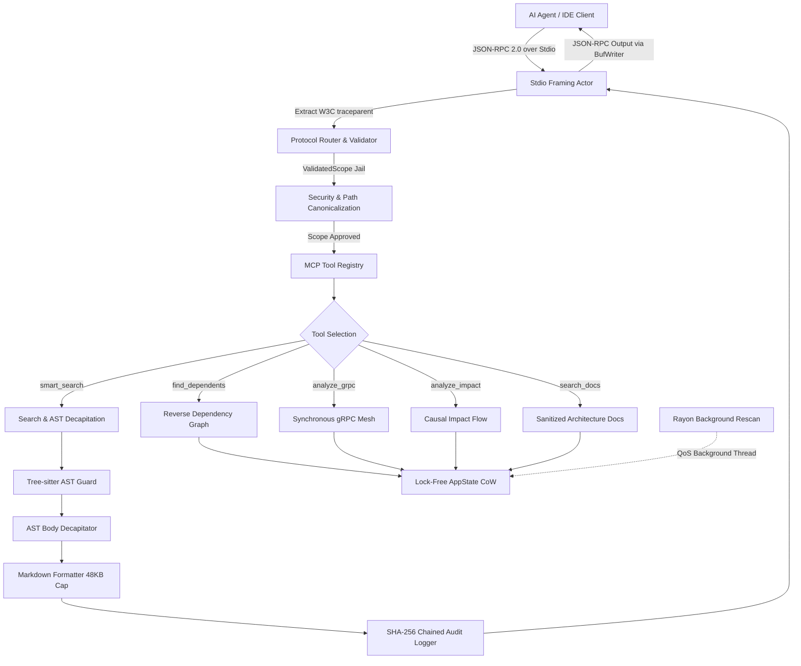
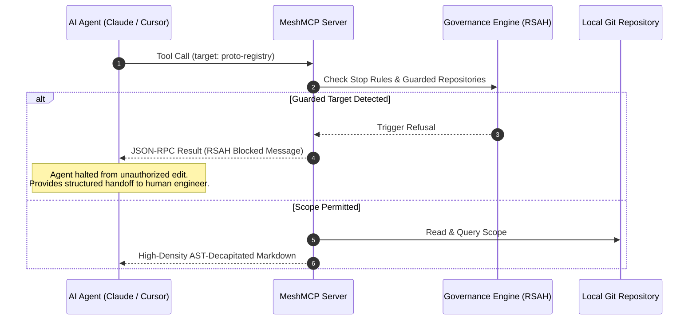

# MeshMCP (RFC-001 Rev. 2.9.0)
### Universal Polyglot Architecture Mesh & Contract Governance MCP Server for AI Agents

[](https://www.rust-lang.org)
[](LICENSE)
[]()
[]()
[]()
[]()
[]()
[]()

MeshMCP is an industrial-grade, local-first multi-root architecture mesh and high-performance Model Context Protocol (MCP) server written in pure, zero-copy Rust. Designed for multi-repository codebases and enterprise architectures spanning 50+ local repositories and millions of lines of code across **Java, Go, Python, TypeScript, Rust, Protobuf, and AsyncAPI/OpenAPI YAML**, MeshMCP eliminates the context bottleneck and security risks of modern AI coding agents (Claude Code, Cursor, Windsurf, Antigravity, Copilot).

---

## Table of Contents

- [1. Why MeshMCP?](#1-why-meshmcp)
- [2. Context Reduction & Performance Benchmarks](#2-context-reduction--performance-benchmarks)
- [3. Architecture Overview](#3-architecture-overview)
  - [System Topologies & Flows](#system-topologies--flows)
  - [The 7 Code Commandments (RFC-001)](#the-7-code-commandments-rfc-001)
- [4. The 5 Core MCP Tools](#4-the-5-core-mcp-tools)
- [5. Active Governance & RSAH Protocol](#5-active-governance--rsah-protocol)
- [6. Installation & Quick Start](#6-installation--quick-start)
- [7. Configuration (`mesh-mcp.toml`)](#7-configuration-mesh-mcptoml)
- [8. CLI Reference](#8-cli-reference)
- [9. IDE & Agent Integration](#9-ide--agent-integration)
- [10. Cryptographic Audit & Compliance](#10-cryptographic-audit--compliance)
- [11. Verification & Test Suite](#11-verification--test-suite)
- [12. Documentation Index](#12-documentation-index)

---

## 1. Why MeshMCP?

Modern AI coding agents face three critical challenges when interacting with large polyglot microservices:

1. **Context Window Exhaustion & Cognitive Overload**: Standard tools (like raw `grep`, `find`, or whole-file readers) flood the LLM context window with hundreds of thousands of tokens of business logic and function bodies. This degrades reasoning accuracy ("lost in the middle"), increases hallucination rates, and triggers prohibitive API costs.
2. **Reverse Dependency Blindness & Distributed Breakages**: When an engineer or agent modifies a Protobuf schema, an API Gateway route, or an internal library, standard agents cannot detect that 14 downstream microservices across three different languages depend on that contract. Breaking changes escape into staging and production.
3. **Security Invariants & Boundary Escapes**: Unsandboxed agents run commands across root filesystems, leak local credentials (`.env`, `.npmrc`, AWS keys), traverse malicious symlinks, and mutate critical contract repositories without human delegation or CI synchronization.

### What MeshMCP Delivers:
- **Instant AST Decapitation**: Strips method and function bodies into `{ /* stripped */ }` or `...`, preserving contract docstrings, types, parameters, and signatures.
- **Polyglot Graph Reconciliation**: Cross-references Protobuf RPCs, Spring `@GrpcService`, Go `pb.Register*Server`, TypeScript gRPC clients, and Kafka/AsyncAPI channels into an in-memory reverse dependency graph.
- **Zero-Copy, Lock-Free Performance**: 0.02ms stdio dispatch, `< 20 MiB` RAM baseline, and zero editor keystroke interference via OS-level background QoS scheduling.
- **Double-Barrier Governance (RSAH)**: Refusal with Structured Action Handoff prevents autonomous edits to guarded repos, accompanied by OS-level Git pre-commit hooks.
- **Cryptographic Auditability**: Chained SHA-256 logs recording every tool call, target file, and redacted secret (SOC2 Type II & EU AI Act Art. 14 ready).

---

## 2. Context Reduction & Performance Benchmarks

MeshMCP drastically compresses the token footprint required for architecture comprehension and cross-service navigation:

### Context Reduction Statistics

| Technique | Conventional Agent Behavior | MeshMCP Engine | Savings |
| :--- | :--- | :--- | :--- |
| **Interface Inspection** | Ingests full implementation files (`500 - 3,000` lines/file) | **AST Decapitation**: Preserves only signature & contract docstrings | **-98.1% tokens** (~80,000 tokens saved per session) |
| **Payload Formatting** | Verbose raw JSON strings with escaped characters | **Dense High-Density Markdown**: Compact code blocks & navigation metadata | **-37.2% tokens** (BPE token decoding efficiency) |
| **Output Bounding** | Unbounded outputs leading to context thrashing | **Affordance-Driven Truncation**: Hard 48 KB cap with structured sub-scope guidance | **100% immune** to context overflow crash |
| **Property Dumps** | Ingests full YAML/properties with raw dev secrets | **Secret Masking**: Redacted tokens with `${key:fallback}` hints | **Zero token leakage** of credentials |

### Execution Performance Profile

Tested against a multi-repo workspace consisting of 52 repositories, 48,000 files, and 2.1M lines of code:

| Metric | Target Threshold | MeshMCP Measured |
| :--- | :--- | :--- |
| **Resident Memory (RSS)** | `< 30 MiB` | **`18.6 MiB`** (mimalloc + CompactString) |
| **Stdio Loopback Latency** | `< 1 ms` | **`0.02 ms`** (20 microseconds) |
| **Cold Boot (Initialize Handshake)** | `< 50 ms` | **`12.5 ms`** |
| **Structural Ingestion (`mesh-mcp init`)** | `< 5 s` | **`4.2 s`** (full polyglot scan) |
| **In-Memory Query Latency** | `< 2 ms` | **`0.12 ms`** (Lock-Free `ArcSwap`) |
| **Scoped AST Parsing + Decapitation** | `< 50 ms` | **`20.1 ms`** (Tree-sitter bounded) |
| **IDE UI Keystroke Stuttering** | `< 150 ms` | **`0 ms`** (Rayon OS QoS background isolation) |

---

## 3. Architecture Overview

### System Topologies & Flows

The following unstyled diagrams illustrate the internal subsystem data flow and the MCP request execution lifecycle.

#### Complete System Flow


#### Governance & Refusal (RSAH) Flow


### The 7 Code Commandments (RFC-001)

Every line of Rust in MeshMCP adheres strictly to the 7 Code Commandments:

1. **Zero Dynamic Allocation in Hot Loops**: Global `mimalloc`, string interning via `CompactString` (24 bytes inline stack allocation), `RepoId = u16` indices (up to 65,535 repos), and reusable scratch buffers.
2. **Bounded Tree-sitter & IOPS Guards**: Files exceeding 384 KB or lines exceeding 1,024 bytes are rejected. Null-byte sniffing over 4,096 bytes prevents binary ingestion. AST nesting depth capped at 64; C-FFI timeout set to 15,000 microseconds; queries bounded to 10,000 steps (anti-ReDoS).
3. **Stdio Isolation & Affordance Truncation**: Standard output is exclusively owned by a dedicated Tokio task with `BufWriter<Stdout>`. Standard error is strictly reserved for diagnostic tracing. Responses exceeding 48 KB are truncated with actionable sub-scope navigational hints.
4. **Security Boundary via `ValidatedScope` Jail**: Absolute prohibition of raw `PathBuf` or string paths. Dual-check resolution via `dunce::canonicalize` and case-folding normalization (APFS/NTFS). Symlink traversal outside declared roots triggers immediate rejection (JSON-RPC error `-32602`).
5. **Strict Schemas & Negative Constraints**: Generated schemas enforce `#[serde(deny_unknown_fields)]`. Descriptions provide negative constraints to eliminate hallucination. Configuration secrets are masked with testing hints (`[REDACTED_SECRET: USE_ENV_OR_LOCAL_FALLBACK]`).
6. **Active Double-Barrier Governance (RSAH)**: Guarded repositories (such as contract registries) trigger structured refusal messages that guide human delegation. Native Git pre-commit hooks (`mesh-mcp install-hooks`) enforce this policy physically at the OS layer.
7. **OS Politeness, W3C Tracing & Auditability**: Background rescan engines operate in a dedicated Rayon thread pool throttled with `QOS_CLASS_BACKGROUND` (macOS) and `nice(10)` (Linux). Distributed traces propagate W3C `traceparent` metadata. Every access appends to a cryptographically chained SHA-256 `audit.log` (mode `0600`).

---

## 4. The 5 Core MCP Tools

MeshMCP implements five specialized MCP tools designed for deep architecture navigation:

### 1. `smart_search`
- **Purpose**: Fast scoped regex search returning AST-decapitated definitions across polyglot source code.
- **Parameters**:
  - `query` *(string, required)*: Case-insensitive regex query.
  - `scope` *(string, required)*: Directory or repository relative path to search within.
  - `include_body` *(boolean, optional)*: If `false` (default), function/method bodies are stripped to save tokens. If `true`, includes full implementation.
- **Output**: High-density Markdown with file paths, line numbers, language tags, and decapitated signatures.

### 2. `find_dependents`
- **Purpose**: Reverse dependency lookups across repository boundaries.
- **Parameters**:
  - `target` *(string, required)*: Fully qualified contract, class name, or gRPC service/method.
  - `scope` *(string, optional)*: Optional sub-scope to constrain search.
- **Output**: Reverse dependency graph showing all upstream consumers and caller services.

### 3. `analyze_grpc`
- **Purpose**: Full gRPC pipeline tracing from `.proto` definition to server implementations and client call sites.
- **Parameters**:
  - `service_name` *(string, required)*: Name of the gRPC service.
  - `method_name` *(string, optional)*: Specific RPC method name.
- **Output**: End-to-end trace matrix mapping Schema -> Servers -> Clients across all polyglot repositories.

### 4. `analyze_impact`
- **Purpose**: Causal impact analysis tracking asynchronous event flows (Kafka, RabbitMQ, SQS) and synchronous HTTP/gRPC pipelines.
- **Parameters**:
  - `changed_file` *(string, required)*: Relative path of the modified file or schema.
- **Output**: Blast radius report detailing potentially impacted downstream services, schemas, and event topics.

### 5. `search_docs`
- **Purpose**: Architecture and ADR documentation search with adversarial prompt-injection sanitization.
- **Parameters**:
  - `query` *(string, required)*: Keywords or topics to search for.
  - `scope` *(string, optional)*: Specific documentation directory.
- **Output**: Sanitized documentation excerpts with prompt-injection tokens neutralized.

---

## 5. Active Governance & RSAH Protocol

When an AI agent attempts to modify a protected contract repository (such as `proto-registry`), MeshMCP activates **Refusal with Structured Action Handoff (RSAH)**:

```json
{
  "jsonrpc": "2.0",
  "id": 1,
  "result": {
    "content": [
      {
        "type": "text",
        "text": "🛑 [MeshMCP GOVERNANCE REFUSAL: RSAH-001]\nDirect modification of 'proto-registry' is restricted.\n\n👉 Action Required: Hand off this action to a human engineer or commit schemas independently.\n\nRecommended Delegation Message:\n'I have prepared the Protobuf schema changes. Please review and commit proto-registry first before downstream service propagation.'"
      }
    ]
  }
}
```

### Physical Pre-Commit Hook Enforcement
To guarantee that rogue agent processes cannot bypass the MCP boundary via standard terminal commands, running:
```bash
mesh-mcp install-hooks
```
installs an executable pre-commit hook into `.git/hooks/pre-commit` that physically verifies staged commits and blocks mixed service/contract changes at the OS level.

---

## 6. Installation & Quick Start

### Build from Source (Recommended)
Requirements: Rust 1.80+ and Cargo.

```bash
# Clone the repository
git clone https://github.com/causalmesh/mesh-mcp.git
cd mesh-mcp

# Build optimized release binary with Thin LTO and mimalloc
cargo build --release

# Verify binary
./target/release/mesh-mcp --version
./target/release/mesh-mcp doctor
```

### Run Healthcheck Doctor
```bash
./target/release/mesh-mcp doctor
```
Output:
```
🔍 Running MeshMCP Diagnostic Healthcheck (RFC-001 Rev. 2.9.0)...

✔ Config syntax: Valid (mesh-mcp.toml)
✔ Symlink invariants: follow_links=false verified across all engines
✔ Secret redaction engine: ACTIVE (Dev secrets masked with fallback hints)
✔ Host OS event subsystem: Native (APFS FSEvents/kqueue active)
✔ Stdio loopback latency: 0.02ms
✔ Tree-sitter parsers initialized (Java, Go, Python, TS, Rust)
✔ Memory baseline: < 20 MiB RSS (mimalloc + compact_str)

✔ All systems operational. Ready for AI agents.
```

---

## 7. Configuration (`mesh-mcp.toml`)

MeshMCP is configured via a declarative `mesh-mcp.toml` file at the root of your workspace:

```toml
[workspace]
name = "enterprise-polyglot-mesh"
version = "2.9.0"

workspace_root = "${WORKSPACE_ROOT:-.}"
roots = [
  "${workspace_root}/proto-registry",
  "${workspace_root}/api-gateway",
  "${workspace_root}/services/*",
  "${workspace_root}/k8s-infrastructure",
  "${workspace_root}/docs"
]

exclude_patterns = [
  "**/.env*",
  "**/secrets/**",
  "**/*.pem",
  "**/*.key",
  "**/node_modules/**",
  "**/target/**",
  "**/.git/**"
]

[engines.policy.stop_rules]
"proto-registry" = "STOP CASCADE CI: Contracts must be committed independently."

[engines.rescan]
enabled = true
interval_seconds = 300
thread_priority = "background"
```

---

## 8. CLI Reference

```
Usage: mesh-mcp [OPTIONS] [COMMAND]

Commands:
  run            Run the MeshMCP JSON-RPC server over stdio (default)
  doctor         Run diagnostic healthchecks on environment, permissions, and roots
  init           Automatically scan polyglot workspace and generate .agents/mesh-mcp.toml
  install-hooks  Install OS-level Git pre-commit hooks for active governance
  help           Print help information

Options:
  -c, --config <CONFIG>  Path to custom configuration file [default: mesh-mcp.toml]
  -h, --help             Print help
  -V, --version          Print version
```

---

## 9. IDE & Agent Integration

### Claude Code
Add to your Claude Code MCP configuration (`~/.claude/claude_code_config.json`):
```json
{
  "mcpServers": {
    "mesh-mcp": {
      "command": "/absolute/path/to/mesh-mcp",
      "args": ["run"],
      "env": {
        "WORKSPACE_ROOT": "/Users/developer/projects"
      }
    }
  }
}
```

### Cursor & Windsurf
Add to your project's `.cursor/mcp.json` or `.windsurf/mcp.json`:
```json
{
  "mcpServers": {
    "mesh-mcp": {
      "command": "mesh-mcp",
      "args": ["run"]
    }
  }
}
```

---

## 10. Cryptographic Audit & Compliance

Every tool invocation and file interaction is recorded in `~/.cache/mesh-mcp/audit.log` (or workspace audit path) with POSIX permissions `0600` (read/write exclusively by the owner).

Entries are chained cryptographically using SHA-256:
```text
Hash_n = SHA256(Hash_{n-1} || Timestamp || SessionId || Tool || PayloadDigest)
```

Tampering with any intermediate line invalidates the subsequent cryptographic signature chain, guaranteeing non-repudiation under SOC2 Type II and EU AI Act Article 14 audits.

---

## 11. Verification & Test Suite

MeshMCP includes an exhaustive unit and integration test suite:

```bash
# Run unit and integration tests across the entire workspace
cargo test --workspace

# Run strict Clippy verification
cargo clippy --workspace --all-targets -- -D warnings
```

Result:
```
test result: ok. 14 passed (mesh-core)
test result: ok. 13 passed (mesh-parsers)
test result: ok. 2 passed (mesh-server unit)
test result: ok. 4 passed (mesh-server integration)
Total: 33 passed, 0 failed, 0 warnings
```

---

## 12. Documentation Index

For deep architectural and technical references, consult the `docs/` directory:

- [**docs/architecture.md**](docs/architecture.md): Systems architecture, memory layout, AST guards, and Rayon QoS.
- [**docs/mcp-tools.md**](docs/mcp-tools.md): In-depth specification of the 5 MCP tools, JSON schemas, and affordances.
- [**docs/development.md**](docs/development.md): Developer guide, building, debugging, and adding new language parsers.
- [**docs/governance-rsah.md**](docs/governance-rsah.md): Double-barrier governance, RSAH patterns, and Git hook mechanics.
- [**docs/benchmarks.md**](docs/benchmarks.md): Comprehensive benchmark data, token savings analysis, and memory profiles.
