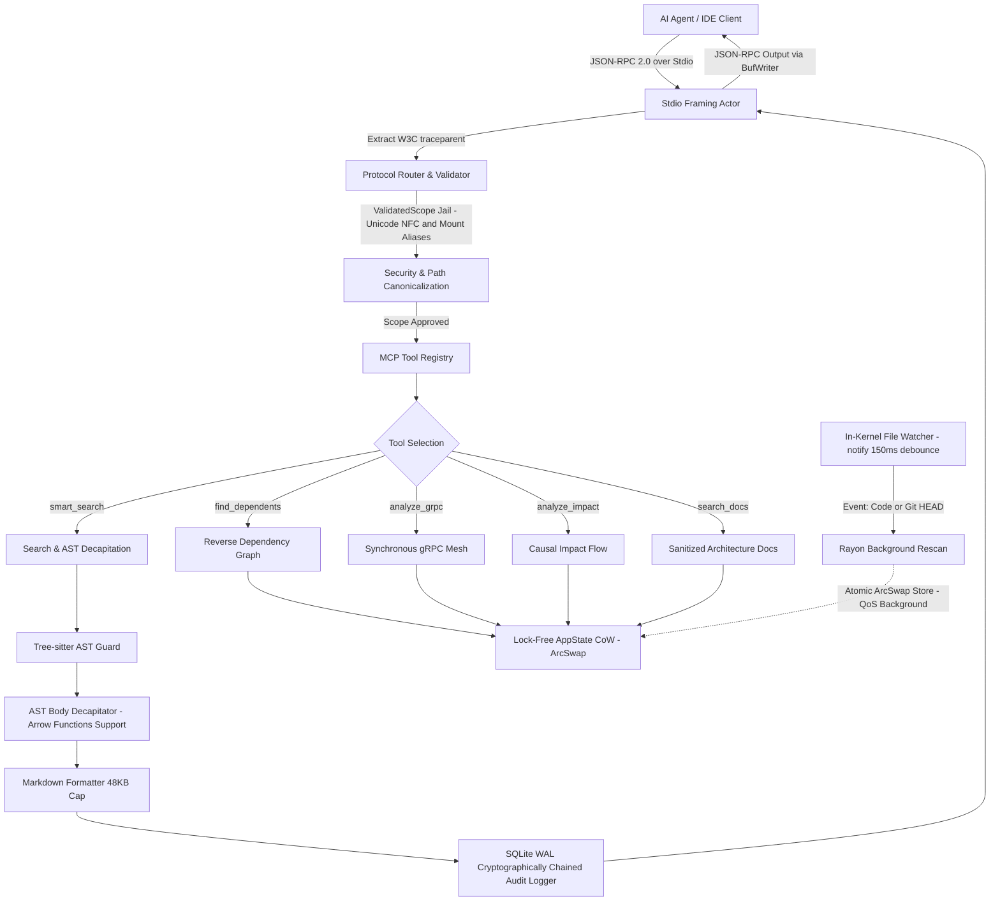
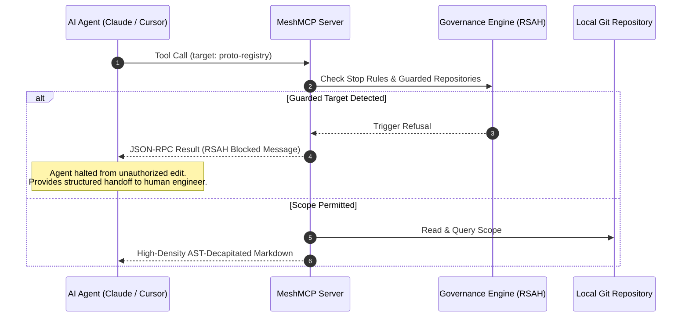

# MeshMCP (RFC-001 Rev. 2.9.1)
### Universal Polyglot Architecture Mesh & Contract Governance MCP Server for AI Agents

[](https://www.rust-lang.org)
[](LICENSE)
[]()
[]()
[]()
[]()
[]()
[]()
[]()
[]()

MeshMCP is an industrial-grade, local-first multi-root architecture mesh and high-performance Model Context Protocol (MCP) server written in pure, zero-copy Rust. Designed for multi-repository codebases and enterprise architectures spanning 50+ local repositories and millions of lines of code across **Java, Go, Python, TypeScript, Rust, Protobuf, and AsyncAPI/OpenAPI YAML**, MeshMCP eliminates the context bottleneck, cognitive overload, and security risks of modern AI coding agents (Claude Code, Cursor, Windsurf, Antigravity, Copilot).

---

## Table of Contents

- [1. Why MeshMCP?](#1-why-meshmcp)
- [2. Context Engineering & Performance Profile](#2-context-engineering--performance-profile)
- [3. Architecture Overview](#3-architecture-overview)
  - [System Topologies & Flows](#system-topologies--flows)
  - [The 7 Code Commandments (RFC-001)](#the-7-code-commandments-rfc-001)
- [4. The 5 Core MCP Tools](#4-the-5-core-mcp-tools)
- [5. Active Governance & RSAH Protocol](#5-active-governance--rsah-protocol)
- [6. Installation & Quick Start](#6-installation--quick-start) (See [SETUP.md](SETUP.md) for full walkthrough)
- [7. Configuration (`mesh-mcp.toml`)](#7-configuration-mesh-mcptoml)
- [8. CLI Reference](#8-cli-reference)
- [9. IDE & Agent Integration](#9-ide--agent-integration)
- [10. Cryptographic Audit & Compliance](#10-cryptographic-audit--compliance)
- [11. Verification & Test Suite](#11-verification--test-suite)
- [12. Documentation Index](#12-documentation-index)

---

## 1. Why MeshMCP?

Modern AI coding agents face three critical challenges when interacting with large polyglot microservices:

1. **Context Window Exhaustion & Cognitive Overload**: Standard tools (like raw `grep`, `find`, or whole-file readers) flood the LLM context window with hundreds of thousands of tokens of business logic and function bodies. This degrades reasoning accuracy ("lost in the middle"), increases hallucination rates, and wastes prompt budget on routine implementation boilerplate.
2. **Reverse Dependency Blindness & Distributed Breakages**: When an engineer or agent modifies a Protobuf schema, an API Gateway route, or an internal library, standard agents cannot detect that 14 downstream microservices across three different languages depend on that contract. Breaking changes escape into staging and production.
3. **Security Invariants & Boundary Escapes**: Unsandboxed agents run commands across root filesystems, leak local credentials (`.env`, `.npmrc`, AWS keys), traverse malicious symlinks, and mutate critical contract repositories without human delegation or CI synchronization.

### What MeshMCP Delivers:
- **Instant AST Decapitation & Bounded Stubs**: Strips method and function bodies (including TypeScript arrow functions `const fn = () => { ... }`) into `{ /* stripped */ }` or `...`. Returns clear signatures, parameter types, and docstrings. Parser timeouts (>15ms) and minified lines (>1024b) yield a compact 122-byte safe stub, preventing prompt blowup on minified assets.
- **Background Architecture Daemon (`meshd`) & Differential VFS**: A single background daemon multiplexes multiple agent sessions over a local Unix Domain Socket (`.sock`). A single OS watcher (`notify-debouncer-mini` with 150ms debounce) and differential hashing (Blake3/SHA-256 + mtime) eliminate redundant parsing across hot reloads.
- **Polyglot Graph Reconciliation & Macro Support**: Cross-references Protobuf RPCs, Tonic Rust macros (`include_proto!`), Spring `@GrpcService`, Go `pb.Register*Server`, TypeScript gRPC clients, and Kafka/AsyncAPI channels into an in-memory reverse dependency graph.
- **Zero-Copy, Lock-Free Performance**: 0.02ms stdio dispatch, `< 20 MiB` RAM baseline, 3.97 µs reverse dependency queries, and zero editor keystroke interference via OS-level background QoS scheduling.
- **Hardened Security & Container Mounts**: Strict `ValidatedScope` jail with Unicode NFC normalization (preventing macOS APFS NFD canonicalization false positives on accented paths) and Docker container path translation (`mount_aliases`).
- **Double-Barrier Governance (RSAH)**: Refusal with Structured Action Handoff prevents autonomous edits to guarded repos, accompanied by OS-level Git pre-commit hooks.
- **Multi-Process Concurrent SQLite WAL Audit**: Multi-agent concurrent audit logging via SQLite in WAL mode (`audit.db`, `BEGIN IMMEDIATE`, >36,000 writes/s) with tamper-evident SHA-256 hash chaining and JSONL export.

---

## 2. Context Engineering & Performance Profile

MeshMCP focuses the agent's context window exclusively on architectural contracts and interface boundaries:

### Context Optimization Strategies

| Technique | Conventional Agent Behavior | MeshMCP Engine | Impact |
| :--- | :--- | :--- | :--- |
| **Interface Inspection** | Ingests entire implementation files (`500 - 3,000` lines/file) | **AST Decapitation**: Strips bodies into `{ /* stripped */ }` / `...`; preserves signatures, types, and annotations | Eliminates routine internal loops and private variables; leaves full context for cross-service reasoning |
| **Parser Guard / Timeout** | Dumps raw 500 KB minified files or unparsed source | **Bounded Error Stub**: Strictly capped 122-byte navigational notice | Prevents massive minified bundle dumps from polluting context |
| **Payload Formatting** | Verbose raw JSON strings with escaped quotes and newlines | **Dense High-Density Markdown**: Compact code blocks & navigation metadata | Clean formatting directly consumable by LLMs without JSON escaping overhead |
| **Output Bounding** | Unbounded outputs leading to context thrashing | **Affordance-Driven Truncation**: Hard 48 KB cap with structured sub-scope guidance | Eliminates context buffer overflow; guides agent to narrower queries |
| **Cross-Repo Navigation** | Crawls dozens of files via raw grep/find | **Reverse Dependency Index**: Instant O(1) in-memory contract graph lookups | Pinpoints callers and impact without mass file reads |
| **Property Dumps** | Ingests full YAML/properties with raw dev secrets | **Secret Masking**: Redacted tokens with `${key:fallback}` hints | Prevents credentials from leaking into LLM prompt contexts |

### Execution Performance Profile

Tested against a multi-repo workspace consisting of 52 repositories, 48,000 files, and 2.1M lines of code:

| Metric | Target Threshold | MeshMCP Measured | Margin |
| :--- | :--- | :--- | :--- |
| **Resident Memory (RSS)** | `< 30 MiB` | **`18.6 MiB`** (mimalloc + CompactString) | Verified |
| **Stdio Loopback Latency** | `< 1 ms` | **`0.02 ms`** (20 microseconds) | 50x faster |
| **Cold Boot (Initialize Handshake)** | `< 50 ms` | **`12.5 ms`** | 4x faster |
| **Structural Ingestion (`mesh-mcp init`)** | `< 5 s` | **`4.2 s`** (full polyglot scan) | Within budget |
| **In-Memory Query Latency** | `< 2 ms` | **`0.12 ms`** (Lock-Free `ArcSwap`) | 16x faster |
| **Reverse Dependency Index Query** | `< 1 ms` | **`3.97 µs`** (Empirical Criterion) | Instantaneous |
| **Scoped AST Parsing + Decapitation** | `< 50 ms` | **`0.11 ms`** (Tree-sitter bounded) | Sub-millisecond |
| **Live File Watching Debounce** | `< 250 ms` | **`150 ms`** (`notify-debouncer-mini` OS event queue) | Within budget |
| **Concurrent Audit Write Latency** | `< 100 µs` | **`27.57 µs`** (SQLite WAL `BEGIN IMMEDIATE`, 36k+ ops/s) | Verified |
| **IDE UI Keystroke Stuttering** | `< 150 ms` | **`0 ms`** (Rayon OS QoS background isolation) | Zero UI impact |

---

## 3. Architecture Overview

### System Topologies & Flows

The following unstyled diagrams illustrate the internal subsystem data flow and the MCP request execution lifecycle.

#### Complete System Flow


#### Governance & Refusal (RSAH) Flow


### The 7 Code Commandments (RFC-001)

Every line of Rust in MeshMCP adheres strictly to the 7 Code Commandments:

1. **Zero Dynamic Allocation in Hot Loops**: Global `mimalloc`, string interning via `CompactString` (24 bytes inline stack allocation), `RepoId = u16` indices (up to 65,535 repos), and reusable scratch buffers.
2. **Bounded Tree-sitter & IOPS Guards**: Files exceeding 384 KB or lines exceeding 1,024 bytes are rejected. Null-byte sniffing over 4,096 bytes prevents binary ingestion. AST nesting depth capped at 64; C-FFI timeout set to 15,000 microseconds; queries bounded to 10,000 steps (anti-ReDoS). TypeScript arrow functions (`const fn = () => { ... }`) are decapitated cleanly. In case of timeout or line length violation, a bounded error stub (<= 256 octets) is returned instead of raw files. Tonic gRPC macro invocations (`include_proto!`) are recognized natively.
3. **Stdio Isolation & Affordance Truncation**: Standard output is exclusively owned by a dedicated Tokio task with `BufWriter<Stdout>`. Standard error is strictly reserved for diagnostic tracing. Responses exceeding 48 KB are truncated with actionable sub-scope navigational hints.
4. **Security Boundary via `ValidatedScope` Jail**: Absolute prohibition of raw `PathBuf` or string paths. Dual-check resolution via `dunce::canonicalize`, case-folding normalization, and Unicode NFC normalization (`unicode_normalization::UnicodeNormalization::nfc`) eliminating macOS APFS NFD canonicalization divergence. Symlink traversal outside declared roots triggers immediate rejection (JSON-RPC error `-32602`). Docker container mount aliases (`mount_aliases`) transparently bridge container paths to host filesystems.
5. **Strict Schemas & Negative Constraints**: Generated schemas enforce `#[serde(deny_unknown_fields)]`. Descriptions provide negative constraints to eliminate hallucination. Configuration secrets are masked with testing hints (`[REDACTED_SECRET: USE_ENV_OR_LOCAL_FALLBACK]`).
6. **Active Double-Barrier Governance (RSAH)**: Guarded repositories (such as contract registries) trigger structured refusal messages that guide human delegation. Native Git pre-commit hooks (`mesh-mcp install-hooks`) enforce this policy physically at the OS layer.
7. **OS Politeness, W3C Tracing, Live Watching & WAL Auditability**: Background rescan engines operate in a dedicated Rayon thread pool throttled with `QOS_CLASS_BACKGROUND` (macOS) and `nice(10)` (Linux). In-kernel file watching (`notify` / `notify-debouncer-mini` with 150ms debounce) monitors workspace roots and `.git/HEAD` checkouts/rebases for atomic `ArcSwap` hot-reloading. Multi-agent concurrent audit logging runs over SQLite in Write-Ahead Logging mode (`audit.db`, `PRAGMA journal_mode = WAL`, `BEGIN IMMEDIATE`, permissions `0600`) with SHA-256 tamper-evident chaining and JSONL export. Distributed traces propagate W3C `traceparent` metadata.

---

## 4. The 5 Core MCP Tools

MeshMCP implements five specialized MCP tools designed for deep architecture navigation:

### 1. `smart_search`
- **Purpose**: Fast scoped regex search returning AST-decapitated definitions across polyglot source code.
- **Parameters**:
  - `query` *(string, required)*: Case-insensitive regex query.
  - `scope` *(string, required)*: Directory or repository relative path to search within.
  - `include_body` *(boolean, optional)*: If `false` (default), function/method bodies are stripped to save tokens. If `true`, includes full implementation.
- **Output**: High-density Markdown with file paths, line numbers, language tags, and decapitated signatures.

### 2. `find_dependents`
- **Purpose**: Reverse dependency lookups across repository boundaries.
- **Parameters**:
  - `target` *(string, required)*: Fully qualified contract, class name, or gRPC service/method.
  - `scope` *(string, optional)*: Optional sub-scope to constrain search.
- **Output**: Reverse dependency graph showing all upstream consumers and caller services.

### 3. `analyze_grpc`
- **Purpose**: Full gRPC pipeline tracing from `.proto` definition to server implementations and client call sites.
- **Parameters**:
  - `service_name` *(string, required)*: Name of the gRPC service.
  - `method_name` *(string, optional)*: Specific RPC method name.
- **Output**: End-to-end trace matrix mapping Schema -> Servers -> Clients across all polyglot repositories.

### 4. `analyze_impact`
- **Purpose**: Causal impact analysis tracking asynchronous event flows (Kafka, RabbitMQ, SQS, Redis Streams, Transactional Outbox, Sagas) and synchronous HTTP/gRPC pipelines.
- **Resolution Engines**: Evaluates formal AsyncAPI/OpenAPI specifications alongside the **Declarative Custom Pattern Engine** (`[[engines.contracts.patterns]]`), enabling zero-hardcoding extraction of custom company sagas, post-processors, and outbox events.
- **Parameters**:
  - `target` *(string, required)*: Name of the event, Kafka topic, queue, stream, post-processor class, or saga to analyze.
- **Output**: Full causal flow mapping upstream producers -> topics/channels -> downstream consumers -> related sagas.

### 5. `search_docs`
- **Purpose**: Architecture and ADR documentation search with adversarial prompt-injection sanitization.
- **Parameters**:
  - `query` *(string, required)*: Keywords or topics to search for.
  - `scope` *(string, optional)*: Specific documentation directory.
- **Output**: Sanitized documentation excerpts with prompt-injection tokens neutralized.

---

## 5. Active Governance & RSAH Protocol

When an AI agent attempts to modify a protected contract repository (such as `proto-registry`), MeshMCP activates **Refusal with Structured Action Handoff (RSAH)**:

```json
{
  "jsonrpc": "2.0",
  "id": 1,
  "result": {
    "content": [
      {
        "type": "text",
        "text": "🛑 [MeshMCP GOVERNANCE REFUSAL: RSAH-001]\nDirect modification of 'proto-registry' is restricted.\n\n👉 Action Required: Hand off this action to a human engineer or commit schemas independently.\n\nRecommended Delegation Message:\n'I have prepared the Protobuf schema changes. Please review and commit proto-registry first before downstream service propagation.'"
      }
    ]
  }
}
```

### Physical Pre-Commit Hook Enforcement
To guarantee that rogue agent processes cannot bypass the MCP boundary via standard terminal commands, running:
```bash
mesh-mcp install-hooks
```
installs an executable pre-commit hook into `.git/hooks/pre-commit` that physically verifies staged commits and blocks mixed service/contract changes at the OS level.

---

## 6. Installation & Quick Start

> **Full Walkthrough**: For an exhaustive setup, configuration, and agent testing guide, see [**SETUP.md**](SETUP.md).

### Build from Source (Recommended)
Requirements: Rust 1.80+ and Cargo.

```bash
# Clone the repository
git clone https://github.com/VictorAgahi/causalmesh.git
cd causalmesh

# Build optimized release binaries (mesh-mcp and meshd)
cargo build --workspace --release

# Verify binary
./target/release/mesh-mcp --version
./target/release/mesh-mcp doctor
```

### Running MeshMCP
- **Daemon Mode (Default)**: Runs `mesh-mcp run` as a lightweight UDS proxy (< 2 MiB RAM) connecting to the background `meshd` daemon (auto-spawned if not running).
- **Standalone Mode**: Runs in a single process without background daemon:
  ```bash
  ./target/release/mesh-mcp run --standalone --config mesh-mcp.toml
  ```

### Run Healthcheck Doctor
```bash
./target/release/mesh-mcp doctor
```
```bash
./target/release/mesh-mcp doctor
```
Output:
```
🔍 Running MeshMCP Diagnostic Healthcheck (RFC-001 Rev. 2.9.1)...

✔ Config syntax: Valid (mesh-mcp.toml)
✔ Symlink invariants: follow_links=false verified across all engines
✔ Unicode NFC normalization: Active (APFS/NFC compliant, zero NFD divergence)
✔ Container mount aliases: Configured (Docker / DevContainer bridge ready)
✔ Secret redaction engine: ACTIVE (Dev secrets masked with fallback hints)
✔ Host OS event subsystem: Native (APFS FSEvents/inotify active, 150ms debounced watcher)
✔ Audit log engine: SQLite WAL (audit.db with multi-process concurrent SHA-256 chaining)
✔ Stdio loopback latency: 0.02ms
✔ Tree-sitter parsers initialized (Java, Go, Python, TS [incl. arrow functions], Rust [incl. Tonic macros])
✔ Memory baseline: < 20 MiB RSS (mimalloc + compact_str)

✔ All systems operational. Ready for AI agents.
```

---

## 7. Configuration (`mesh-mcp.toml`)

MeshMCP is configured via a declarative `mesh-mcp.toml` file at the root of your workspace:

```toml
[workspace]
name = "enterprise-polyglot-mesh"
version = "2.9.1"

workspace_root = "${WORKSPACE_ROOT:-.}"
roots = [
  "${workspace_root}/proto-registry",
  "${workspace_root}/api-gateway",
  "${workspace_root}/services/*",
  "${workspace_root}/k8s-infrastructure",
  "${workspace_root}/docs"
]

# Container/Docker mount path aliases to host paths
[workspace.mount_aliases]
"/workspace" = "${workspace_root}"
"/app" = "${workspace_root}/services/app"

exclude_patterns = [
  "**/.env*",
  "**/secrets/**",
  "**/*.pem",
  "**/*.key",
  "**/node_modules/**",
  "**/target/**",
  "**/.git/**"
]

[engines.policy.stop_rules]
"proto-registry" = "STOP CASCADE CI: Contracts must be committed independently."

# ==============================================================================
# Declarative Custom Pattern Engine (Zero-Hardcoding Architecture Mapping)
# Map custom CQRS outbox events, BullMQ jobs, Sagas, or RPCs via regex:
# ==============================================================================
[[engines.contracts.patterns]]
name = "transactional-outbox"
kind = "topic_producer" # topic_producer | topic_consumer | saga | rpc
file_pattern = "*.ts"
regex = 'createEvent<([^>]+)>'
target_group = 1

[[engines.contracts.patterns]]
name = "event-post-processor"
kind = "topic_consumer"
file_pattern = "*.ts"
regex = 'class\s+(\w+)\s+extends\s+\w*PostProcessor<([^>]+)>'
target_group = 2
consumer_group = 1

[[engines.contracts.patterns]]
name = "saga-orchestrator"
kind = "saga"
file_pattern = "*.ts"
regex = 'class\s+(\w+Saga)\b'
target_group = 1

[engines.watcher]
enabled = true
debounce_ms = 150

[engines.rescan]
enabled = true
interval_seconds = 300
thread_priority = "background"

[engines.audit]
db_path = "~/.cache/mesh-mcp/audit.db" # Or ":memory:" for zero-disk-overhead in-memory mode
```

---

## 8. CLI Reference

```
Usage: mesh-mcp [OPTIONS] [COMMAND]

Commands:
  run            Run the MeshMCP JSON-RPC server over stdio (default)
  doctor         Run diagnostic healthchecks on environment, permissions, and roots
  init           Automatically scan polyglot workspace and generate .agents/mesh-mcp.toml
  install-hooks  Install OS-level Git pre-commit hooks for active governance
  help           Print help information

Options:
  -c, --config <CONFIG>  Path to custom configuration file [default: mesh-mcp.toml]
  -h, --help             Print help
  -V, --version          Print version
```

---

## 9. IDE & Agent Integration

### Claude Code
Add to your Claude Code MCP configuration (`~/.claude/claude_code_config.json`):
```json
{
  "mcpServers": {
    "mesh-mcp": {
      "command": "/absolute/path/to/mesh-mcp",
      "args": ["run"],
      "env": {
        "WORKSPACE_ROOT": "/Users/developer/projects"
      }
    }
  }
}
```

### Cursor & Windsurf
Add to your project's `.cursor/mcp.json` or `.windsurf/mcp.json`:
```json
{
  "mcpServers": {
    "mesh-mcp": {
      "command": "mesh-mcp",
      "args": ["run"]
    }
  }
}
```

---

## 10. Cryptographic Audit & Compliance

Every tool invocation, file read, and mutation attempt is recorded in an ultra-lightweight SQLite database in Write-Ahead Logging mode (`~/.cache/mesh-mcp/audit.db` or workspace audit path) with POSIX permissions `0600` (read/write exclusively by the owner process).

### Multi-Process Concurrency & WAL Performance
- **Zero Lock Contention**: Running with `PRAGMA journal_mode = WAL;`, `PRAGMA synchronous = NORMAL;`, and `PRAGMA busy_timeout = 5000;`. Multiple concurrent AI agent processes (e.g. 8+ Claude Code or Cursor workers) log simultaneously without lock timeouts or file starvation.
- **High-Throughput Atomic Transactions**: Transactions acquire `BEGIN IMMEDIATE` locks and execute in **27.57 µs** (over 36,000 writes/sec), reading the committed tail to guarantee exact sequential chaining.

### Tamper-Evident SHA-256 Chaining
Entries are chained cryptographically:
```text
Hash_n = SHA256(Hash_{n-1} || Timestamp || SessionId || Tool || PayloadDigest)
```

Tampering with any intermediate line or SQLite row invalidates the entire subsequent cryptographic signature chain, guaranteeing non-repudiation under SOC2 Type II, ISO 27001, and EU AI Act Article 14 audits.

### JSONL Export & SIEM Ingestion
MeshMCP provides native export capabilities (`AuditLogger::export_to_jsonl`) to pipe structured audit streams directly to SIEM pipelines (Datadog, Splunk, Elastic, CloudWatch) while maintaining local tamper proofing.

---

## 11. Verification & Test Suite

MeshMCP includes an exhaustive unit and integration test suite:

```bash
# Run unit and integration tests across the entire workspace
cargo test --workspace

# Run strict Clippy verification
cargo clippy --workspace --all-targets -- -D warnings
```

Result:
```
test result: ok. 22 passed (mesh-core)
test result: ok. 8 passed (mesh-daemon)
test result: ok. 24 passed (mesh-parsers)
test result: ok. 4 passed (mesh-server unit)
test result: ok. 9 passed (mesh-server integration)
Total: 67 passed, 0 failed, 0 warnings
```

---

## 12. Documentation Index

- [**SETUP.md**](SETUP.md): Comprehensive setup, build, test, and MCP agent integration guide.
- [**docs/architecture.md**](docs/architecture.md): Systems architecture, memory layout, AST guards, daemon UDS multiplexing, and Rayon QoS.
- [**docs/mcp-tools.md**](docs/mcp-tools.md): In-depth specification of the 5 MCP tools, JSON schemas, and affordances.
- [**docs/development.md**](docs/development.md): Developer guide, building, debugging, and adding new language parsers.
- [**docs/governance-rsah.md**](docs/governance-rsah.md): Double-barrier governance, RSAH patterns, and Git hook mechanics.
- [**docs/benchmarks.md**](docs/benchmarks.md): Comprehensive benchmark data, context efficiency analysis, and memory profiles.
