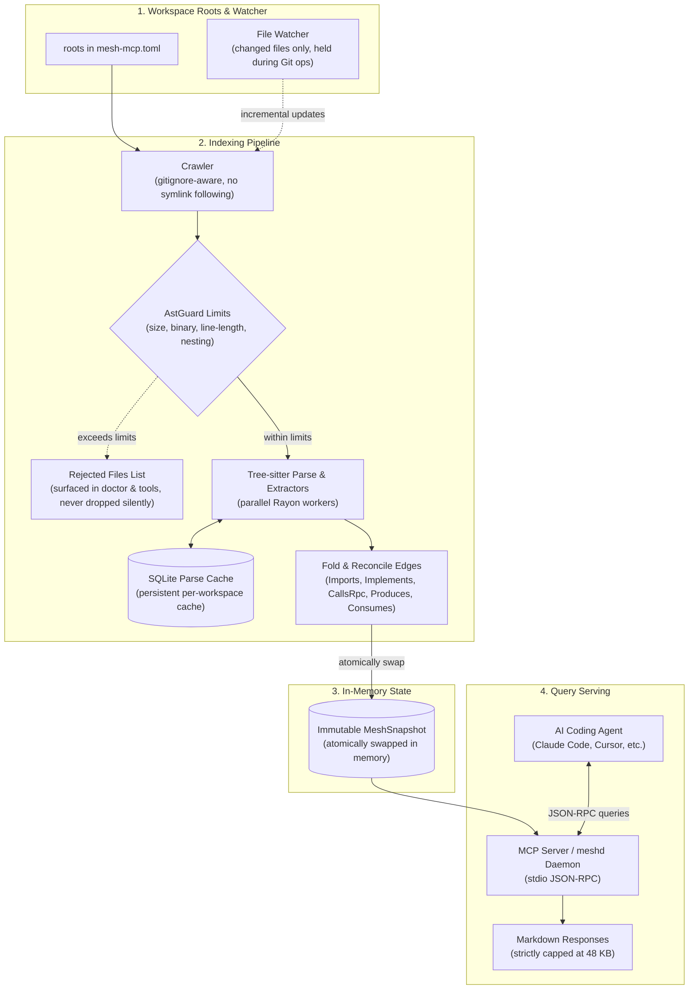

# MeshMCP

[](LICENSE-APACHE)

MeshMCP is a local [Model Context Protocol](https://modelcontextprotocol.io) server, written in
Rust, that indexes a multi-language, multi-service codebase and answers structural questions for
an AI coding agent: where a symbol is declared, who depends on a contract, which services
implement and call a gRPC method, who produces and consumes an event, and what the team's own
documentation says. It runs on the developer's machine, reads only the directories it is
configured with, and its binaries contain no network client code.

---

## The problem

A coding agent explores a repository the way a newcomer does: it greps, opens files one at a
time, and infers relationships from names. In a single-language repository this works. In a
workspace where a `.proto` contract is implemented in Go, called from TypeScript and Java, and
followed by Kafka events consumed in Python, the relationships the agent needs are spread across
files it has no reason to open. The usual results are missed callers, changes that break a
consumer in another service, and a context window filled with function bodies that were only
read to find a signature.

MeshMCP builds that cross-service map once, keeps it in memory, updates it as files change, and
exposes it through six MCP tools.

---

## The six tools

| Tool | Answers |
| :--- | :--- |
| `smart_search` | Where is a symbol declared? Returns signatures with bodies stripped, ranked and paginated. |
| `find_dependents` | Who imports or depends on this type, package or contract? |
| `analyze_grpc` | Where is this RPC defined, implemented and called? Also checks the `.proto` for wire-format breaking changes against a Git base. |
| `analyze_impact` | What is affected if this RPC, service, topic or event changes? One table row per impacted element, marked `INTERNAL`/`EXTERNAL` with edge confidence. |
| `search_docs` | What do our Markdown docs, ADRs and RFCs say about this term? |
| `visualize_mesh` | Per-service topology as Mermaid, JSON or HTML, bounded in size, with zoom. |

Arguments, output formats and error handling: [docs/mcp-tools.md](docs/mcp-tools.md).

---

## Installation

**Prebuilt binaries (recommended).** `install.sh` downloads the rolling `latest` build of `main` for macOS
(arm64, x86-64), Linux x86-64 and Windows x86-64, and falls back to `cargo install` elsewhere:

```bash
curl -fsSL https://raw.githubusercontent.com/VictorAgahi/causalmesh/main/install.sh | bash
```

**Connect an agent:**

```bash
claude mcp add mesh-mcp -- mesh-mcp run          # Claude Code
mesh-mcp doctor                                   # config, roots, parsers, daemon, cache, index health
```

**Pilot install from a checkout** (macOS or Linux, x86-64 or arm64; builds locally, downloads
nothing, idempotent):

```bash
git clone https://github.com/VictorAgahi/causalmesh.git
cd /path/to/your/workspace
/path/to/causalmesh/scripts/install_pilot.sh        # cargo build --release, then init after confirmation
```

It copies `mesh-mcp` and `meshd` into `~/.local/bin`, runs
`mesh-mcp init --auto --write-ide-config` (keeps an existing config, merges `.cursor/mcp.json` and
`.vscode/mcp.json` without removing other servers) and checks the result with
`mesh-mcp doctor --json`. Building needs a stable Rust toolchain and a C compiler.

The full walkthrough, including configuration of roots, docs vocabulary, custom patterns, skills
and stop rules, is in [SETUP.md](SETUP.md). A five-language example workspace is in
[`examples/polyglot-shop`](examples/polyglot-shop/README.md).

### CLI

| Command | Purpose |
| :--- | :--- |
| `mesh-mcp run [--standalone]` | MCP server on stdio (daemon-backed by default). |
| `mesh-mcp init --auto [--write-ide-config]` | Generate `.agents/mesh-mcp.toml` from the directory layout; optionally write Cursor / VS Code MCP entries. |
| `mesh-mcp doctor [--fix] [--json]` | Diagnose configuration, index health, socket, daemon version, cache and sandbox; `--fix` repairs what is safe to repair (never the audit log). |
| `mesh-mcp graph [--format html\|mermaid\|json\|fingerprint] [--open]` | Render the full topology, or print a content fingerprint of the index. |
| `mesh-mcp stats [--since 7d\|24h\|all]` | Local audit summary: calls, `isError` rate, p50/p95 latency per tool, cache hit rate, `meshd` restarts. |
| `mesh-mcp install-hooks` | Install the Git pre-commit hook. |

Logs go to stderr. Under `mesh-mcp run`, stdout carries only JSON-RPC frames.

---

## How it works


```mermaid
flowchart TD
    subgraph Inputs["1. Workspace Roots & Watcher"]
        Config["roots in mesh-mcp.toml"]
        Watcher["File Watcher<br/>(changed files only, held during Git ops)"]
    end

    subgraph Pipeline["2. Indexing Pipeline"]
        Crawl["Crawler<br/>(gitignore-aware, no symlink following)"]
        Guard{"AstGuard Limits<br/>(size, binary, line-length, nesting)"}
        Rejected["Rejected Files List<br/>(surfaced in doctor & tools, never dropped silently)"]
        Parse["Tree-sitter Parse & Extractors<br/>(parallel Rayon workers)"]
        Cache[("SQLite Parse Cache<br/>(persistent per-workspace cache)")]
        Reconcile["Fold & Reconcile Edges<br/>(Imports, Implements, CallsRpc, Produces, Consumes)"]
    end

    subgraph State["3. In-Memory State"]
        Snapshot[("Immutable MeshSnapshot<br/>(atomically swapped in memory)")]
    end

    subgraph Serving["4. Query Serving"]
        Server["MCP Server / meshd Daemon<br/>(stdio JSON-RPC)"]
        Agent["AI Coding Agent<br/>(Claude Code, Cursor, etc.)"]
        Answers["Markdown Responses<br/>(strictly capped at 48 KB)"]
    end

    Config --> Crawl
    Watcher -.->|"incremental updates"| Crawl
    Crawl --> Guard
    Guard -->|"within limits"| Parse
    Guard -.->|"exceeds limits"| Rejected
    Parse <--> Cache
    Parse --> Reconcile
    Reconcile -->|"atomically swap"| Snapshot
    Snapshot --> Server
    Agent <-->|"JSON-RPC queries"| Server
    Server --> Answers
```

- **Daemon mode (default).** `mesh-mcp run` is a thin stdio proxy to a per-workspace `meshd`
  process (Unix socket on macOS/Linux, named pipe on Windows), so several editor windows on the
  same repository share one index. `meshd` is started on demand and exits after 30 idle minutes.
  `mesh-mcp run --standalone` keeps everything in one process (containers, CI).
- **Persistent parse cache.** One SQLite file per workspace under `~/.cache/mesh-mcp/workspaces/`,
  with a size quota and LRU eviction, so a restart or a branch switch back to known content does
  not re-parse it.
- Details: [docs/architecture.md](docs/architecture.md).

---

## Languages and what is extracted

Verified against `crates/mesh-parsers/src/languages/` at the time of writing. "Declarations" means
classes, interfaces, functions/methods and similar symbols usable by `smart_search`.

| Language | Declarations | Imports (`find_dependents`) | gRPC | Events / messaging | HTTP endpoints |
| :--- | :---: | :---: | :--- | :--- | :--- |
| Java | yes | yes | `*ImplBase` servers, `@GrpcService`, `newBlockingStub/newStub/newFutureStub` clients | `@KafkaListener`, `KafkaTemplate` | Spring MVC / JAX-RS annotations |
| Go | yes | yes | `Register*Server`, `New*Client` | kafka-go, sarama, confluent-kafka-go | — |
| Python | yes | yes | `*Servicer` servers, `*_pb2_grpc.*Stub(...)` clients | confluent_kafka, aiokafka, Celery | Flask / FastAPI routes (path and method) |
| TypeScript / JavaScript (`.ts`, `.tsx`, `.js`) | yes | yes | NestJS `@GrpcMethod`, `getService<...>()`, imported `new XClient(...)` (ts-proto, `@grpc/grpc-js`) | kafkajs `subscribe`/`send`, NestJS `@EventPattern`/`@MessagePattern` and `client.emit`/`client.send`, BullMQ `Queue`/`Worker` | — |
| Rust | yes | yes | tonic service implementations | rdkafka | — |
| C++ | yes | yes (`#include`) | — | — | — |
| Kotlin | yes | — | — | `@KafkaListener`, kafka-clients `subscribe`/`send` | Spring annotations |
| C# | yes | — | — | Confluent.Kafka producers/consumers | — |
| Ruby, PHP, Swift, Scala | yes | — | — | — | — |
| Protobuf | services, methods, messages | `import` | contract source of truth | — | — |
| OpenAPI / AsyncAPI YAML | paths, channels | — | — | AsyncAPI channels | OpenAPI paths |
| Spring `application*.yml` / `.properties` | properties (secrets masked) | — | — | used to resolve topic names | — |
| Markdown | sections for `search_docs` | — | — | — | — |

Conventions MeshMCP does not recognise (an in-house event bus, an outbox table) can be declared
as regular expressions in `[[engines.contracts.patterns]]`; see [SETUP.md](SETUP.md#custom-contract-patterns).

---

## Measured results

Every figure below is copied from a dated section of [docs/quality.md](docs/quality.md) or from a
file in the repository, with the platform it was measured on. Numbers from a developer
workstation are single-machine measurements, not guarantees for your hardware.

### Extraction correctness (gRPC service-to-service edges)

Hand-written ground truth (`tests/golden/*.expected.yaml`, read from each project's source, never
from MeshMCP output), scored by `scripts/golden/score.py` against pinned commits
(`scripts/golden/repos.txt`).

| Corpus | Golden edges | Precision | Recall |
| :--- | ---: | ---: | ---: |
| Google `online-boutique` | 14 | 100 % | 100 % |
| OpenTelemetry `otel-demo` | 13 | 100 % | 100 % |
| Google `bank-of-anthos` | 0 (no gRPC) | 100 % | 100 % (nothing fabricated) |

Source: `docs/quality.md`, 2026-09-26, Plan 4 step 4.5 (release binary, before/after on the same
corpus). Enforced on every pull request by `.github/workflows/golden.yml` on `ubuntu-latest`,
which fails below 1.0/1.0 on all three corpora.

**Scope of this claim:** only gRPC edges are scored, on three open-source demo applications (27
edges in total). Kafka topic chains and HTTP routes have hand-written ground truth
(`otel-demo`'s `orders` topic, `bank-of-anthos`'s 18 Flask routes) but no scorer yet.

### Determinism

Indexing the same content twice gives the same index: `scripts/determinism.sh` requires a single
content fingerprint over 5 sequential and 8 concurrent runs per example workspace. It is a
blocking CI job on `ubuntu-latest` and `macos-latest` (`.github/workflows/ci.yml`).

### Performance budgets (synthetic 5,000-file workspace)

The nightly job (`.github/workflows/nightly-bench.yml`, `ubuntu-latest`) generates a fixed-seed
5,000-file workspace with 8 service roots (`scripts/bench/gen_synthetic.py`) and fails if
`scripts/bench/scale_bench.py` exceeds `scripts/bench/budgets.json`:

| Metric | Budget (`budgets.json`) | Measured, 6.0.0 |
| :--- | ---: | ---: |
| Boot to first `initialize` response | 3,000 ms | 0.30–0.31 s |
| Peak RSS | 300 MB | 49 MB |
| `smart_search` p50 / p95 | 300 / 800 ms | 2.2–2.4 / 3.7–7.8 ms |
| Reload after a file edit, until searchable | 3,000 ms | 205–209 ms |

Measured column: `docs/quality.md`, "Plan 3 closeout (2026-09-26, 6.0.0)", release build on the
developer workstation, two runs outside the repository. The budgets carry 4–5x headroom for
shared CI runners. Larger-repository budgets: see [docs/quality.md](docs/quality.md).

### Resource use and payload size

| What | Before | After | Source (`docs/quality.md`) and platform |
| :--- | ---: | ---: | :--- |
| Idle `meshd` CPU, macOS, 3,000 files in 503 directories, 10 min | 4.21 % (2 s polling) | 0.000 % (FSEvents) | 2026-09-27, step 4.2, macOS, shared loaded machine |
| `git checkout` rewriting 3,000 files while searching | 3 partial index generations served mid-checkout | 1 generation after the checkout, identical to a cold index | 2026-09-27, step 4.2 (`scripts/test_git_storm.sh`) |
| Parser memory for a 1.5 MB OpenAPI spec | 42.92 MB (28.7x file size) | 3.36 MB (2.2x) | 2026-09-27, step 4.9, Apple M2 |
| 30 KB YAML file with alias fan-out (process peak delta) | 1,847.70 MB | 3.00 MB | 2026-09-27, step 4.9, Apple M2 |
| Parse cache, 5,000-file corpus | 1,070 B/entry, one machine-wide file, no eviction | 1,171 B/entry, one file per workspace, quota + LRU; warm boot 127–136 ms | 2026-09-26, step 4.4, developer workstation |
| `analyze_impact` on the `polyglot-shop` fixture, median of 51 calls | — | 24.5–26.7 µs (test asserts < 100 ms) | 2026-09-27, step 4.6a, Apple M2 |
| Heaviest default `smart_search` page on the golden corpora | 15,418 bytes | 8,424 bytes | 2026-09-27, steps 4.13 and 4.1 note, macOS arm64 |
| Empty `smart_search` page, `bank-of-anthos` | 2,133 bytes | 248 bytes | 2026-09-27, step 4.1 note, macOS arm64 |

### What is not measured yet

- **Token or cost savings.** MeshMCP makes no quantified claim here. Bodies are stripped from
  search results and pages are capped, but whether an agent ends up using fewer tokens on real
  tasks is what the pilot's A/B protocol in [docs/pilot-scorecard.md](docs/pilot-scorecard.md)
  will measure. That grid is empty until the pilot has run.
- Accuracy of event (Kafka) and HTTP route extraction, and of `analyze_impact` beyond one hop,
  against ground truth.
- Behaviour on large real repositories (the scale corpora are synthetic), and a long-lived
  `meshd` over weeks. The full list is in `docs/quality.md`, "What's NOT measured yet".

---

## Security and governance

| Control | What it does | Limits |
| :--- | :--- | :--- |
| **Path jail** (`ValidatedScope`) | Every path argument is Unicode-normalised, cleaned, canonicalised and must fall under a configured root; otherwise the call fails. The crawler never follows symlinks, so a link pointing outside the roots is never indexed. Case-folded comparison on macOS and Windows. | Limits what the tools read; it does not sandbox the process itself. |
| **Network sandbox** (`meshd`, Linux) | After binding its socket, `meshd` installs a seccomp filter on every thread that makes creating IPv4/IPv6 sockets and `io_uring` fail with `EPERM`. `MESH_DAEMON_SANDBOX=required` makes a refused filter fatal. `mesh-mcp doctor` reports whether the running daemon is confined. | Linux only (x86_64, aarch64, riscv64). `mesh-mcp run --standalone` and macOS/Windows are not kernel-confined; there the guarantee is only that the code has no network client. Not a filesystem sandbox. |
| **Secret masking** | Values of keys that look like secrets (`password`, `secret`, `token`, `credential`, `apikey`, …) in YAML and `.properties` files are replaced with `[REDACTED_SECRET: USE_ENV_OR_LOCAL_FALLBACK]`; the same key-based masking is applied to `key: value` / `key = value` lines in `smart_search` snippets. `.env*`, `*.pem`, `*.key` are excluded from indexing by default. | Keyed on names. A secret assigned to an innocuous name, or embedded in a string literal in code, is not detected. |
| **Prompt-injection filtering** | Indexed Markdown is scanned for known injection phrases and chat-template markers, which are replaced before `search_docs` returns them. | A fixed phrase list, not a classifier. |
| **Audit log** | Unless disabled (`cryptographic_audit_trail = false`), every tool call, including refused and invalid ones, is appended to a local SQLite database (`~/.cache/mesh-mcp/audit.db`, mode `0600`) with a SHA-256 hash chain covering timestamp, session, tool, argument digest, status, files accessed and redaction count. `mesh-mcp stats` summarises it locally. | Tamper-evident, not tamper-proof: a local user can delete the file. No compliance certification is claimed. |
| **Stop rules (RSAH)** | `[engines.policy.stop_rules]` names guarded paths. With `read_governance_mode = "enforce_refusal"`, tool calls about a guarded path return a structured refusal telling the agent to stop and hand off to a human; `audit_warn` only logs. | The default (`allow_all`) never refuses reads, and no shipped tool writes anything, so refusals only occur if you opt in. |
| **Pre-commit hook** | `mesh-mcp install-hooks` installs a Git hook that rejects a commit staging both `.proto` files under the configured `proto_dirs` and service source files (contract first, consumers after). | Only that one rule; does nothing when `proto_dirs` is not configured; bypassable with `git commit --no-verify` like any client-side hook. |

Details: [docs/architecture.md](docs/architecture.md) (jail, sandbox, audit) and
[docs/governance-rsah.md](docs/governance-rsah.md) (stop rules, skills, hook).

---

## Status and known limitations

- **Version 7.0.0** on `main`. Single Rust workspace (`mesh-core`, `mesh-parsers`,
  `mesh-server`, `mesh-daemon`); CI runs formatting, strict Clippy, and the test suite on Linux,
  macOS and Windows, plus the determinism and golden-corpus gates.
- **Ready for a pilot, not yet validated in production use.** The A/B pilot is the next
  measurement.
- Extraction is pattern-based per language and framework (table above). Code that reaches a
  service through reflection, dependency-injection strings or generated code outside the
  workspace is not linked. Edges carry a confidence (`exact`, `heuristic`, `ambiguous`) so the
  agent can weigh them.
- Files over 384 KB (1.5 MB for contracts and generated schemas), with a line over 1 KB, a null
  byte in the first 4 KB, or nesting deeper than 64 are not parsed. They are listed by
  `mesh-mcp doctor`, and rejected source files are named in the `smart_search` /
  `find_dependents` results whose scope covers them.
- File watching: one recursive FSEvents stream per root on macOS; per-directory watches on Linux
  and Windows, where very large trees can exhaust `inotify` watches (`doctor` checks the limit).
- The network sandbox exists on Linux only (see above).

---

## Documentation

| Document | Contents |
| :--- | :--- |
| [SETUP.md](SETUP.md) | Installation and configuration walkthrough, config reference, troubleshooting. |
| [docs/mcp-tools.md](docs/mcp-tools.md) | Tool schemas, output formats, error codes. |
| [docs/architecture.md](docs/architecture.md) | Snapshot model, indexing, parser guards, jail, daemon, cache, sandbox, audit. |
| [docs/governance-rsah.md](docs/governance-rsah.md) | Stop rules, RSAH refusals, project skills, pre-commit hook. |
| [docs/quality.md](docs/quality.md) | Every measurement, dated, with method and command. |
| [docs/benchmarks.md](docs/benchmarks.md) | The measurement harnesses and how to run them. |
| [docs/development.md](docs/development.md) | Building, testing, adding a language. |
| [docs/pilot-scorecard.md](docs/pilot-scorecard.md) | A/B protocol for the pilot. |

Contributors: the architectural invariants a change must preserve are in [CLAUDE.md](CLAUDE.md)
and [AGENT.md](AGENT.md); task-specific guides for coding agents are in
[`.agents/skills/`](.agents/skills/README.md).

---

## License

Dual-licensed under the [Apache License, Version 2.0](LICENSE-APACHE) or the
[MIT license](LICENSE-MIT), at your option.
