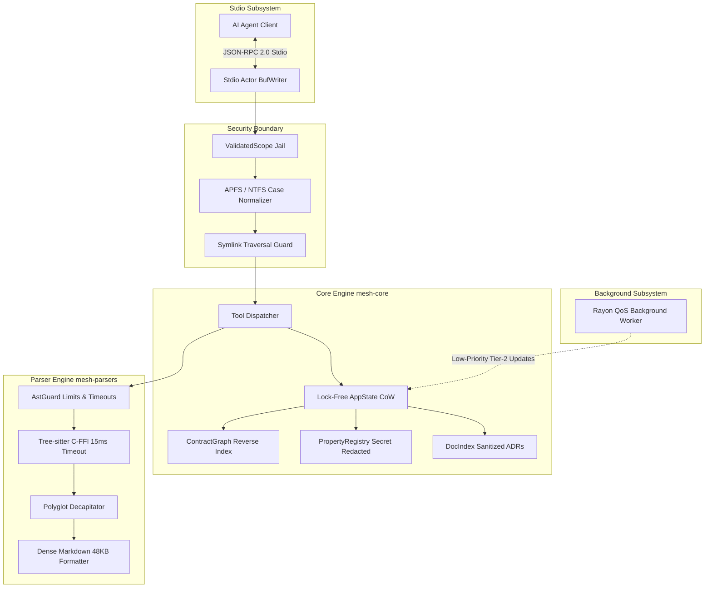
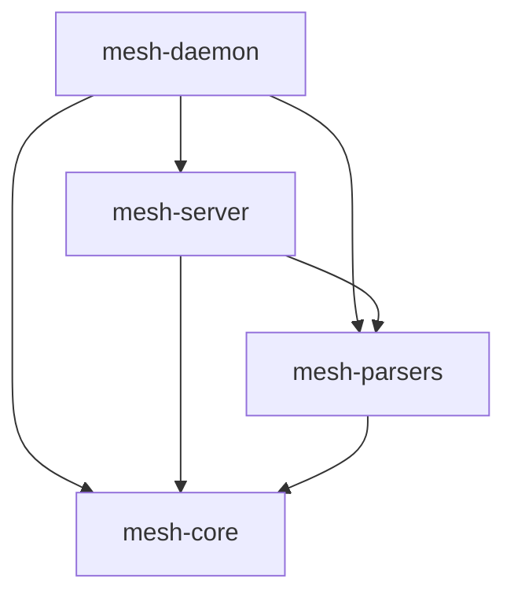
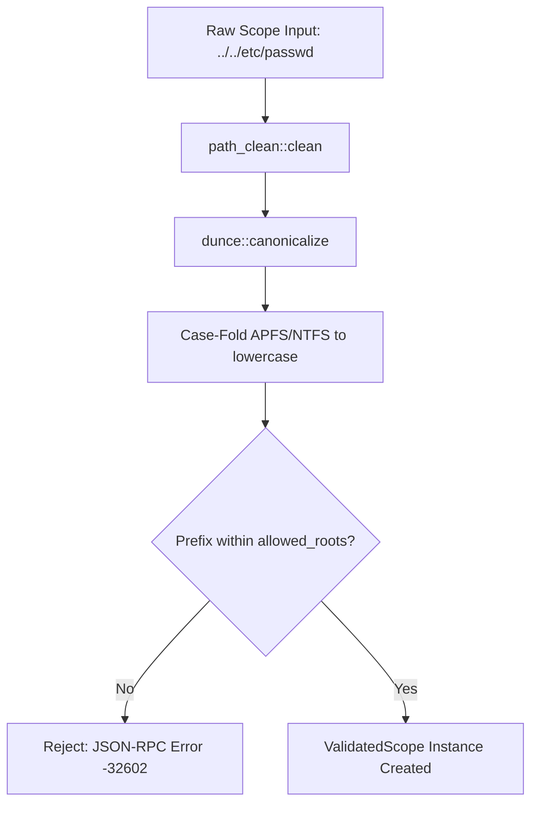
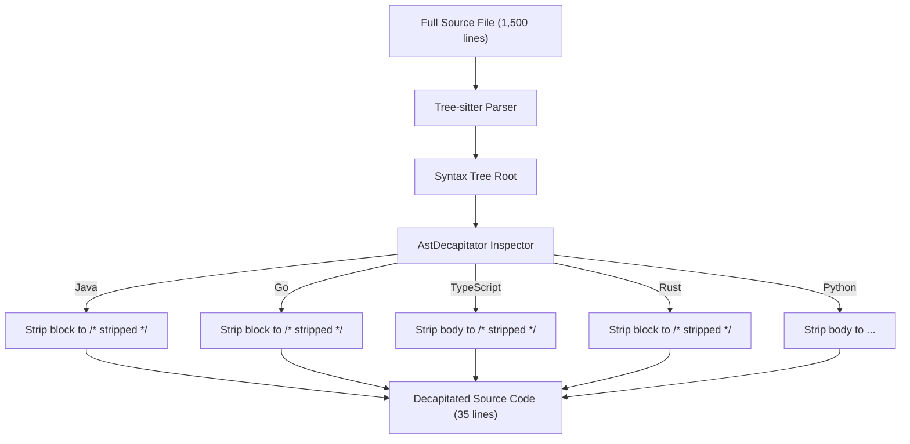

# MeshMCP Systems Architecture & Engineering Deep Dive

## 1. High-Level Architectural Vision

MeshMCP is engineered as a local-first, low-latency, memory-efficient polyglot architecture mesh for AI coding agents. Unlike traditional language servers (LSP) or indexing daemons that load full Abstract Syntax Trees (AST) and heavy symbol tables into memory, MeshMCP operates on a **contract-first, zero-copy architecture**.

It addresses the fundamental cognitive thermodynamics problem of Large Language Models:
- LLM attention mechanisms degrade quadratically or logarithmically when overwhelmed with implementation logic.
- Cross-service dependencies in microservice architectures (Protobuf, gRPC, REST, Kafka) require relational visibility, not line-by-line function implementations.



---

## 2. Workspace Crate Topology

MeshMCP is structured into four specialized crates to enforce strict separation of concerns, rapid incremental compilation, and modular security auditing:

```
crates/
├── mesh-core/       # Pure domain logic, memory models, security jail, VFS, audit & state
├── mesh-parsers/    # Tree-sitter C-FFI bindings, AST decapitators, and Markdown engine
├── mesh-server/     # Tokio JSON-RPC stdio actor, MCP protocol framing, and UDS client proxy
└── mesh-daemon/     # meshd background daemon, UDS server, multiplexer, single file watcher & idle watchdog
```

### Dependency Hierarchy


- **`mesh-core`** depends only on core runtime utilities (`tokio`, `compact_str`, `arc-swap`, `dunce`, `ring`, `rayon`). It has zero Tree-sitter dependencies.
- **`mesh-parsers`** handles all grammar evaluation, C-FFI bindings, and AST body stripping.
- **`mesh-server`** implements the JSON-RPC actor model, CLI subcommands (`doctor`, `init`, `install-hooks`), and the transparent UDS client proxy.
- **`mesh-daemon`** (`meshd`) maintains the long-lived in-memory architecture graph, differential VFS, single OS watcher, and serves multiple agent sessions concurrently over Unix Domain Sockets.

---

## 3. Memory Model & Zero-Copy Hot Loop

In high-concurrency agent workflows where thousands of definitions are searched and cross-referenced, dynamic heap allocation is the primary bottleneck. MeshMCP enforces zero allocation in hot loops:

### 3.1 Global Allocator: `mimalloc`
MeshMCP replaces the system allocator with Microsoft's `mimalloc`:
```rust
#[global_allocator]
static GLOBAL: mimalloc::MiMalloc = mimalloc::MiMalloc;
```
`mimalloc` provides thread-local free lists, eliminating lock contention when background Rayon worker threads allocate scratch buffers while the Stdio actor serves foreground MCP queries.

### 3.2 String Interning: `CompactString`
Identifiers, repository names, method signatures, and file sub-paths never use Rust's standard `String` (which incurs a 24-byte pointer/capacity/length heap allocation). Instead, MeshMCP uses `compact_str::CompactString`:
- **Small String Optimization (SSO)**: Strings up to 24 bytes (on 64-bit systems) are stored completely on the stack with zero heap indirection.
- **Cache Locality**: Vectors of `CompactString` retain sequential CPU cache line locality during iterations.

### 3.3 Interned Repository Identifiers: `RepoId = u16`
In a 50-repository to 65,000-repository workspace, mapping strings in graph nodes consumes significant memory and induces pointer chasing. MeshMCP interns repository names into a compact 16-bit integer:
```rust
pub type RepoId = u16;
```
All graph lookups index into flat arrays or contiguous maps indexed by `RepoId`, scaling seamlessly to 65,535 microservices and libraries.

### 3.4 Lock-Free State Management via `ArcSwap<MeshSnapshot>`
State updates never acquire mutexes or read-write locks in the query path. Everything that
changes at runtime lives in **one** immutable snapshot, so a reader can never observe a new
contract graph next to a stale doc index:
```rust
pub struct MeshSnapshot {
    pub contract_graph: ContractGraph,
    pub doc_index: DocIndex,
    pub property_registry: PropertyRegistry,
    pub generation: u64,
}

pub struct AppState {
    pub config: Arc<Config>,            // fixed for the process lifetime
    pub allowed_roots: Arc<[PathBuf]>,  // fixed
    pub governance: Arc<GovernanceEngine>,
    pub snapshot: ArcSwap<MeshSnapshot>, // the only hot-swapped state
    // ...
}
```
Queries take an atomic `state.snapshot()` guard using pointer copying. Background rescans
build an updated snapshot and publish it atomically via `install_snapshot()`, delivering
**0ns lock contention** for agent queries.

---

## 4. The Security Boundary: `ValidatedScope` Jail

AI coding agents are vulnerable to path traversal attacks, malicious symlinks in `node_modules`, and arbitrary filesystem reads. MeshMCP introduces the `ValidatedScope` newtype pattern.

### Resolution Protocol:
1. **Lexical Clean**: Paths pass through `path_clean::clean()`.
2. **Canonicalization**: The path is resolved via `dunce::canonicalize()` (which resolves Windows UNC paths safely and eliminates virtual directory segments).
3. **Case Folding Normalization**: On macOS (APFS) and Windows (NTFS), case insensitivity can bypass string prefix checks (e.g., `/Users/REPO` vs `/users/repo`). MeshMCP canonicalizes paths to lowercase before boundary validation.
4. **Boundary Prefix Check**: The resolved path must start with at least one configured root in `mesh-mcp.toml`.
5. **Symlink Prohibition**: `follow_links(false)` is enforced across all filesystem crawlers (`ignore::WalkBuilder`). Any traversal targeting symlinks pointing outside the workspace jail immediately errors with JSON-RPC `-32602`.



---

## 5. Tree-Sitter & AstGuard Pipeline

Tree-sitter is a powerful incremental parsing framework, but raw C-FFI invocations can crash processes through stack overflows or ReDoS attacks. MeshMCP sandwiches Tree-sitter behind strict defensive bounds:

### 5.1 Pre-Parsing Lexical Guards
Before passing any file to a Tree-sitter parser:
1. **Size Bound**: Files > 384 KB are immediately rejected.
2. **Line Length Bound**: Lines exceeding 1,024 bytes (e.g., minified JS bundles) are rejected.
3. **Binary Sniffing**: The first 4,096 bytes are scanned for null bytes (`0x00`). If detected, parsing halts.
4. **Nesting Depth Check**: Quick lexical scanner checks brace/parenthesis nesting depth. Files with depth > 64 are rejected to prevent C stack exhaustion.

### 5.2 C-FFI Timeout
MeshMCP configures a hardware timeout for every parse session:
```rust
unsafe {
    tree_sitter::ffi::ts_parser_set_timeout_micros(parser, 15_000); // 15 milliseconds
}
```
If a complex file causes parsing to loop, Tree-sitter aborts cleanly and returns an error without stalling the agent.

### 5.3 Streaming ReDoS Limits
AST query matches are executed with a hard step counter:
- Cursor iterations are limited to $10,000$ steps per query.
- Match results are capped at $500$ captures.

---

## 6. Polyglot AST Decapitation Engine

When an agent searches for functions or classes using `smart_search`, MeshMCP strips all implementation bodies, preserving only signatures, parameters, return types, and docstrings.



### Representative AST Decapitation By Language
In typical service codebases, function bodies comprise 50% to 80% of lines. Decapitation strips internal loops, temporary variables, and private business logic while preserving public contracts:

| Language | Original Source Snippet | Decapitated AST Representation | Preserved Contract Elements |
| :--- | :--- | :--- | :--- |
| **Java** | `public UserResponse getUser(UserId id) { ... 120 lines ... }` | `public UserResponse getUser(UserId id) { /* stripped */ }` | Method name, arguments, types, annotations |
| **Go** | `func (s *Server) GetUser(ctx context.Context, req *Req) (*Res, error) { ... 85 lines ... }` | `func (s *Server) GetUser(ctx context.Context, req *Req) (*Res, error) { /* stripped */ }` | Receiver, function name, parameters, return types |
| **TypeScript**| `const getBilling = async (id: string): Promise<Billing> => { ... 90 lines ... };` | `const getBilling = async (id: string): Promise<Billing> => { /* stripped */ };` | Const binding, arrow signature, async, return type |
| **Python** | `def get_user(self, user_id: str) -> UserResponse: ... 60 lines ...` | `def get_user(self, user_id: str) -> UserResponse: ...` | Function name, self, type hints, return annotations |
| **Rust** | `pub async fn get_user(&self, id: &UserId) -> Result<User, Error> { ... 140 lines ... }` | `pub async fn get_user(&self, id: &UserId) -> Result<User, Error> { /* stripped */ }` | Visibility, async fn, parameters, Result types |

---

## 7. Stdio Framing & Actor Isolation

The Model Context Protocol operates over standard input/output. Mixing `println!` or logging into `stdout` corrupts JSON-RPC framing and crashes the client.

### Architecture:
- **Zero Stdout Pollution**: MeshMCP's `main.rs` initializes `tracing_subscriber` targeting strictly `std::io::stderr`. Not a single `println!` exists in the codebase.
- **Dedicated Tokio Actor**: A single background task holds exclusive write access to `tokio::io::BufWriter<tokio::io::Stdout>`.
- **Bounded Channels**: Ingestion and egress channels are bounded to 64 frames. If an agent floods queries, backpressure prevents memory ballooning.
- **Graceful EOF Termination**: When the parent process closes Stdin, the Stdio actor detects `Ok(0)`, broadcasts cancellation tokens, and shuts down within 50ms.

---

## 8. Operating System Politeness & Rayon QoS

Background indexing must never cause IDE keystroke stuttering or fan spin on developer laptops.

MeshMCP schedules Tier-2 background rescans on a dedicated Rayon thread pool configured with operating system quality-of-service throttling:

- **macOS (Darwin)**: Sets thread priority using `libc::pthread_set_qos_class_self_np(libc::QOS_CLASS_BACKGROUND, 0)`. macOS kernel delegates these threads to high-efficiency cores (E-cores) and deprioritizes disk I/O.
- **Linux**: Calls `libc::setpriority(libc::PRIO_PROCESS, 0, 10)` to yield CPU cycles to IDE and language server processes.

---

## 9. Cryptographic Audit Trail (SOC2 & EU AI Act)

For compliance under SOC2 Type II and EU AI Act Article 14 (human-in-the-loop oversight for automated systems), MeshMCP generates an append-only cryptographic audit trail:

- **Location**: `~/.cache/mesh-mcp/audit.log` (or workspace-configured audit path).
- **Permissions**: Mode `0600` (readable/writable exclusively by user).
- **Chaining Function**:
  ```text
  Hash_n = SHA256(Hash_{n-1} || Timestamp || SessionId || Tool || PayloadDigest)
  ```

An auditor or CI verification script can replay the log from genesis (`0000000000000000000000000000000000000000000000000000000000000000`). Any modified, inserted, or removed record breaks all subsequent SHA-256 signatures.
