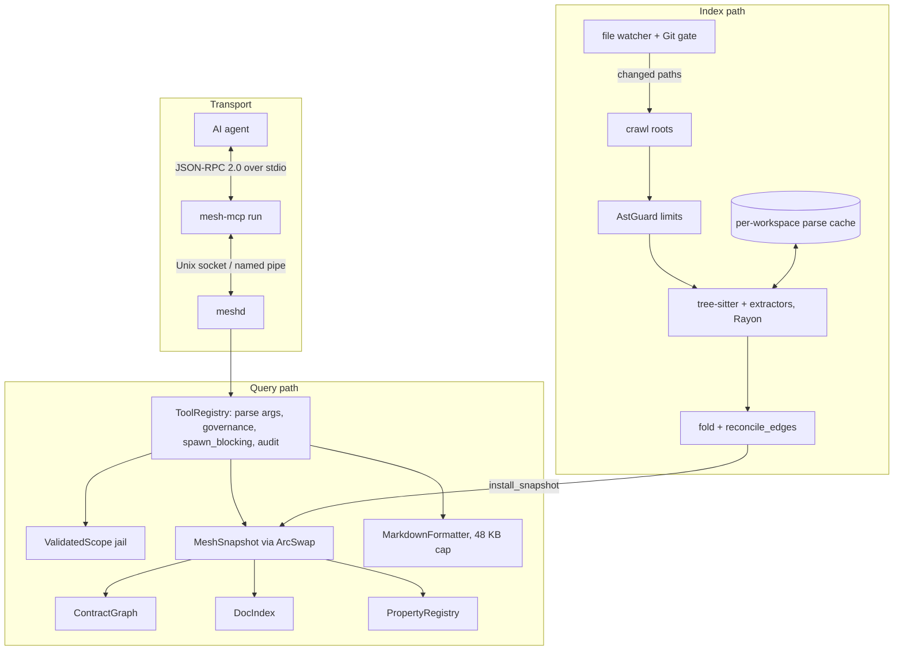
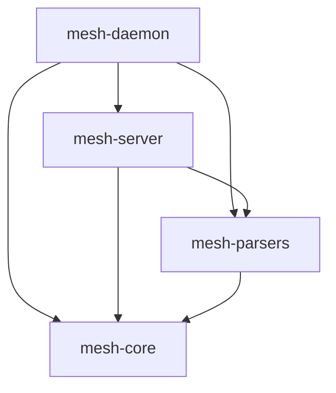
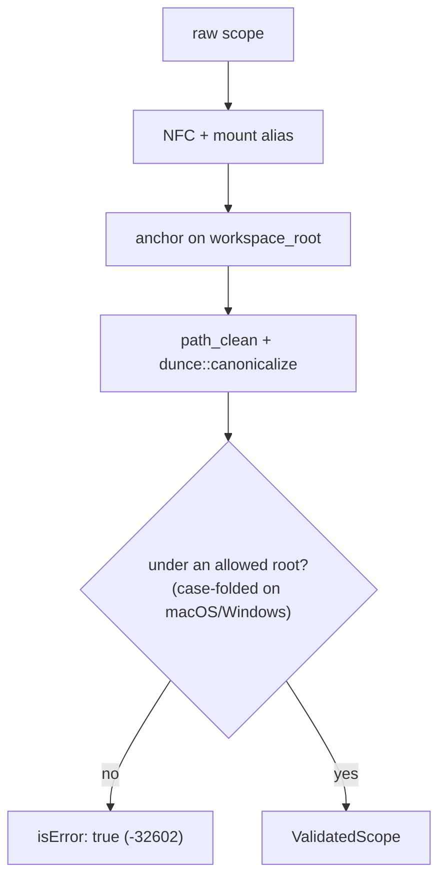

# MeshMCP Architecture

This document describes how MeshMCP is built: the crates, the snapshot model, the indexing
pipeline and its guards, the path jail, the transport, the daemon, the parse cache, the Linux
network sandbox and the audit trail. Statements here are checked against the code; measured
figures are not repeated here and live in [`quality.md`](quality.md).

## 1. Overview

MeshMCP indexes the *contracts* of a workspace (declarations, imports, gRPC services and calls,
event producers and consumers, HTTP endpoints, OpenAPI/AsyncAPI specs, Spring properties,
Markdown sections) into an in-memory graph and answers MCP tool calls from it. It does not keep
full syntax trees in memory: each file is parsed, its facts are extracted, and the tree is
dropped.


```mermaid
graph TD
    subgraph Transport
        Agent[AI agent] <-->|JSON-RPC 2.0 over stdio| Proxy[mesh-mcp run]
        Proxy <-->|Unix socket / named pipe| Daemon[meshd]
    end

    subgraph Query path
        Daemon --> Registry[ToolRegistry: parse args, governance, spawn_blocking, audit]
        Registry --> Jail[ValidatedScope jail]
        Registry --> Snap[MeshSnapshot via ArcSwap]
        Snap --> Graph[ContractGraph]
        Snap --> Docs[DocIndex]
        Snap --> Props[PropertyRegistry]
        Registry --> Fmt[MarkdownFormatter, 48 KB cap]
    end

    subgraph Index path
        Crawl[crawl roots] --> Guard[AstGuard limits]
        Guard --> Parse[tree-sitter + extractors, Rayon]
        Parse --> Fold[fold + reconcile_edges]
        Fold -->|install_snapshot| Snap
        Watch[file watcher + Git gate] -->|changed paths| Crawl
        Cache[(per-workspace parse cache)] <--> Parse
    end
```

`mesh-mcp run --standalone` runs the same query and index paths inside one process, without the
daemon.

---

## 2. Crates

```
crates/
├── mesh-core/       # graph, snapshot state, config, path jail, crawler, VFS, watcher,
│                    # parse cache, audit, governance, YAML streaming, doc index, properties
├── mesh-parsers/    # AstGuard, tree-sitter grammars, per-language extractors,
│                    # AST decapitation, Markdown formatting, graph rendering
├── mesh-server/     # `mesh-mcp` binary: JSON-RPC loop, MCP tools, indexer, CLI, daemon proxy
└── mesh-daemon/     # `meshd` binary: socket / named-pipe server, idle watchdog, Linux sandbox
```


```mermaid
graph TD
    Daemon[mesh-daemon] --> Server[mesh-server]
    Daemon --> Core[mesh-core]
    Daemon --> Parsers[mesh-parsers]
    Server --> Core
    Server --> Parsers
    Parsers --> Core
```

`mesh-core` has no tree-sitter dependency. All grammar code is in `mesh-parsers`.

---

## 3. Memory and concurrency model

### 3.1 Allocator and strings
Both binaries use `mimalloc` as the global allocator (`#[global_allocator]` in
`mesh-server/src/main.rs` and `mesh-daemon/src/main.rs`). Symbol names, packages and similar
identifiers are `CompactStr` (`compact_str::CompactString`), which stores strings up to 24 bytes
inline. A file path is interned once per file as `FilePath = Arc<Path>` and shared by every node
declared in that file. `RepoId = u16` numbers the configured roots; `RepoId::MAX` marks synthetic
cross-root nodes such as event-bus topic hubs.

### 3.2 One immutable snapshot
Everything that changes at runtime lives in one immutable `MeshSnapshot`, published through an
`ArcSwap`:

```rust
pub struct MeshSnapshot {
    pub contract_graph: ContractGraph,
    pub doc_index: DocIndex,
    pub property_registry: PropertyRegistry,
    pub generation: u64,
    pub health: IndexHealth,
    // ...
}
```

A query takes one `state.snapshot()` guard (an atomic pointer load, no lock) and reads from it for
the whole request. A reload builds a new snapshot off to the side and publishes it with
`install_snapshot()`, which increments `generation`. A reader therefore never sees a new graph
next to a stale doc index, and readers never wait for writers. Writers are serialised by a
`reload_lock`.

### 3.3 Blocking work
Tools do disk, tree-sitter and SQLite work, so `McpTool::run` is synchronous and
`ToolRegistry::invoke` runs it on Tokio's blocking pool; the JSON-RPC loop and, in daemon mode,
other clients keep being served meanwhile. Indexing runs on Rayon (section 8).

---

## 4. Path jail: `ValidatedScope`

Every path that a tool receives (the `scope` of `smart_search`, a `.proto` path given to
`analyze_grpc`) goes through `ValidatedScope::resolve_with_aliases`:

1. Unicode NFC normalisation of the input.
2. Container path translation through `[workspace.mount_aliases]`, if configured.
3. A relative path is anchored on the resolved `workspace_root` (then, if it does not exist
   there, on the process working directory).
4. `path_clean::clean`, then `dunce::canonicalize`, which resolves symlinks. A path that does not
   exist fails here (`PathNotFound`).
5. The canonical path must start with one of the configured roots. On macOS and Windows the
   comparison is case-folded (case-insensitive file systems); on Linux it is not, because folding
   would widen the jail.

A failure is a `SecurityError`, classified `-32602` and returned to the client as a tool result
with `isError: true` (MCP 2024-11-05: a failure inside a tool is not a protocol error), so the
agent can correct the call. The crawler uses `ignore::WalkBuilder` with `follow_links(false)`,
always excludes `.git`, and honours `.gitignore` and `exclude_patterns`, so a symlink pointing out
of a root is never indexed.

`smart_search` additionally treats an omitted `scope`, `"."`, `"*"` or the exact workspace root as
"all configured roots"; any other ancestor of the roots is still rejected. See
[`mcp-tools.md`](mcp-tools.md).


```mermaid
graph TD
    Raw["raw scope"] --> NFC["NFC + mount alias"]
    NFC --> Anchor["anchor on workspace_root"]
    Anchor --> Clean["path_clean + dunce::canonicalize"]
    Clean --> Check{"under an allowed root?<br/>(case-folded on macOS/Windows)"}
    Check -->|no| Err["isError: true (-32602)"]
    Check -->|yes| Valid["ValidatedScope"]
```

---

## 5. Parser guards (`AstGuard`)

### 5.1 Before tree-sitter
`AstGuard` (`crates/mesh-parsers/src/guard.rs`) rejects, before the C parser is touched:

1. **Size**, from `stat` only, before reading: more than 384 KB (`MAX_FILE_SIZE_BYTES`), or
   1.5 MB (`MAX_SCHEMA_FILE_SIZE_BYTES`) for contracts and generated stubs (`.proto`, `.pb.go`,
   `_pb2.py`, `openapi.yaml`, ...).
2. **Binary content**: a null byte in the first 4,096 bytes.
3. **Long lines**: any line over 1,024 bytes (minified bundles).
4. **Nesting**: a bracket depth over 64, measured by a lexical scan that ignores strings and
   comments, to avoid overflowing the native stack in the C parser.

Markdown, YAML and `.properties` files get only the binary check, since prose legitimately has
long lines. Every rejected file is recorded in `IndexHealth` (path, reason, size), reported by
`mesh-mcp doctor`, and named in `smart_search` / `find_dependents` answers whose scope contains
it (source files only), so the agent knows to read it directly.

### 5.2 Parse timeouts
The timeout depends on the caller:

- **Indexing** (`AstGuard::parse_with`, used by `PolyglotIndexer` for full scans and reloads):
  `INDEX_PARSE_TIMEOUT_MICROS` = 2 s. This is a hang guard, not a performance budget. It used to
  be 15 ms; under CPU contention that budget tripped on ordinary files, and which files tripped
  depended on scheduling, which made the index non-deterministic.
- **On-demand decapitation** (`AstGuard::with_parser`, used by `smart_search` when rendering a
  result): `QUERY_PARSE_TIMEOUT_MICROS` = 500 ms, because it runs on the agent's request path.
  On failure the snippet falls back to `AstDecapitator::BOUNDED_ERROR_STUB`.

An indexing parse failure is not treated as an empty file: `FileIndex::parse_failed` is set, the
file is retried once sequentially outside the parallel pool, and a file that still fails is
counted in `IndexHealth`. On a reload, the file's last known-good facts are kept.

### 5.3 Query limits
Tree-sitter queries run through `AstGuard::execute_bounded_query`: the cursor match limit is 500
(`QUERY_MATCH_LIMIT`) and iteration stops after 10,000 steps (`MAX_QUERY_STEPS`).

### 5.4 YAML and Markdown memory
YAML is read event by event (`mesh_core::yaml_stream`, driving libyaml through `unsafe-libyaml`)
rather than loaded as a whole document. Alias replay is charged to per-file budgets (events and
replayed bytes, proportional to the file size), and flattened Spring properties to an output
budget; a file over budget ingests nothing. Markdown is split into sections under a per-file
memory budget. The measurements that motivated this are in `quality.md`, step 4.9.

---

## 6. AST decapitation

`smart_search` returns declarations with their implementation bodies replaced, so the agent sees
signatures, parameters, return types, annotations and docstrings without the body:

| Language | Example output |
| :--- | :--- |
| Java | `public UserResponse getUser(UserId id) { /* stripped */ }` |
| Go | `func (s *Server) GetUser(ctx context.Context, req *Req) (*Res, error) { /* stripped */ }` |
| TypeScript | `async getBilling(id: string): Promise<Billing> { /* stripped */ }` |
| Python | `def get_user(self, user_id: str) -> UserResponse:` + docstring + `...` |
| Rust | `pub async fn get_user(&self, id: &UserId) -> Result<User, Error> { /* stripped */ }` |

Bodies are replaced by byte range (`collect_body_replacements`, applied bottom-up), with a
recursion depth cap equal to `MAX_NESTING_DEPTH`. Line numbers in results are original-file
coordinates. `include_body: true` returns the full implementation for one result. Protobuf and
YAML are returned as-is (they are declarations already). How much a given file shrinks depends
entirely on how much of it is function bodies; no general percentage is claimed.

---

## 7. Stdio transport

- `stdout` is written only by the `StdioFramingActor` writer task, through one
  `BufWriter<Stdout>`, one JSON-RPC frame per line, flushed after each frame. Logs go to stderr
  through `tracing` (`main.rs` configures the subscriber with `std::io::stderr`).
  `println!` appears only in CLI commands that do not run the JSON-RPC loop
  (`mesh-mcp doctor --json`, `mesh-mcp graph`).
- Reader and writer channels are bounded (`MPSC_BUFFER_CAPACITY` = 64 frames), so a client that
  floods requests gets backpressure instead of unbounded memory growth.
- When the client closes stdin, the loop drops its sender and awaits the writer task, so the last
  response is flushed before the process exits.
- Notifications (no `id`) never receive a reply. Methods: `initialize`, `ping`, `tools/list`,
  `tools/call`; anything else is `-32601`.
- In proxy mode, `mesh-mcp run` copies bytes between stdio and the daemon socket without adding
  any. If the daemon dies mid-session the proxy exits with status 1 and logs the daemon log path;
  if it cannot connect right after a successful liveness check it falls back to standalone mode.

---

## 8. Background work, file watching, daemon and cache

### 8.0 Thread priority and file watching

The boot scan runs on the global Rayon pool at normal priority (the user is waiting for it).
Incremental reloads run on `BackgroundRescanEngine`, a dedicated Rayon pool whose threads lower
their own priority:

- **macOS**: `pthread_set_qos_class_self_np(QOS_CLASS_BACKGROUND, 0)`.
- **Linux**: `setpriority(PRIO_PROCESS, 0, 10)`.
- **Windows**: `SetThreadPriority(.., THREAD_PRIORITY_BELOW_NORMAL)`, then
  `THREAD_MODE_BACKGROUND_BEGIN` (the latter alone does not change the reported CPU priority).

The file watcher (`crates/mesh-core/src/watcher.rs`) debounces events for 150 ms, coalesces a
burst into one queued reload, and hands the changed paths to `WorkspaceIndexer::reload_paths`,
which re-reads only those files. A change under `.git/refs` or `HEAD`, a directory event, or a
path whose parent directory is gone falls back to a full differential reload (crawl, then re-read
only files whose size or mtime changed, confirmed by content hash).

- **macOS** watches each root with one recursive FSEvents stream and applies `.gitignore` and
  `exclude_patterns` to events in memory. `PollWatcher` (2 s) is used only for a root FSEvents
  refuses (network or unsupported volume), with a warning.
- **Linux and Windows** use per-directory watches, capped at `MAX_WATCHED_DIRS` (2,048) across
  all roots, beyond which the watcher falls back to polling.
- **Git operations.** For each root the watcher resolves the real Git directory (following
  `gitdir:` for worktrees and submodules) and holds reloads while `index.lock`, `rebase-merge/`
  or `rebase-apply/` exists or `HEAD` is moving, then installs one generation when the operation
  has settled. A hold lasts at most 60 s; an `index.lock` older than 30 s with no `git` process
  is treated as orphaned. While a hold is open, tool answers come immediately from the last
  complete snapshot and start with a note naming its generation.

The daemon transport is a Unix domain socket on macOS/Linux and a named pipe on Windows.

### 8.1 One `meshd` per workspace (P0 step 1.8)

Before P0 step 1.8, every `meshd` on a machine bound the same one-per-user socket
(`~/.cache/mesh/meshd.sock`) regardless of which workspace it was indexing — two unrelated
repos open in two IDE windows would race to bind it, and whichever lost would have its
`mesh-mcp` sessions silently served by the *other* repo's daemon (idempotence invariant I7: a
response must always concern the workspace of the session that asked, never someone else's).

Each `mesh-mcp run` invocation now discovers its config first, derives a `workspace_id` — the
first 16 hex characters of SHA-256(canonical base directory + `CARGO_PKG_VERSION`) — and resolves
its daemon at a socket scoped to that id: `meshd-<workspace_id>.sock` under
`$XDG_RUNTIME_DIR/mesh/` if set, else `~/.cache/mesh/` (`MESH_SOCKET_PATH` overrides both), or
`\\.\pipe\mesh-mcp-<user>-<workspace_id>` on Windows. The socket is created `0600` in a `0700`
directory. `meshd` also writes its version next to the socket, so `mesh-mcp run` warns when it
connects to a daemon of another version and `mesh-mcp doctor --fix` can stop it. If no daemon is listening there yet,
`mesh-mcp` spawns one with `--socket <that path>` and `.current_dir(<canonical base>)` explicitly
— it never relies on inherited environment or an ambient default to land on the right workspace.
Upgrading the binary changes `workspace_id` too, so a stale daemon from a previous version is
simply never found again rather than serving newer clients against an outdated snapshot format.

`meshd` also no longer waits for its first full scan to finish before opening that socket: the
socket accepts connections (and `initialize`/`ping` succeed) immediately, while the initial
ingestion runs in the background. A `tools/call` made before that first scan installs its
snapshot gets an explicit "still indexing" error instead of an answer computed against the
still-empty default snapshot — and `mesh-mcp`'s own 500ms wait for the socket to appear is no
longer a race against a large repo's indexing time, since the socket now exists independently of
how long that indexing takes.

### 8.2 One parse cache per workspace, under a quota (plan 4 step 4.4)

The persistent parse cache (`PersistentIndexCache`, `crates/mesh-core/src/index_cache.rs`) is
scoped the same way as the socket: `~/.cache/mesh-mcp/workspaces/<workspace_id>/index-cache.db`
(SQLite, WAL, mode `0600`, `auto_vacuum = INCREMENTAL`). It is opened once per process by
`AppState::open_index_cache` and shared by the boot scan and every incremental reload, so a
branch switch back to already-seen content is a lookup instead of a re-parse.

- **Quota**: `[cache] max_size_mb` (default 2048), counting database + WAL. Enforced on open and
  after every scan batch that wrote more than 100 entries or left the files over quota.
- **Eviction**: least recently used first, 1,000 entries per transaction, until live pages fit in
  80 % of the quota; then `PRAGMA incremental_vacuum` and a `TRUNCATE` checkpoint give the space
  back to the filesystem.
- **Recency**: `file_index_access(cache_key, last_accessed_at)`, a narrow side table indexed on
  `last_accessed_at`. Reads only record the key in memory; the timestamps are written in the
  scan's single write transaction. Keeping the timestamp out of the ~1 KB payload row avoids
  rewriting every payload page on a warm boot.
- **Counters**: `PersistentIndexCache::stats()` exposes hits, misses, swallowed SQLite errors and
  evicted entries since open.

The pre-4.4 machine-wide `~/.cache/mesh-mcp/index-cache.db` is no longer read.

### 8.3 Kernel network sandbox of `meshd` (Linux, plan 4 step 4.10)

MeshMCP has no network code. On Linux, `meshd` also has the kernel guarantee it: right after
binding its Unix socket (`server::run_uds_server_then`), it installs a seccomp-bpf filter
(`crates/mesh-daemon/src/sandbox.rs`, built with `seccompiler`) that returns `EPERM` for:

- `socket(AF_INET, …)` and `socket(AF_INET6, …)`: no TCP, UDP or raw IP socket, hence no outbound
  connection and no DNS lookup;
- `io_uring_setup`: `IORING_OP_SOCKET` would create sockets without the `socket` syscall. `meshd`
  does not use io_uring (Tokio uses epoll);
- on x86_64, the x32-ABI spellings of both syscalls (same audit architecture, bit 30 set). Any
  other architecture (e.g. i386 `int 0x80`) fails seccompiler's architecture check and kills the
  process.

Everything else is allowed. `AF_UNIX` is the daemon's transport; other families (`AF_NETLINK`, …)
are local kernel interfaces that glibc may use internally, not a route off the machine. The filter
is a deny-list on purpose: an allow-list of every syscall Tokio, rayon, `notify`, SQLite and
tree-sitter may issue would turn a libc or kernel upgrade into a daemon crash.

The filter is installed with `SECCOMP_FILTER_FLAG_TSYNC` (`seccompiler::apply_filter_all_threads`,
which also sets `PR_SET_NO_NEW_PRIVS`). `meshd` runs under `#[tokio::main]`, so by the time the
socket is bound the Tokio workers and blocking pool, rayon and the file watcher already exist;
TSYNC applies the filter to all of them. Later threads and child processes (`git`, `ps`, `pgrep`)
inherit it. `/proc/<pid>/task/*/status` shows `Seccomp: 2` for every thread.

**Failure policy.** If the kernel refuses the filter (seccomp disabled, a container that forbids
`seccomp(2)`, gVisor without TSYNC), `meshd` logs a `warn` and keeps serving: the filter is
defence in depth, and a daemon that refuses to start pushes every IDE client into standalone mode,
which is not confined either. `MESH_DAEMON_SANDBOX=required` makes `meshd` remove its socket and
exit instead (on every OS, since the sandbox never exists outside Linux; on Windows the check runs
before the named pipe is created). Any other non-empty value is logged and treated as `required`,
so a typo never silently leaves a host unconfined. `mesh-mcp doctor` reports, on Linux, whether the
running `meshd` carries its own seccomp filter (`/proc/<pid>/status`, filter count compared to its
own so a container runtime's default filter does not pass for it).

**Limits.**
- Only `meshd` is confined. `mesh-mcp run` (the stdio proxy, or `--standalone`, which indexes
  in-process) and `mesh-mcp graph --open` (which launches a browser) are not.
- Linux only, on x86_64, aarch64 and riscv64. macOS (`sandbox_init` is deprecated) and Windows
  are out of scope.
- `git` subprocesses inherit the filter: any git operation that would need the network (a remote
  helper, a lazy-fetch of a partial clone) fails with `EPERM` inside `meshd`. MeshMCP only runs
  local git commands.
- The filter denies *creating* IP sockets. An IP socket file descriptor inherited without
  `O_CLOEXEC` from whatever launched `meshd` would stay usable; `meshd` itself opens none before the
  filter and has no code that would use one.
- This is a network sandbox, not a filesystem one: `meshd` can still read and write every file its
  user can.

---

## 9. Audit trail

MeshMCP records every tool call in a local, append-only, hash-chained log. It is meant to give an
operator or reviewer tamper-evident evidence of what an agent queried; it is not a certified
compliance control, and a user with access to the file can delete it.

- **Location**: `~/.cache/mesh-mcp/audit.db` (SQLite, WAL mode; the `.log` naming in older docs is
  historical — `default_log_path()` is an alias for `default_db_path()`).
- **Permissions**: Mode `0600` (readable/writable exclusively by user).
- **Chaining Function** (chain v2 — every row also carries the `chain_version` it was written
  under, so upgrading the binary does not invalidate a database written before this formula
  existed; v1 rows keep verifying under the original 5-field formula):
  ```text
  Hash_n = SHA256(Hash_{n-1} || Timestamp || SessionId || Tool || ArgsDigest
                   || Status || FilesAccessed || SecretsRedactedCount)
  ```
  The v1 formula omitted `Status`, `FilesAccessed` and `SecretsRedactedCount`, which are stored
  in the same row — meaning those three fields could be altered without breaking chain
  verification. v2 closes that.

- **What is recorded**: successful calls, and also calls refused before running (invalid
  arguments, RSAH refusals), with status `ERROR`. Arguments are stored and committed to the chain
  through their SHA-256 digest. The whole trail can be turned off with
  `[engines.policy] cryptographic_audit_trail = false`.
- **Metrics tables** (`tool_call_metrics`, `index_cache_metrics`, `process_starts`) sit next to
  the chained table, outside the hash chain; `mesh-mcp stats` reads them.

`AuditLogger::verify_db` replays the chain from the genesis hash (64 zeros): a modified row, or an
inserted or removed row in the middle of the chain, breaks every later link. Removing the most
recent rows (truncating the tail) is not detectable from the file alone. `mesh-mcp doctor` runs
the verification and reports a broken chain; `doctor --fix` never modifies the audit database.
`mesh-mcp stats` opens it read-only, and nothing it computes leaves the machine.
