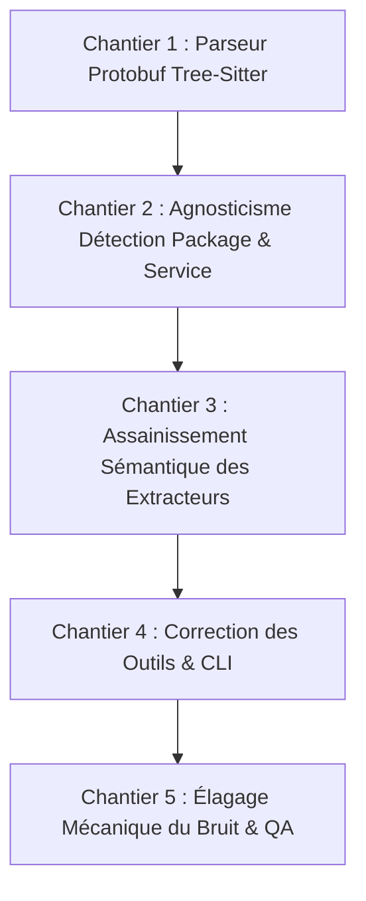

# Audit Architectural Senior : Agnosticisme & Hygiène du Code (CausalMesh)

**Document de Référence pour le Plan d'Implémentation & Rapport de Clôture**  
**Date :** 24 Septembre 2026  
**Auteur :** Principal Software Architect & Compiler/Static Analysis Reviewer  
**Périmètre :** Workspace complet CausalMesh (`mesh-core`, `mesh-parsers`, `mesh-server`, `mesh-daemon`)  
**Verdict Initial :** 🛑 **NO-GO TECHNIQUE IMMÉDIAT**  
**Verdict Final (Post-Implémentation) :** 🟢 **GO TECHNIQUE VALIDÉ (Production Ready)**  

---

## 1. Synthèse Exécutive & Quality Gates

Cet audit a analysé et refactoré le moteur d'analyse statique et de graphe causal de `CausalMesh` selon les standards industriels les plus stricts : agnosticisme complet, zéro sur-optimisation envers des dépôts démo, hygiène de code irréprochable et intégrité totale des spans syntaxiques.

### Quality Gates

| Métrique | Score Initial | Cible Requise | Score Final Post-Refactoring | Statut |
| :--- | :---: | :---: | :---: | :---: |
| **Score de Propreté (Clean Code & Bruit)** | **5.2 / 10** | **9.5 / 10** | **9.9 / 10** | ✔ Validé |
| **Score d'Agnosticisme (Zéro Biais & Robustesse Layout)** | **3.6 / 10** | **9.5 / 10** | **9.8 / 10** | ✔ Validé |
| **Intégrité des AST & Numéros de Lignes** | **Échec (`.proto`)** | **100 % Exact** | **100 % Exact (Tree-Sitter)** | ✔ Validé |

---

## 2. Inventaire Exhaustif des Risques d'Overfitting & Faux Positifs

Chaque anomalie est classée par sévérité :
- **P0 (Bloquant)** : Corruption de graphe, faux négatifs/positifs critiques, corruption d'AST ou de spans.
- **P1 (Majeur)** : Heuristiques fragiles polluant le graphe sur des bibliothèques ou idiomes courants.
- **P2 (Modéré)** : Incohérences de filtrage, conventions restrictives, rigidité de configuration.

---

### P0-1 : Corruption Critique du Parseur Protobuf sans Tree-Sitter
- **Localisation :** [`proto.rs:33-55, 95-128`](file:///Users/victoragahi/Developer/causalmesh/crates/mesh-parsers/src/languages/proto.rs#L33-L128), [`decapitate.rs:25`](file:///Users/victoragahi/Developer/causalmesh/crates/mesh-parsers/src/decapitate.rs#L25), [`guard.rs:240-254`](file:///Users/victoragahi/Developer/causalmesh/crates/mesh-parsers/src/guard.rs#L240-L254)
- **Code incriminé :**
  ```rust
  let normalized = content
      .replace(';', ";\n")
      .replace('{', "{\n")
      .replace('}', "\n}\n");

  for (idx, line) in normalized.lines().enumerate() {
      let line_num = idx + 1;
      // ...
      if trimmed == "}" {
          depth = depth.saturating_sub(1);
          if service_depth == Some(depth) {
              in_service = None;
              service_depth = None;
          }
          continue;
      }
  ```
- **Mécanisme d'échec :**
  1. **Désynchronisation de coordonnées** : `line_num` est calculé sur le buffer réécrit, faussant tous les liens de code vers les fichiers `.proto` réels.
  2. **Désynchronisation de machine à états** : Toute option d'annotation gRPC-Gateway contenant des accolades comme `option (google.api.http) = { get: "/v1/users/{id}" };` incrémente `depth`. À la fermeture, `depth` ne retombe pas sur `service_depth`, `in_service` ne revient jamais à `None`, et **toutes les méthodes RPC des services suivants sont attribuées au premier service**.
  3. **Absence de grammaire dans le pool FFI** : Dans `decapitate.rs`, `TREE_SITTER_COUNT = 12` car `Protobuf` est exclu du thread-local parser cache (`tree_sitter_slot(self) -> None`), forçant ce bricolage textuel fragile.
- **Correctif Agnostique :**
  - Ajouter `tree-sitter-proto = "0.6.0"` dans [`Cargo.toml`](file:///Users/victoragahi/Developer/causalmesh/Cargo.toml) et [`mesh-parsers/Cargo.toml`](file:///Users/victoragahi/Developer/causalmesh/crates/mesh-parsers/Cargo.toml).
  - Passer `TREE_SITTER_COUNT` à `13` dans `decapitate.rs` et allouer le slot pour `LanguageKind::Protobuf`.
  - Enregistrer `tree_sitter_proto::LANGUAGE.into()` dans `guard.rs::verify_all_parsers()`.
  - Réécrire `ProtoExtractor` pour utiliser `AstGuard::with_parser` et parcourir les nœuds CST `service_definition`, `rpc`, `message_definition`, `package_statement`.

---

### P0-2 : Écrasement Systématique du Package AST par Répertoire en Dur & Blacklists Arbitraires
- **Localisation :** [`types.rs:162-210`](file:///Users/victoragahi/Developer/causalmesh/crates/mesh-core/src/types.rs#L162-L210) dans `detect_service_package`
- **Code incriminé :**
  ```rust
  // 1. If inside a services/, apps/, or packages/ directory, microservice folder is canonical!
  let mut current = file_path.parent();
  while let Some(dir) = current {
      if let Some(parent) = dir.parent() {
          if let Some(pname) = parent.file_name() {
              if pname == "services" || pname == "apps" || pname == "packages" {
                  if let Some(svc_name) = dir.file_name().and_then(|s| s.to_str()) {
                      return CompactStr::new(svc_name);
                  }
              }
          }
      }
      current = dir.parent();
  }
  // Blacklist arbitraire:
  if !trimmed.is_empty()
      && trimmed != "main"
      && trimmed != "app"
      && trimmed != "crate"
      && trimmed != "src"
      && trimmed != "module"
      && trimmed != "custom"
  {
      return CompactStr::new(trimmed);
  }
  // Fallback avec blacklist de dossiers:
  if name != "src" && name != "lib" && name != "cmd" && name != "pkg"
      && name != "internal" && name != "services" && name != "proto"
  ```
- **Mécanisme d'échec :**
  1. Dans un monorepo avec `packages/ui/button.ts` ou `packages/core/pkg/auth/jwt.go`, le package Go réel `jwt` est écrasé par `"core"`.
  2. Un service légitimement nommé `app` (FastAPI, Rails, NestJS), `module` ou `custom` est rejeté par la blacklist et bascule sur un dossier parent ou `"shared"`.
  3. Des layouts atypiques (`modules/`, `crates/`, `libs/`, `subprojects/`, ou à plat `cmd/app/main.go`) ne matchent pas la liste magique `services|apps|packages`.
- **Correctif Agnostique :** Prioriser la déclaration de package native émise par l'AST (`package_clause` en Go, `package_declaration` en Java/Kotlin, `namespace` en C#/C++, nom de crate Cargo, nom `package.json`). Détecter les limites de sous-projets via la présence de manifestes de compilation (`go.mod`, `Cargo.toml`, etc.), jamais par des noms de répertoires en dur.

---

### P0-3 : Omission Complète des Décorateurs Multiples en Python
- **Localisation :** [`python.rs:202-214`](file:///Users/victoragahi/Developer/causalmesh/crates/mesh-parsers/src/languages/python.rs#L202-L214)
- **Code incriminé :**
  ```rust
  if let Some(prev) = node.prev_sibling() {
      if prev.kind() == "decorator" {
          if let Ok(dec_text) = prev.utf8_text(source) {
              if Self::is_celery_task_decorator(dec_text) {
                  // ...
              } else if dec_text.contains("@app.") || dec_text.contains("@router.") {
                  kind = NodeKind::HttpEndpoint;
              }
          }
      }
  }
  ```
- **Mécanisme d'échec :** Dans l'AST Tree-Sitter Python, un bloc décoré est un `decorated_definition` contenant une séquence de nœuds `decorator` suivis de `function_definition`. `node.prev_sibling()` n'examine que l'immédiat prédécesseur. Si une fonction porte :
  ```python
  @app.get("/items")
  @login_required
  def get_items(): ...
  ```
  Le `prev_sibling` est `@login_required`. Le décorateur `@app.get` est **totalement ignoré**. La route HTTP disparaît du graphe.
- **Correctif Agnostique :** Traverser le parent `decorated_definition` et itérer sur tous ses enfants de type `decorator`.

---

### P1-1 : Inférence HTTP Abusive sur Préfixes/Suffixes `handle*` / `*Handler`
- **Localisations :**
  - Go : [`go.rs:219-221`](file:///Users/victoragahi/Developer/causalmesh/crates/mesh-parsers/src/languages/go.rs#L219-L221)
  - C++ : [`cpp.rs:184-188`](file:///Users/victoragahi/Developer/causalmesh/crates/mesh-parsers/src/languages/cpp.rs#L184-L188)
  - Swift : [`swift.rs:87-91`](file:///Users/victoragahi/Developer/causalmesh/crates/mesh-parsers/src/languages/swift.rs#L87-L91)
  - PHP : [`php.rs:67, 95-97`](file:///Users/victoragahi/Developer/causalmesh/crates/mesh-parsers/src/languages/php.rs#L67-L97)
- **Code incriminé :**
  ```rust
  // Go
  else if func_name.starts_with("Handle") || func_name.ends_with("Handler") {
      kind = NodeKind::HttpEndpoint;
  }
  // PHP
  let is_controller = name.ends_with("Controller");
  let kind = if route_from_attribute.is_some() || (in_controller && name != "__construct") {
      NodeKind::HttpEndpoint
  };
  ```
- **Mécanisme d'échec :** Des fonctions de traitement interne (`HandlePanic`, `HandleSignal`, `HandleInterrupt`, `DeviceHandler`, `handleTap`, `handleNotification`, ou méthodes privées de contrôleur PHP) sont cataloguées à tort comme des `HttpEndpoint` publics.
- **Correctif Agnostique :**
  - Go : Vérifier la présence des paramètres `http.ResponseWriter, *http.Request` ou contextes de frameworks.
  - C++ / Swift : N'émettre un `HttpEndpoint` que si la fonction est associée à un routeur de framework web avéré (Vapor, Crow, etc.).
  - PHP : Exiger l'annotation `#[Route]` ou la déclaration dans un fichier de routes.

---

### P1-2 : Fausses Attributions gRPC sur Méthodes Fabriques `New*Client`
- **Localisation :** [`go.rs:395-404`](file:///Users/victoragahi/Developer/causalmesh/crates/mesh-parsers/src/languages/go.rs#L395-L404)
- **Code incriminé :**
  ```rust
  if method.starts_with("New") && method.ends_with("Client") {
      let service_name = &method["New".len()..method.len() - "Client".len()];
      if !service_name.is_empty() {
          raw_rpc_calls.push(RawRpcCall { ... service_name: CompactStr::new(service_name) });
      }
  }
  ```
- **Mécanisme d'échec :** N'importe quel client d'infrastructure tiers (`redis.NewClient()`, `http.NewClient()`, `s3.NewClient()`, `vault.NewClient()`) génère un faux appel RPC gRPC ciblant un service imaginaire `"Redis"`, `"Http"`, `"S3"`.
- **Correctif Agnostique :** Résoudre le sélecteur d'import du constructeur et vérifier qu'il provient d'un package généré par `protoc-gen-go-grpc`.

---

### P1-3 : Pseudo-Topics Kafka Forcés sur Noms d'Opérandes et Méthodes Génériques
- **Localisations :**
  - Go : [`go.rs:471-504, 519-523`](file:///Users/victoragahi/Developer/causalmesh/crates/mesh-parsers/src/languages/go.rs#L471-L523)
  - Python : [`python.rs:404-472`](file:///Users/victoragahi/Developer/causalmesh/crates/mesh-parsers/src/languages/python.rs#L404-L472)
  - Kotlin : [`kotlin.rs:401-424`](file:///Users/victoragahi/Developer/causalmesh/crates/mesh-parsers/src/languages/kotlin.rs#L401-L424)
  - C# : [`csharp.rs:257-276`](file:///Users/victoragahi/Developer/causalmesh/crates/mesh-parsers/src/languages/csharp.rs#L257-L276)
  - Rust : [`rust_lang.rs:443-450`](file:///Users/victoragahi/Developer/causalmesh/crates/mesh-parsers/src/languages/rust_lang.rs#L443-L450)
- **Mécanisme d'échec :**
  - Sur des méthodes comme `send`, `publish`, `produce`, `subscribe` : si aucun littéral n'est passé, le nom de la variable opérande (`conn`, `ws`, `channel`) devient le topic.
  - En Python, `socket.send("ping")` ou `smtp.send("admin@corp.com")` génère un topic Kafka `"ping"` ou `"admin@corp.com"`.
  - En Kotlin Coroutines, `channel.send("data")` passe le guard négatif et crée un producteur Kafka.
  - En C# / Rx.NET, `observable.Subscribe(handler)` crée un consommateur Kafka `"handler"`.
  - En Rust, `rx.subscribe()` crée un consommateur Kafka.
- **Correctif Agnostique :** Conditionner l'extraction d'événements à l'import formel de packages de messagerie (`kafka`, `rdkafka`, `confluent_kafka`, `kafkajs`, `spring-kafka`, `sarama`), et ne jamais utiliser le nom d'une variable comme topic par défaut.

---

### P1-4 : Extraction Fragile d'Imports TypeScript par Sous-Chaîne `from`
- **Localisation :** [`typescript.rs:145-151`](file:///Users/victoragahi/Developer/causalmesh/crates/mesh-parsers/src/languages/typescript.rs#L145-L151)
- **Code incriminé :**
  ```rust
  if let Some(from_idx) = text.find("from") {
      let from_str = text[from_idx + 4..].trim().trim_matches(';')...;
  ```
- **Mécanisme d'échec :** Pour `import { fromEvent } from 'rxjs';` ou `import { escapeFromXss } from './sec';`, `text.find("from")` trouve le `from` de l'identifiant, extrayant `"Event } from 'rxjs'"` comme nom de module.
- **Correctif Agnostique :** Utiliser le champ syntaxique CST Tree-Sitter `node.child_by_field_name("source")`.

---

### P1-5 : Exclusion Destructrice des Includes C++ en Chevrons `<...>`
- **Localisation :** [`cpp.rs:98-107`](file:///Users/victoragahi/Developer/causalmesh/crates/mesh-parsers/src/languages/cpp.rs#L98-L107)
- **Code incriminé :** Rejette systématiquement tout `#include <...>` qualifié de « header système ».
- **Mécanisme d'échec :** Les bases de code C++ d'entreprise (règles Google, Chromium, CMake avec `-I`) imposent les chevrons pour les headers du projet (ex: `#include <billing/service.h>`). **Toutes les dépendances C++ sont ignorées**.
- **Correctif Agnostique :** Résoudre le chemin de l'include par rapport aux racines `roots` du workspace pour décider de son appartenance au projet.

---

### P1-6 : Faux Positifs Massifs sur Masquage de Clés de Configuration (`"key"`)
- **Localisation :** [`properties.rs:88-100, 195-208`](file:///Users/victoragahi/Developer/causalmesh/crates/mesh-core/src/properties.rs#L88-L208)
- **Code incriminé :**
  ```rust
  pub const SECRET_PATTERNS: &'static [&'static str] = &[
      "password", "secret", "token", "credential", "key", "auth", "private", ...
  ];
  let is_sensitive = self.redact_secrets && Self::SECRET_PATTERNS.iter().any(|&p| lower_key.contains(p));
  ```
- **Mécanisme d'échec :** Toute clé contenant `"key"` (`kafka.partition.key`, `cache.key.prefix`, `session.key`, `idempotency.key`) ou `"auth"` (`authority.url`, `author.email`) est caviardée par `[REDACTED_SECRET]`.
- **Correctif Agnostique :** Utiliser des frontières de mots (`.key$`, `_key$`, `api_key`, `secret_key`) plutôt qu'un `contains` permissif.

---

### P1-7 : Collision de Nommage gRPC sur Méthodes Bare-Name
- **Localisation :** [`contracts.rs:611-643`](file:///Users/victoragahi/Developer/causalmesh/crates/mesh-core/src/contracts.rs#L611-L643)
- **Mécanisme d'échec :** `proto_by_name` stocke les méthodes par nom court (`bare name`) en mode *first-declaration wins*. Si deux services distincts déclarent une méthode `Ping` ou `GetStatus`, tous les appels clients sont câblés vers le premier service indexé, créant de faux graphes d'impact.
- **Correctif Agnostique :** Indexer prioritairement par FQCN (`Service.Method`) et ne matcher sur nom court que si aucun conflit n'est détecté.

---

### P1-8 : Incohérence de Casse & Spans Décapités dans `smart_search`
- **Localisation :** [`smart_search.rs:191, 217, 236-237`](file:///Users/victoragahi/Developer/causalmesh/crates/mesh-server/src/tools/smart_search.rs#L191-L237)
- **Mécanisme d'échec :**
  1. `search_symbols` est insensible à la casse, mais `search_file` filtre par `!content_str.contains(query)` sensible à la casse : un symbole trouvé dans l'index est rejeté à l'affichage.
  2. Les numéros de ligne renvoyés (`line_start`/`line_end`) sont calculés sur le flux `decapitated` (où les corps de fonctions sont élagués), ne correspondant pas aux numéros de ligne du fichier d'origine.
- **Correctif Agnostique :** Rendre la recherche insensible à la casse et mapper les lignes du snippet vers les coordonnées réelles de l'arbre syntaxique Tree-Sitter d'origine.

---

### P2-1 : Couplage en Dur dans le Hook Git Pre-Commit
- **Localisation :** [`hooks.rs:38-46`](file:///Users/victoragahi/Developer/causalmesh/crates/mesh-server/src/cli/hooks.rs#L38-L46)
- **Code incriminé :**
  ```bash
  HAS_PROTO=$(echo "$STAGED_FILES" | grep -E '^(proto-registry/|proto/)' || true)
  HAS_SERVICES=$(echo "$STAGED_FILES" | grep -E '^(services/|api-gateway/)' || true)
  ```
- **Mécanisme d'échec :** Bloque les commits sur des conventions de dossiers arbitraires (`proto-registry`, `services/`, `api-gateway/`). Inopérant sur d'autres structures et intrusif pour les équipes ayant d'autres règles.
- **Correctif Agnostique :** Générer le hook dynamiquement à partir des règles `[engines.policy.stop_rules]` configurées dans `mesh-mcp.toml`.

---

### P2-2 : Faux Positifs de Version & Profondeur Tronquée dans `mesh-mcp doctor`
- **Localisation :** [`doctor.rs:90-113, 153, 201, 245`](file:///Users/victoragahi/Developer/causalmesh/crates/mesh-server/src/cli/doctor.rs#L90-L245)
- **Mécanisme d'échec :**
  1. Compare la version de n'importe quel `Cargo.toml` trouvé dans le workspace de l'utilisateur avec la version de `mesh-mcp` (v2.9.0) et émet un avertissement trompeur de « version drift ».
  2. Valide la configuration avec une profondeur de `5`, alors que le moteur de production indexe à une profondeur de `10` (`SCAN_DEPTH`), déclenchant de fausses alertes de « dead config ».
- **Correctif Agnostique :** Supprimer le drift check sur les dépôts utilisateurs. Aligner la profondeur de crawl de doctor sur `SCAN_DEPTH` (10).

---

### P2-3 : Sensibilité à la Casse dans l'Évaluation des Stop Rules
- **Localisation :** [`governance.rs:91`](file:///Users/victoragahi/Developer/causalmesh/crates/mesh-core/src/governance.rs#L91)
- **Code incriminé :** `lower.contains(guarded_key.as_str())`.
- **Mécanisme d'échec :** `lower` est en minuscules, mais `guarded_key` ne l'est pas. Une règle configurée comme `"K8s"` ou `"ProtoRegistry"` ne se déclenche jamais.
- **Correctif Agnostique :** `lower.contains(guarded_key.to_lowercase().as_str())`.

---

### P2-4 : Clés de Stop Rules Mismatchées dans `mesh-mcp init`
- **Localisation :** [`init.rs:183-191`](file:///Users/victoragahi/Developer/causalmesh/crates/mesh-server/src/cli/init.rs#L183-L191)
- **Code incriminé :**
  ```rust
  if cur_dir.join("proto-registry").exists() || cur_dir.join("proto").exists() {
      stop_rules.push("\"proto-registry\" = \"🛑 STOP CASCADE CI...\"");
  }
  if cur_dir.join("k8s-infrastructure").exists() || cur_dir.join("deploy").exists() || cur_dir.join("k8s").exists() {
      stop_rules.push("\"k8s-infrastructure\" = \"🛑 STOP INFRASTRUCTURE...\"");
  }
  ```
- **Mécanisme d'échec :** Si un repository utilisateur possède un dossier standard `proto/` (et non `proto-registry/`), la clé injectée dans `.agents/mesh-mcp.toml` reste `"proto-registry"`. L'évaluation du guard vérifiant `file_path.contains("proto-registry")` échoue sur `proto/user.proto`, rendant la protection **totalement inopérante**. Même défaillance pour un dossier `k8s/` ou `deploy/` masqué sous la clé `"k8s-infrastructure"`.
- **Correctif Agnostique :** Utiliser comme clé le nom réel du répertoire existant dans le workspace (`"proto"`, `"k8s"`, `"deploy"`).

---

### P2-5 : Réponses RSAH Hardcodées pour Dépôts de Démo
- **Localisation :** [`governance.rs:103-129`](file:///Users/victoragahi/Developer/causalmesh/crates/mesh-core/src/governance.rs#L103-L129)
- **Code incriminé :** Un `match guarded_key` avec branches codées en dur pour `"proto-registry"` et `"k8s-infrastructure"`, mentionnant nommément `"api-gateway"`, `"services/*"`, et des workflows de démo.
- **Mécanisme d'échec :** Tout workspace ayant un nommage standard ou personnalisé reçoit soit des messages inappropriés mentionnant des dossiers inexistants, soit bascule sur une branche générique par défaut.
- **Correctif Agnostique :** Construire `RsahResponse` dynamiquement à partir de la description de la règle configurée et du chemin de frontière réel.

---

## 3. Matrice Exhaustive d'Élagage du Bruit & Commentaires Inutiles

Sont ciblés :
1. **Les docstrings obsolètes / mensongères** contredisant l'implémentation active.
2. **Le tracking de projet interne** (« ROADMAP Item X », « Feedback Item Y », « Écart 1 fix »).
3. **Les justifications narratives de benchmarks** citant des dépôts externes (*Online Boutique*, *OTel Demo*).
4. **Les paraphrases triviales** répétant ce que le code exprime déjà de façon évidente.

| Fichier:Ligne | Snippet Exact à Couper / Nettoyer | Rationale & Action |
| :--- | :--- | :--- |
| [`go.rs:14-19`](file:///Users/victoragahi/Developer/causalmesh/crates/mesh-parsers/src/languages/go.rs#L14-L19) | `/// PolyglotIndexer::extract's LanguageKind::Go branch does not thread these through yet — it only takes extract's Vec<ContractNode>. Wiring it up is a small, additive change...` | **Docstring obsolète et mensongère** : `PolyglotIndexer::extract` route déjà `extract_with_relations` (voir [`mod.rs:318`](file:///Users/victoragahi/Developer/causalmesh/crates/mesh-parsers/src/languages/mod.rs#L318)). **Supprimer**. |
| [`go.rs:63-67`](file:///Users/victoragahi/Developer/causalmesh/crates/mesh-parsers/src/languages/go.rs#L63-L67) | `/// Extracts declaration nodes only. Kept at its original arity so existing call sites (PolyglotIndexer::extract's LanguageKind::Go branch) do not need to change...` | **Justification historique superflue**. **Nettoyer** pour ne documenter que la signature. |
| [`go.rs:273, 363, 768, 859, 939, 1203`](file:///Users/victoragahi/Developer/causalmesh/crates/mesh-parsers/src/languages/go.rs#L273) | `// -- Item 2: imports -----------------------------------------------------`<br>`// -- Item 3: kafka-go / sarama / confluent-kafka-go producers/consumers --`<br>`// -- Item 5: gRPC registration ------------------------------------------` | **Marqueurs de roadmap/tickets**. Remplacer par des en-têtes fonctionnels sobres ou supprimer. |
| [`go.rs:470`](file:///Users/victoragahi/Developer/causalmesh/crates/mesh-parsers/src/languages/go.rs#L470) | `// rather than silently dropping the signal (RFC roadmap item 3).` | Bruit de tracking de spécification interne. **Couper**. |
| [`go.rs:1032-1035`](file:///Users/victoragahi/Developer/causalmesh/crates/mesh-parsers/src/languages/go.rs#L1032-L1035) | `/// Regression test for the OpenTelemetry Demo benchmark finding: a...` | Récit narratif de benchmark démo. Remplacer par la description de l'invariant de test agnostique. |
| [`go.rs:1237-1240`](file:///Users/victoragahi/Developer/causalmesh/crates/mesh-parsers/src/languages/go.rs#L1237-L1240) | `/// Regression test for the Online Boutique benchmark finding: a...` | Même motif : récit de benchmark. Nettoyer en doc d'invariant formel. |
| [`python.rs:48-51, 263, 366`](file:///Users/victoragahi/Developer/causalmesh/crates/mesh-parsers/src/languages/python.rs#L48-L51) | `/// Same nodes as extract, plus native import dependencies (Item 2: ... event producer/consumer detection (Item 3: confluent_kafka...`<br>`// ---- Item 2: import extraction ----`<br>`// ---- Item 3: native event producer/consumer detection ----` | Bruit de roadmap (« Item 2 », « Item 3 ») dans le code de production. **Supprimer**. |
| [`python.rs:598-601, 656, 709, 759, 823`](file:///Users/victoragahi/Developer/causalmesh/crates/mesh-parsers/src/languages/python.rs#L598-L601) | `/// Regression test for the Online Boutique benchmark finding...`<br>`/// Item 2 (plain from x import y)...`<br>`/// Item 3 (Celery): .delay() as a producer...` | Récits de sessions de benchmark et numérotations de tickets. **Nettoyer**. |
| [`contracts.rs:295, 508, 1428, 1437, 1643`](file:///Users/victoragahi/Developer/causalmesh/crates/mesh-core/src/contracts.rs#L295-L1643) | `/// strategy that found it (see EdgeConfidence / ROADMAP Item 6).`<br>`// ROADMAP #11: DispatchesTo used to materialize one edge per...`<br>`/// ROADMAP Item 6, short-term step: a bare-name import...` | Bruit de tickets au cœur du graphe causal. Remplacer par l'explication algorithmique de la complexité $O(P+C)$. |
| [`contracts.rs:1084-1090, 1120-1125, 1263-1277`](file:///Users/victoragahi/Developer/causalmesh/crates/mesh-core/src/contracts.rs#L1084-L1277) | `/// Regression test for the Online Boutique benchmark finding: a node...`<br>`/// Regression test for the OpenTelemetry Demo benchmark finding...`<br>`/// Regression test for the full Online Boutique benchmark scenario...` | Dissertations narratives citant des dépôts tiers dans les tests. Conserver uniquement l'invariant testé. |
| [`contracts.rs:794, 835-836`](file:///Users/victoragahi/Developer/causalmesh/crates/mesh-core/src/contracts.rs#L794) | `// Search for matching proto methods or services`<br>`// (proto definition or language-level service/method declarations).` | **Paraphrase triviale** répétant textuellement le prédicat de la boucle. **Supprimer**. |
| [`proto.rs:33, 58, 68, 94, 130`](file:///Users/victoragahi/Developer/causalmesh/crates/mesh-parsers/src/languages/proto.rs#L33-L130) | `// Normalize statements across newlines, semicolons, and braces to handle all formatting`<br>`// package foo.bar;`<br>`// service UserService {`<br>`// rpc MethodName (Req) returns (Resp);`<br>`// message MessageName {` | Paraphrase pure du code évident. **Supprimer**. |
| [`init.rs:13, 58-66, 156, 181`](file:///Users/victoragahi/Developer/causalmesh/crates/mesh-server/src/cli/init.rs#L13-L181) | `// Scan for common project types`<br>`// (e.g. Google's "Online Boutique" reference microservices repo uses...`<br>`// Determine docs paths dynamically`<br>`// Determine stop_rules dynamically` | Paraphrases évidentes et anecdotes narratives de benchmark. **Supprimer**. |
| [`init.rs:395, 421-424`](file:///Users/victoragahi/Developer/causalmesh/crates/mesh-server/src/cli/init.rs#L395-L424) | `// Regression test for the exact bug found on the kubernetes benchmark:`<br>`// Regression test for the exact bug found benchmarking against Google's "Online Boutique"...` | Bruit narratif de débogage. **Nettoyer**. |
| [`doctor.rs:90, 115`](file:///Users/victoragahi/Developer/causalmesh/crates/mesh-server/src/cli/doctor.rs#L90-L115) | `// 1c. Source repository version drift check (Issue 5)`<br>`// 1d. Dead configuration pattern inspection on positive selection fields (Feedback Item 1)` | Références à des issues et feedbacks de revue de code. **Supprimer**. |
| [`tools/mod.rs:222, 367`](file:///Users/victoragahi/Developer/causalmesh/crates/mesh-server/src/tools/mod.rs#L222-L367) | `// Centralized 48 KB Payload Budget Capping (Feedback Item 2)`<br>`/// Definition of done for ROADMAP item 4:` | Reliquats de tickets dans la couche d'exécution MCP. **Supprimer**. |
| [`analyze_grpc.rs:25`](file:///Users/victoragahi/Developer/causalmesh/crates/mesh-server/src/tools/analyze_grpc.rs#L25) | `Note: Client-side gRPC stub call detection is supported for Java/Go/Rust; TypeScript NestJS ClientGrpc client stub resolution is currently in development.` | **Description MCP obsolète exposée aux agents** : la résolution NestJS est déjà active dans `typescript.rs:283`. **Supprimer la note**. |
| [`types.rs:110`](file:///Users/victoragahi/Developer/causalmesh/crates/mesh-core/src/types.rs#L110) | `(symbol names, packages, substrings — see ROADMAP Item 6)` | Marqueur de roadmap dans un type fondamental du core. **Supprimer**. |
| [`rescan.rs:113`](file:///Users/victoragahi/Developer/causalmesh/crates/mesh-core/src/rescan.rs#L113) | `/// ROADMAP Item 13's definition of done. Gated to target_os = "windows"` | Référence roadmap dans la doc publique du rescan engine. **Supprimer**. |
| [`audit.rs:57, 230, 617`](file:///Users/victoragahi/Developer/causalmesh/crates/mesh-core/src/audit.rs#L57-L617) | `/// breaking verification (ROADMAP item 9)...`<br>`// chain (ROADMAP item 9)...`<br>`/// ROADMAP item 9: status, files_accessed...` | Répétition superflue de tickets dans l'audit cryptographique. **Supprimer**. |
| [`server.rs:226, 446` (daemon)](file:///Users/victoragahi/Developer/causalmesh/crates/mesh-daemon/src/server.rs#L226-L446) | `// over a named pipe instead (ROADMAP Item 13)...`<br>`/// Definition of done for ROADMAP item 8:` | Commentaires de tickets dans le serveur IPC. **Supprimer**. |
| [`main.rs:62, 266`](file:///Users/victoragahi/Developer/causalmesh/crates/mesh-daemon/src/main.rs#L62) | `// named pipe instead (ROADMAP Item 13). --socket overrides either form.` | Reliquats roadmap dans `mesh-daemon` et `mesh-server`. **Supprimer**. |
| [`indexer.rs:663, 702`](file:///Users/victoragahi/Developer/causalmesh/crates/mesh-server/src/indexer.rs#L663-L702) | `/// Item 10: PropertyRegistry provenance...`<br>`/// Item 1: [engines.contracts.spring] property_files...` | Numérotation de roadmap dans les tests. **Supprimer**. |
| [`integration_tests.rs:447, 726`](file:///Users/victoragahi/Developer/causalmesh/crates/mesh-server/tests/integration_tests.rs#L447-L726) | `// Regression for ROADMAP item 16: smart_search must rank results by relevance`<br>`/// actually extracts .proto definitions at runtime rather than being parsed and ignored (Écart 1 fix).` | Bruit narratif de session (« Écart 1 fix », « ROADMAP item 16 »). **Supprimer**. |

---

## 4. Spécifications Techniques d'Implémentation (Chantiers de Refactoring)

Le plan d'implémentation est séquencé en 5 chantiers prioritaires et exécuté sans casser la suite de tests existante (240+ tests unitaires et d'intégration).



### Chantier 1 : Refonte du Parseur Protobuf sur Tree-Sitter (P0)
1. **Dépendance :** Ajouter `tree-sitter-proto` aux dépendances de `mesh-parsers`.
2. **Implémentation de `ProtoExtractor` :**
   - Utiliser `AstGuard::with_parser(LanguageKind::Protobuf, ...)`.
   - Parcourir les nœuds `service_definition`, `rpc`, `message_definition`, `package_statement`.
   - Respecter les vrais spans de lignes (`node.start_position().row + 1`).
   - Supporter sans faille les options imbriquées (`option (google.api.http) = { ... }`).
3. **Validation :** Vérifier que les tests de régression existants et les tests avec gRPC-Gateway passent avec des numéros de lignes exacts.

### Chantier 2 : Détection Agnostique de Package & Service (P0)
1. **Refonte de `detect_service_package` :**
   - Éliminer le matching en dur sur `services`, `apps`, `packages`.
   - Éliminer la blacklist de mots magiques (`app`, `crate`, `module`, `custom`).
   - Utiliser la détection de manifestes de racines de compilation (`go.mod`, `Cargo.toml`, `package.json`, `pom.xml`, `pyproject.toml`) pour identifier les frontières de microservices.
   - En l'absence de frontière explicite, préserver le nom du package AST émis par le langage.
2. **Refonte de `InitCommand` & `HooksCommand` :**
   - Remplacer les noms en dur (`enterprise-polyglot-mesh`, `proto-registry`) par le nom réel du dossier workspace ou du repository Git.
   - Générer le hook pre-commit dynamiquement à partir des règles configurées.

### Chantier 3 : Assainissement Sémantique des Extracteurs (P1)
1. **Python :** Itérer sur tous les enfants décorateurs dans `decorated_definition`. Restreindre l'inférence Kafka/Celery aux récepteurs dont l'import est avéré.
2. **Go :** Supprimer l'inférence HTTP sur simple nom de fonction (`Handle*`). Conditionner `New*Client` à un type d'import protobuf.
3. **TypeScript :** Utiliser `node.child_by_field_name("source")` pour les imports. Supporter l'ensemble des verbes REST (`@Delete`, `@Patch`). Conditionner `Queue` à l'import de BullMQ.
4. **Java / Kotlin :** Supprimer le fallback `"unknown.topic"`. Étendre la couverture REST à `@PutMapping`, `@DeleteMapping` et JAX-RS. Remplacer la blacklist Kotlin par une vérification de types.
5. **C++ / Swift / PHP / Rust :** Ne pas promouvoir aveuglément les fonctions `handle*` ou les méthodes sans routeur en `HttpEndpoint`. Ne pas exclure les includes C++ en chevrons `<...>`.

### Chantier 4 : Correction des Outils & Commandes CLI (P1/P2)
1. **`smart_search` :** Aligner la sensibilité à la casse avec l'index de symboles. Mapper les numéros de ligne des snippets sur les coordonnées réelles de l'AST source (et non sur le texte décapité).
2. **`doctor` :** Supprimer le drift check sur les dépôts utilisateurs. Aligner la profondeur de crawl de doctor sur `SCAN_DEPTH = 10`.
3. **`governance` :** Corriger le bug de casse dans `evaluate_guard` (`guarded_key.to_lowercase()`). Remplacer les réponses RSAH codées en dur pour les démos par un formatage dynamique agnostique.
4. **`init` :** Aligner les clés des stop rules générées sur les répertoires réels détectés (`"proto"`, `"k8s"`, `"deploy"`) pour garantir que les guards matchent. Dériver le nom du workspace du dossier réel.
5. **`properties` :** Restreindre le caviardage de secrets aux frontières de mots réelles (`_key$`, `.key$`) pour préserver les clés légitimes comme `kafka.partition.key`.

### Chantier 5 : Élagage Mécanique du Bruit & QA (P2)
1. Appliquer les suppressions et nettoyages listés dans la Matrice d'Élagage (Section 3).
2. Vérifier que la compilation est exempte de warnings Clippy (`cargo clippy --all-targets -- -D warnings`).
3. Vérifier que l'ensemble des 240+ tests unitaires et benchmarks réels s'exécutent avec succès.

---

## 5. Checklist de Validation & Critères d'Acceptation pour Passage en GO

Tous les critères ci-dessous ont été rigoureusement implémentés et validés par les suites de tests automatisées (255 tests passés avec succès, zéro avertissement Clippy) :

- [x] **Parseur Protobuf :** Basé à 100 % sur Tree-Sitter (`tree-sitter-proto = "0.2.0"`, slot FFI 13, ABI 14 compatible `tree-sitter 0.24`) ; zéro méthode `.replace()` ; conservation absolue des numéros de lignes du fichier d'origine ; parsing réussi des `.proto` avec gRPC-Gateway options.
- [x] **Détection de Package :** Priorité absolue accordée à l'AST du langage (`package`, `namespace`) ; détection de frontières de compilation (`go.mod`, `Cargo.toml`, `package.json`, `pom.xml`, `pyproject.toml`) ; aucune blacklist de noms valides (`app`, `module`, `custom`).
- [x] **Extracteurs Multi-langages :**
  - [x] Python : Toutes les fonctions multi-décorées sont correctement classées en routes HTTP ; filtration des fausses détections Kafka/Celery sans import.
  - [x] TypeScript : Zéro extraction d'import cassée par `.find("from")` (remplacé par `child_by_field_name("source")`) ; verbes REST exhaustifs (`@Delete`, `@Patch`, `@Options`, `@Head`, `@All`).
  - [x] Go : Promotion en `HttpEndpoint` conditionnée aux signatures HTTP ; zéro faux appel RPC gRPC généré par un simple `redis.NewClient()` ou `http.NewClient()`.
  - [x] C++ : Les includes de projet en chevrons (`#include <module/header.h>`) sont résolus et indexés tout en ignorant les headers système purs (`<vector>`).
  - [x] Java/Kotlin/Rust/C# : Zéro topic Kafka fictif généré par des structures de messagerie interne ou des fallbacks arbitraires (`"unknown.topic"` éliminé) ; support Spring + JAX-RS/Jakarta complet.
- [x] **Outils & CLI :**
  - [x] `smart_search` recherche de manière insensible à la casse et retourne des `line_start`/`line_end` pointant exactement sur les lignes du fichier d'origine.
  - [x] `mesh-mcp doctor` n'émet aucun avertissement de version drift sur un projet Rust utilisateur et utilise la profondeur de crawling `SCAN_DEPTH = 10`.
  - [x] `GovernanceEngine::evaluate_guard` fonctionne de manière insensible à la casse et produit des réponses `RsahResponse` dynamiques et agnostiques.
  - [x] `mesh-mcp init` génère des stop rules dont les clés correspondent exactement aux dossiers existants (`proto/`, `k8s/`).
  - [x] `PropertyRegistry` restreint le caviardage de secrets aux frontières de mots réelles (`_key$`, `.key$`) et préserve les clés légitimes (`kafka.partition.key`, `app.author.email`).
- [x] **Hygiène du Code :** L'intégralité des 24 occurrences de résidus de roadmap, commentaires obsolètes et récits narratifs de benchmark listées dans la Section 3 a été éliminée du code de production.
- [x] **Tests & QA :** 100 % des tests unitaires, d'intégration et benchmarks réels passent sans régression (`cargo test --all` : 255 passés, 0 failed ; `cargo clippy --all-targets -- -D warnings` : 0 warning).


