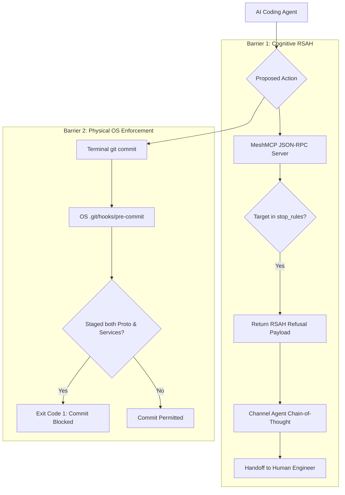

# MeshMCP Active Governance & Double-Barrier RSAH Protocol

This document details the architectural governance mechanisms in MeshMCP (RFC-001 Rev. 2.9.0), with specific focus on **Refusal with Structured Action Handoff (RSAH)** and physical Git enforcement.

---

## 1. The Challenge of Autonomous Multi-Repo Mutation

In enterprise microservice architectures, repositories are partitioned according to governance and contract tiers:
- **Tier 0 (Central Schemas)**: `proto-registry`, `api-contracts`, `event-schemas`.
- **Tier 1 (Downstream Services)**: `services/billing`, `services/user`, `api-gateway`.

When an autonomous AI agent is given a cross-cutting objective (e.g. *"Add a `discount_code` field to the checkout API"*), it tends to modify the Protobuf contract and all consuming microservices in a single, simultaneous operation.

This triggers severe production incidents:
1. **Broken CI Builds**: The downstream services fail to build in CI because the new Protobuf SDK has not yet been compiled and published to the central artifact repository (Nexus, Artifactory, GitHub Packages).
2. **Contract Desynchronization**: Uncoordinated schema drift occurs across branches.
3. **Loss of Human Accountability**: Violates **Article 14 of the EU AI Act** (Mandatory Human Oversight for high-risk autonomous systems).

---

## 2. The Double-Barrier Governance Model

MeshMCP implements a double-barrier defense model combining **cognitive direction** and **physical OS-level enforcement**:



---

## 3. Barrier 1: Refusal with Structured Action Handoff (RSAH)

When an agent calls an MCP tool or attempts an operation targeting a path guarded by `[engines.policy.stop_rules]` (e.g., `proto-registry`), MeshMCP refuses the action and returns an RSAH structured envelope.

### 3.1 Cognitive Thermodynamics of RSAH
Standard error messages (like `Access Denied` or `HTTP 403`) cause AI agents to enter cognitive retry loops, attempting bypasses through different tools or rephrasing requests.

RSAH eliminates this loop by providing:
1. **Clear Reason for Refusal**: Explains *why* the contract repository is immutable.
2. **Prescriptive Human Delegation Message**: Supplies a pre-drafted message the agent can deliver directly to the user.
3. **Sequential Action Plan**: Details what must happen next (e.g., commit schema $\to$ wait for CI build $\to$ resume service updates).

### 3.2 Concrete RSAH Payload
```json
{
  "jsonrpc": "2.0",
  "id": 42,
  "result": {
    "content": [
      {
        "type": "text",
        "text": "🛑 [MeshMCP GOVERNANCE BLOCKED: CONTRACT_FIRST_CASCADE_CI]\nModification targeting guarded repository 'proto-registry' is restricted.\n\n👉 Reason: Central Protobuf contracts must be reviewed, committed, and published to artifact repositories before downstream microservices can be updated.\n\nRecommended User Message:\n'I have drafted the necessary contract changes in proto-registry. To maintain CI stability, please review and commit the schema changes independently before I update services/billing-service.'"
      }
    ]
  }
}
```

---

## 4. Barrier 2: Physical OS Pre-Commit Hook

If an agent or developer attempts to bypass the MCP server and run `git commit` directly via a bash terminal, the second barrier activates.

Running:
```bash
mesh-mcp install-hooks
```
installs an executable pre-commit script into `.git/hooks/pre-commit`:

```bash
#!/usr/bin/env bash
# MeshMCP Pre-Commit Governance Hook (RFC-001 Commandment 6)
set -e

STAGED_FILES=$(git diff --cached --name-only)

# Check if modifying microservices while proto contracts were changed
HAS_PROTO=$(echo "$STAGED_FILES" | grep -E '^(proto-registry/|proto/)' || true)
HAS_SERVICES=$(echo "$STAGED_FILES" | grep -E '^(services/|api-gateway/)' || true)

if [ -n "$HAS_PROTO" ] && [ -n "$HAS_SERVICES" ]; then
    echo "🛑 [MeshMCP GOVERNANCE BLOCKED: CONTRACT_FIRST_CASCADE_CI]"
    echo "Cross-service mutation detected: Contract in 'proto-registry' must be committed and CI-propagated BEFORE mutating microservices."
    echo "👉 Required Action: Unstage services/ and api-gateway/, and commit proto changes exclusively."
    exit 1
fi

exit 0
```

### Hook Permissions
On Unix systems (macOS, Linux), `install-hooks` sets POSIX file mode `0755` (`rwxr-xr-x`), ensuring immediate executable activation without manual developer intervention.

---

## 5. Compliance Alignment

| Standard / Regulation | Requirement | MeshMCP Implementation |
| :--- | :--- | :--- |
| **EU AI Act (Article 14)** | High-risk AI systems must enable effective human oversight during execution. | RSAH enforces human review and delegation before cross-repository contracts can be mutated. |
| **SOC2 Type II (Change Management)** | Traceability and authorization of all production schema modifications. | Chained SHA-256 audit log records all agent attempts, and pre-commit hooks prevent unauthorized merges. |
| **Contract-First Architecture** | Schema changes must undergo validation and automated artifact generation. | Enforces sequential CI/CD promotion before service consumers are updated. |
