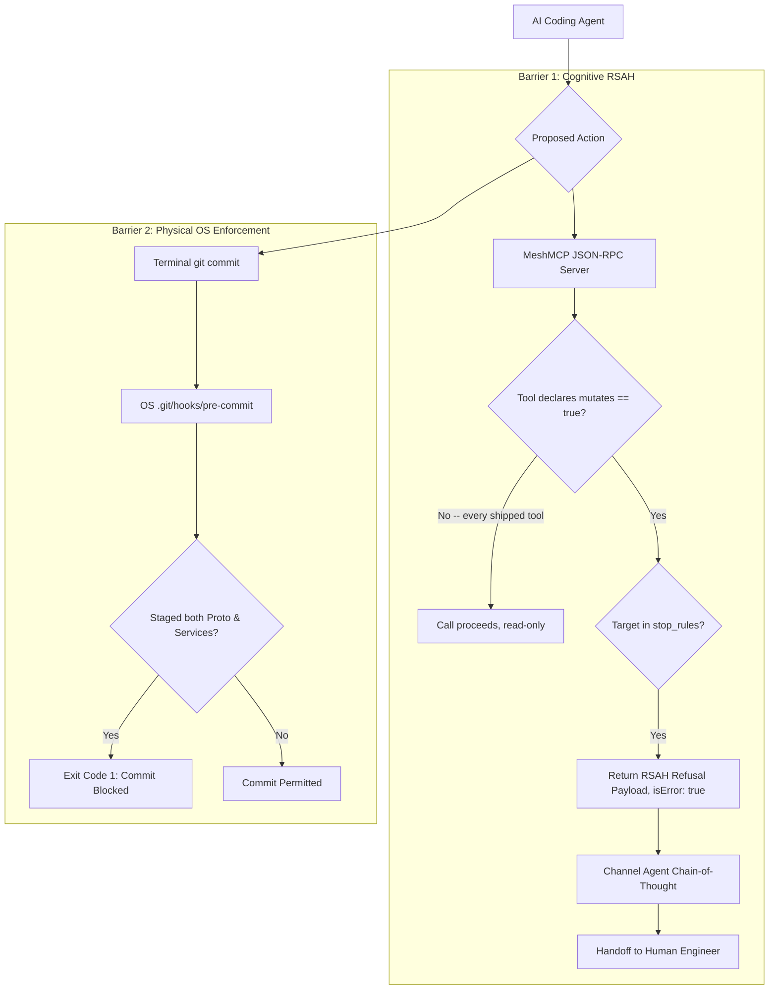

# MeshMCP Active Governance & Double-Barrier RSAH Protocol

This document details the architectural governance mechanisms in MeshMCP (RFC-001 Rev. 2.9.0), with specific focus on **Refusal with Structured Action Handoff (RSAH)** and physical Git enforcement.

---

## 1. The Challenge of Autonomous Multi-Repo Mutation

In enterprise microservice architectures, repositories are partitioned according to governance and contract tiers:
- **Tier 0 (Central Schemas)**: `proto-registry`, `api-contracts`, `event-schemas`.
- **Tier 1 (Downstream Services)**: `services/billing`, `services/user`, `api-gateway`.

When an autonomous AI agent is given a cross-cutting objective (e.g. *"Add a `discount_code` field to the checkout API"*), it tends to modify the Protobuf contract and all consuming microservices in a single, simultaneous operation.

This triggers severe production incidents:
1. **Broken CI Builds**: The downstream services fail to build in CI because the new Protobuf SDK has not yet been compiled and published to the central artifact repository (Nexus, Artifactory, GitHub Packages).
2. **Contract Desynchronization**: Uncoordinated schema drift occurs across branches.
3. **Loss of Human Accountability**: Violates **Article 14 of the EU AI Act** (Mandatory Human Oversight for high-risk autonomous systems).

---

## 2. The Double-Barrier Governance Model

MeshMCP implements a double-barrier defense model combining **cognitive direction** and **physical OS-level enforcement**:



---

## 3. Barrier 1: Refusal with Structured Action Handoff (RSAH)

When an agent calls an MCP tool or attempts an operation targeting a path guarded by `[engines.policy.stop_rules]` (e.g., `proto-registry`), MeshMCP refuses the action and returns an RSAH structured envelope.

### 3.1 Cognitive Thermodynamics of RSAH
Standard error messages (like `Access Denied` or `HTTP 403`) cause AI agents to enter cognitive retry loops, attempting bypasses through different tools or rephrasing requests.

RSAH eliminates this loop by providing:
1. **Clear Reason for Refusal**: Explains *why* the contract repository is immutable.
2. **Prescriptive Human Delegation Message**: Supplies a pre-drafted message the agent can deliver directly to the user.
3. **Sequential Action Plan**: Details what must happen next (e.g., commit schema $\to$ wait for CI build $\to$ resume service updates).

### 3.2 Concrete RSAH Payload

`ToolRegistry::invoke` checks `evaluate_guard` **before** running the tool, for any call where
`McpTool::mutates(&args)` returns `true`. On a hit it short-circuits before the tool runs and
returns an MCP tool error — a `CallToolResult` with `isError: true` whose text is the RSAH
payload. Per the MCP specification a refusal is a tool outcome, not a protocol fault: the client
hands it to the model (which can follow `agent_next_action`) instead of aborting the turn, as the
JSON-RPC error `-32001` used before this did:

```json
{
  "jsonrpc": "2.0",
  "id": 42,
  "result": {
    "isError": true,
    "content": [{ "type": "text", "text": "{\"status\":\"GOVERNANCE_BLOCKED\",\"policy\":\"CONTRACT_FIRST_CASCADE_CI\",\"required_workflow\":{\"step_1\":\"...\",\"step_2\":\"...\",\"step_3\":\"...\",\"step_4\":\"DO NOT modify 'api-gateway' or 'services/*' until the published packages are available.\"},\"agent_next_action\":\"STOP_AND_REPORT_TO_USER\",\"message_to_user\":\"I detected a mutation targeting the Protobuf contract in 'proto-registry'. Per active architecture governance, I'm stopping here: you must submit the contract PR and let CI generate the stubs before adapting the microservices.\"}" }]
  }
}
```

The text is the serialized `RsahResponse` (the same struct the `evaluate_guard` unit tests use),
so an agent can parse it back as JSON.

> **Honest scope**: this check is gated on `McpTool::mutates()`, which every shipped tool
> (`smart_search`, `find_dependents`, `analyze_grpc`, `analyze_impact`, `search_docs`,
> `visualize_mesh`) leaves at its default of `false` — they are all read-only. So while the
> wiring above is real and covered by an integration test
> (`test_invoke_blocks_mutating_call_on_guarded_subject` in
> `crates/mesh-server/src/tools/mod.rs`), it does not fire against any tool call you can make
> today. It activates automatically for a future tool that overrides `mutates()` to `true`. The
> enforcement point that *is* active against every commit today is Barrier 2 below.

---

## 4. Barrier 2: Physical OS Pre-Commit Hook

If an agent or developer attempts to bypass the MCP server and run `git commit` directly via a bash terminal, the second barrier activates.

Running:
```bash
mesh-mcp install-hooks
```
installs an executable pre-commit script into `.git/hooks/pre-commit`:

```bash
#!/usr/bin/env bash
# MeshMCP Pre-Commit Governance Hook (RFC-001 Commandment 6)
set -e

STAGED_FILES=$(git diff --cached --name-only)

# Check if modifying microservices while proto contracts were changed
HAS_PROTO=$(echo "$STAGED_FILES" | grep -E '^(proto-registry/|proto/)' || true)
HAS_SERVICES=$(echo "$STAGED_FILES" | grep -E '^(services/|api-gateway/)' || true)

if [ -n "$HAS_PROTO" ] && [ -n "$HAS_SERVICES" ]; then
    echo "🛑 [MeshMCP GOVERNANCE BLOCKED: CONTRACT_FIRST_CASCADE_CI]"
    echo "Cross-service mutation detected: Contract in 'proto-registry' must be committed and CI-propagated BEFORE mutating microservices."
    echo "👉 Required Action: Unstage services/ and api-gateway/, and commit proto changes exclusively."
    exit 1
fi

exit 0
```

### Hook Permissions
On Unix systems (macOS, Linux), `install-hooks` sets POSIX file mode `0755` (`rwxr-xr-x`), ensuring immediate executable activation without manual developer intervention.

---

## 5. Compliance Alignment

| Standard / Regulation | Requirement | MeshMCP Implementation |
| :--- | :--- | :--- |
| **EU AI Act (Article 14)** | High-risk AI systems must enable effective human oversight during execution. | RSAH enforces human review and delegation before cross-repository contracts can be mutated. |
| **SOC2 Type II (Change Management)** | Traceability and authorization of all production schema modifications. | Chained SHA-256 audit log records all agent attempts, and pre-commit hooks prevent unauthorized merges. |
| **Contract-First Architecture** | Schema changes must undergo validation and automated artifact generation. | Enforces sequential CI/CD promotion before service consumers are updated. |

---

## 6. Project Skills: guidance before refusal

Stop rules are a wall. Skills are a briefing — they hand the agent your team's playbook for an
area *before* it proposes a change, which in practice prevents far more bad edits than a refusal
after the fact.

### Configuration

```toml
[engines.policy.skills]
# Key = an MCP tool name, or any fragment of the scope/target being queried.
"proto-registry"   = ".agents/skills/proto-contract-evolution.md"
"services/billing" = ".agents/skills/billing-invariants.md"
"smart_search"     = ".agents/skills/how-we-search.md"
```

The value is a path to a Markdown file. Anything is valid content; if the file opens with YAML
frontmatter containing `description:`, or with an `# H1`, that line is quoted inline so the
agent can judge relevance without opening the file.

### Matching

Implemented by `GovernanceEngine::recommend_skill` ([`crates/mesh-core/src/governance.rs`](../crates/mesh-core/src/governance.rs)):

1. **Exact MCP tool name** (`smart_search`, `find_dependents`, `analyze_grpc`,
   `analyze_impact`, `search_docs`) — fires on every call to that tool and takes precedence.
2. Otherwise, **case-insensitive substring match against the call's subject**: the `scope` for
   `smart_search`, the `target` for the analysis tools, the `query` for `search_docs`. This is
   the same matching model as `stop_rules`.
3. Among several matching path keys, the **longest key wins**, so `services/billing` overrides
   a broader `services` rule regardless of map ordering.

### Effect

`ToolRegistry::invoke` appends a footer to the tool's output:

```
---
**Project skill for this area**: `.agents/skills/proto-contract-evolution.md` — How to evolve a proto contract without breaking consumers.
Read it before proposing changes here.
```

The footer is appended only on success, and only when a key matches. It costs a handful of
tokens and is well inside the 48 KB output cap.

### Validation

A mistyped path would silently never fire, so `mesh-mcp doctor` checks every configured skill
file and names the ones it cannot find:

```
✔ Project skills: 3 configured, all files found
```
```
✖ Project skills: 1 of 3 file(s) missing — these keys will never recommend anything:
    proto-registry -> .agents/skills/typo.md
```

Paths are resolved as written, or relative to the config file's own directory.

### Relationship to stop rules

| | Skills | Stop rules |
| :--- | :--- | :--- |
| Trigger | any matching tool call | commit touching a guarded path |
| Effect | appends guidance to the response | rejects the commit (RSAH) |
| Enforcement point | MCP server, at query time | git pre-commit hook |
| Blocks the agent | no | yes |

They compose: a skill explains the contract-first workflow while the agent is still exploring,
and the stop rule catches it if the advice is ignored.
